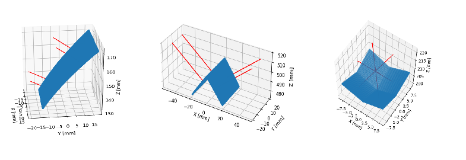

# Introduction

This code provides examples of the detection of 3D objects like planes, lines and corners using RGB and Depth information from RealSense camera. The following objects are supported:

-   Planes : detected multiple planes in the depth image
-   Edges  : detecting edges / intersection of planes 
-   Corners: three plane intersection/ junctions

These objects could be integrated in your robotics and video processing pipe line.
Your code can run in real time, using examples below.


## Installation Windows

1. Install python 3.10 from Python Release Python 3.10.0 | <https://www.python.org>

2. Create virtual environment. In Windows PowerShell:

    python -m venv <your path>\Envs\planes3d

3. Activate virtual environment. In Windows CMD shell:

    <your path>\Envs\planes3d\Scripts\activate.bat

4. Installing realsense driver. For example, download pyrealsense2-2.55.10.089-cp310-cp310-win_amd64.whl:

    pip install pyrealsense2-2.55.10.6089-cp310-cp310-win_amd64.whl

5. Install opencv and numpy:

    pip install opencv-contrib-python

6. Install scipy:

    python -m pip install scipy

7. Install matplotlib:

    pip install matplotlib

## Usage

```py
>>> from plane_detector import PlaneDetector

>>> pd = PlaneDetector()

```