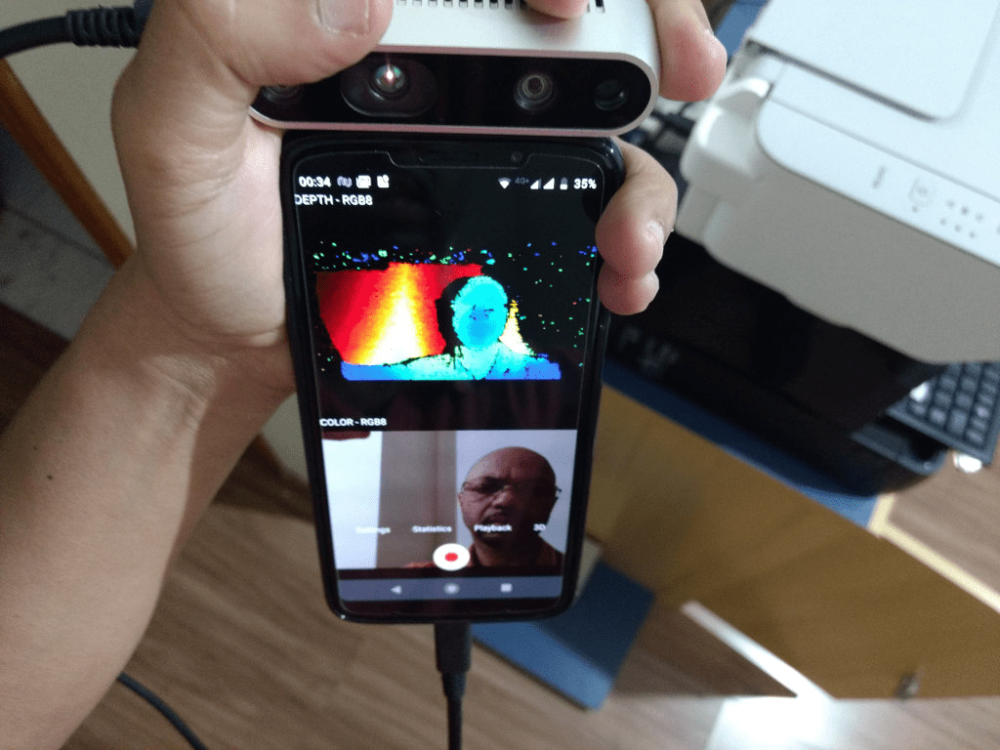

>:pushpin: The SDK 2.0 delivers cross-platform open source libraries & tools that allow users to develop on multiple Operating Systems & development environments.  Intel has validated SDK2.0 on Windows and Linux platforms. Please check [latest Release](https://github.com/IntelRealSense/librealsense/releases) for the build versions.  While Intel has not explicitly validated SDK2.0 on Android platforms, it is expected to work on Android as well. Please refer to the build instructions in the section below. Calibration and firmware update tools that would be used in production and manufacturing processes are not available on Android at this time.  Please contact your Intel representative for additional information.

>:pushpin: The T265 tracking module is not yet supported on Android via librealsense. Support is planned to be added in a future release.

# Intel&reg; RealSense&trade; SDK 2.0 for Android OS

Using the Android wrapper allows you to build both native (C/C++) and Java applications for Android.
In order to do that a RealSense Android App need to include `librealsense.aar` (Android Archive) in it's dependencies.
The AAR file is responsible to acquire camera access permissions and it also provides a JNI based RealSense Java API.

> Previous Android solution was limited to rooted devices only, but is still available [here](https://github.com/IntelRealSense/librealsense/tree/v2.18.1/doc/android)

## Ingredients
Before jumping to the instructions section please ensure you have all the required accessories. 
1. Android target device with Android version >= 4.4 that supports OTG feature.
2. [Android Studio IDE](https://developer.android.com/studio).
3. [USB3 OTG](https://en.wikipedia.org/wiki/USB_On-The-Go) cable.

## Build A RealSense Application
We provide two stand alone examples that demonstrates how to link with librealsense AAR from the maven repository.
These two examples focus on the grudle configuration and contains minimal code.
Follow the [Java example](../wrappers/android/examples/java_example/readme.md) or [Native example](../wrappers/android/examples/native_example/readme.md) for more details.
You can also [build RealSense AAR from source](../wrappers/android/readme.md) and add the generated AAR as a dependency as described [here](https://developer.android.com/studio/projects/android-library#AddDependency).
Graphical Java examples such as 'capture', 'recording' and 'playback' are available in the examples folder as part of the Android wrapper project.

Below is an [example](https://play.google.com/store/apps/details?id=com.intel.realsense.camera) of an application with librealsense on the android platform. 

