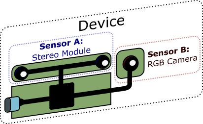

# API Architecture

RealSense API provides access to configuration, control and streaming of data from RealSense depth cameras. You can get started with the  basic functionality using the high level API, or get full control of all camera settings using the low level API:

1. [High-Level Pipeline API](#high-level-pipeline-api)  
The Pipeline interface configures the Intel® RealSense™ device with the best recommended settings and manages hardware resources and threading. It is accompanied by processing blocks, which abstract and simplify common processing of the camera raw data. Use this API when you require the Camera to work but do not need to fine tune the camera settings or control the streamings threads. Recommended for **Application Developers**.

2. [Low-Level Device API](#low-level-device-api)  
 The Low Level Device interface enables you to take direct control of the individual device sensors, fine tune all camera settings, and manage the streaming threads, time synchronization and spatial mapping. Recommended for **Advanced Researches**, **Framework and Tool Developers** and Developers in emerging fields like **VR/AR**.

## High-Level Pipeline API

The High-Level Pipeline API allows the developer to focus on the output of the camera, or selected processing blocks. The `pipeline` class selects the best camera settings, according to the output required by the application. It acquires and activates the camera, manages the different streams threads, and provides time synchronized frames of the active streams. The pipeline provides access to the low level device interface, which it encapsulates. Thus, the sensors information and fine tuning capabilities are still accessible to the application.   
The pipeline API is accompanied by the processing blocks, which provide tools to execute common image processing operations:

* **Synchronize** any set of different asynchronous streams with respect to hardware timestamps using the `syncer` class
* **Align** streams to a common viewport, using the `align` class. You can also use your own calibration data to align devices that were not otherwise calibrated.
* **Project** depth data into the 3D space using the `pointcloud` class. 
* Future releases will add **computer vision plugins** capabilities to the pipeline, for easy enriching available outputs based on camera streams. The pipeline makes sure all synchronization and alignment requirements of those plugins are met and takes care of threading and resource management.

## Low-Level Device API
Intel RealSense™ devices use sensors, some commonplace like a regular RGB camera and some more exotic like the D400 Stereo module or SR300 Structured-Light sensor:

The Low-Level Device API provides you with the means to take direct control of the individual device sensors.   
* Each sensor has its own power management and control.  
* Different sensors can be safely used from different applications and can only influence each other indirectly.
* Each sensor can offer one or more streams of data (images, motion). Streams must be configured together and are usually dependent on each other. For example, D400 depth stream depends on infrared data, so the streams must be configured with a single resolution.
* All sensors provide streaming as minimal capability, but each individual sensor can be extended to offer additional functionality. For example, most video devices let the user configure a custom region of interest for the auto-exposure mechanism.
* Standard video sensors pass UVC / HID compliance and can be used without custom drivers.

Intel RealSense™ D400 stereo module offers **Advanced Mode** functionality, letting you control the various ASIC registers responsible for depth generation.  

The user of the device interface provides a callback to be invoked whenever new data frames become available. This callback runs immediately on the OS thread providing the best possible latency. 
The callback provides a frame with the relevant data type according to the stream, which produced the data. Data frames can be extended to offer the additional functionality relevant to their stream type. For example, video stream frame data includes image resolution and information how to parse the image raw buffer.
