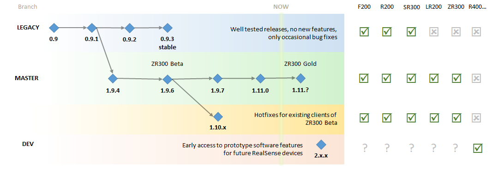

# Overview

# Branching Structure

* [**master**](https://github.com/IntelRealSense/librealsense) - recommended for most uses. Supports broad raster of devices and software features. Compatible with [RealSense Linux SDK](https://github.com/IntelRealSense/realsense_sdk)
* [**legacy**](https://github.com/IntelRealSense/librealsense/tree/legacy) - long-term stable releases without any new functionality.
* [**development**](https://github.com/IntelRealSense/librealsense/tree/development) - new features are being prototyped here.

Additional branches are being created and deleted as we are integrating new major features.

# Releases
As we are moving forward and breaking changes become less frequent, we are trying to follow better, more predictable versioning methodology. However, up to this point the project did not strictly followed [semantic versioning](http://semver.org/).

As of October 2016:
* [librealsense 1.9.7](https://github.com/IntelRealSense/librealsense/releases/tag/v1.9.7) is the last fully validated release, **recommended** for the community.
* [librealsense 1.11.0](https://github.com/IntelRealSense/librealsense/releases/tag/v1.11.0) was provided as an engineering drop (without any known major limitations), likely to become next stable release.
* [librealsense 0.9.3](https://github.com/IntelRealSense/librealsense/releases/tag/v0.9.3) is the long-term stable release if you are not interested in any of the new software / hardware features.  
