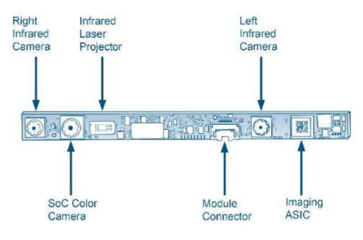
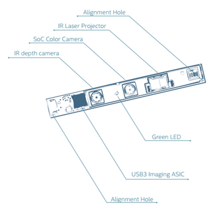

# Camera Specifications

     | R200 | F200 | SR300 |
---- | ---- | ---- | ----- |
Indoor Range |  0.7m - 3.5m | 0.2m – 1.0m | 0.2m – 1.5m
Outdoor Range | 10m | N/A | N/A 
Depth FoV (WxH) | 56°x43° | 68°x54° | 68°x54°
Depth FPS | 30, 60, 90 | 30, 60 | 30, 60 
IR FPS | 30, 60, 90 | 5 - 300 | 5 - 200 
Depth Method | Active Stereo IR | Coded Light IR | Coded Light IR
Minimum F/W | 1.0.72.04 | 2.60.0.0 | 3.10.10.0 |

## R200 Notes

The R200 is an active stereo camera with a 70mm baseline. Indoors, the R200 uses a class-1 laser device to project additional texture into a scene for better stereo performance. The R200 works in disparity space and has a maximum search range of 63 pixels horizontally, the result of which is a 72cm minimum depth distance at the nominal 628x468 resolution. At 320x240, the minimum depth distance reduces to 32cm. The laser texture from multiple R200 devices produces constructive interference, resulting in the feature that R200s can be collocated in the same environment. The dual IR cameras are global shutter, while 1080p RGB imager is rolling shutter. An internal clock triggers all 3 image sensors as a group and this library provides matched frame sets.

Outdoors, the laser has no effect over ambient infrared from the sun. Furthermore, at default settings, IR sensors can become oversaturated in a fully sunlit environment so gain/exposure/fps tuning might be required. The recommended indoor depth range is around 3.5m.  

## F200 & SR300 Notes

The F200 is Intel's first-generation coded light camera using a high-frequency MEMS mirror to project a 2D greycode pattern. This pattern causes destructive interference with other F200 and SR300 cameras and performance is dramatically degraded when multiple cameras are pointed at the same subject. Both F200 and SR300 do not work outside due to ambient IR. For indoor usage, a specific camera control ('motion vs range tradeoff') has an ability to extend range (longer exposure) at the expense of framerate -- with aggressive settings enabled, FPS may drop as low as 2 FPS. The second generation SR300 is backwards compatible with the F200 and includes a number of on-chip improvements to increase performance and accuracy. In both generations, the IR sensor is global shutter, while the 1080p RGB imager is rolling shutter. 

