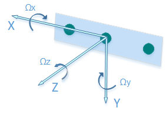

# D435i

The **Intel® RealSense™ D435i** is a depth camera which includes a [Bosch BMI055](https://www.bosch-sensortec.com/bst/products/all_products/bmi055) 6-axis inertial sensor in addition to the depth camera which measures linear accelerations and angular velocities. Each IMU data packet is timestamped using the depth sensor hardware clock to allow temporal synchronization between gyro, accel and depth frames.

## Should I use a T265 in addition to or instead of the D435i?

The [T265](./t265.md) is designed to produce high accuracy, low latency 6 degree of freedom position data without using any additional computational resources. It does not contain a depth camera but can be used in combination with any of the D400 series depth cameras (including the D435i).

## <a name="origin">Sensor origin and coordinate system</a>
The IMU sensor location and orientation relative to the depth sensors are conveniently embedded into the sensor's extrinsic data. In order to align and them with SDK-wide established [orientation convention](https://github.com/IntelRealSense/librealsense/wiki/Projection-in-RealSense-SDK-2.0#point-coordinates) using the depth sensor as coordinate system origin, each IMU sample is multiplied internally by the extrinsic matrix.

The resulting orientation angles and acceleration vectors share the coordinate system with the depth sensor.  
  
1.  The positive x-axis points to the right.  
2.  The positive y-axis points down.  
3.  The positive z-axis points forward  

The coordinate system is also compatible with the [OpenCV pinhole camera model](https://docs.opencv.org/3.4.0/d9/d0c/group__calib3d.html)  

## <a name="imu_calibration">IMU calibration</a>
The D435i IMU sensor does not include internal calibration, which may manifest itself with non-zero angular velocities produced at idle mode and the gravity (accel) force measured being not equal to 9.80665.

A [complementary calibration tool](https://github.com/IntelRealSense/librealsense/tree/development/tools/rs-imu-calibration#rs-imu-calibration-tool) has been developed and published as part of the SDK.  

Running the calibration routine will calculate IMU intrinsics and store them on device's NVRAM for later use in SDK.

The depth<->IMU sensor extrinsic (rigid body transformation) is precalculated based on mechanical drawings and cannot be modified.
 
When initialized, the SDK will query the device for the existance of the IMU calibration data, and if present - apply it to the raw IMU samples produced by the device.

## Integration with the SDK
The following `librealsense` tools and demos are IMU ready:
 - `rs-capture` - 2D Visualization
 - `rs-enumerate-devices` - list the IMU and tracking profiles (FPS rates and formats).  
 - `rs-data-collect` - Store and serialize IMU in Excel-friendly csv format. The tool uses low-level sensor API to minimize software-imposed latencies. Useful for performance profiling.  
 - `realsense-viewer` - Provides 2D visualization of IMU data.

The IMU and data streams are fully compatible with SDK's embedded recorder utility.  

## API
The IMU is treated by the SDK like any other supported sensor. Therefore the sensor access and invocation API calls are similar to those of the depth/rgb sensors of D400 and SR300:

```cpp
rs2::pipeline pipe;

rs2::config cfg;
cfg.enable_stream(RS2_STREAM_GYRO);
cfg.enable_stream(RS2_STREAM_ACCEL);

pipe.start(cfg);

while (app) // Application still alive?
{
    rs2::frameset frameset = pipe.wait_for_frames();

    // Find and retrieve IMU data
    if (rs2::motion_frame accel_frame = frameset.first_or_default(RS2_STREAM_ACCEL))
    {
        rs2_vector accel_sample = accel_frame.get_motion_data();
        //std::cout << "Accel:" << accel_sample.x << ", " << accel_sample.y << ", " << accel_sample.z << std::endl;
        //...
    }

    if (rs2::motion_frame gyro_frame = frameset.first_or_default(RS2_STREAM_GYRO))
    {
        rs2_vector gyro_sample = gyro_frame.get_motion_data();
        //std::cout << "Gyro:" << gyro_sample.x << ", " << gyro_sample.y << ", " << gyro_sample.z << std::endl;
        //...
    }
}
```

