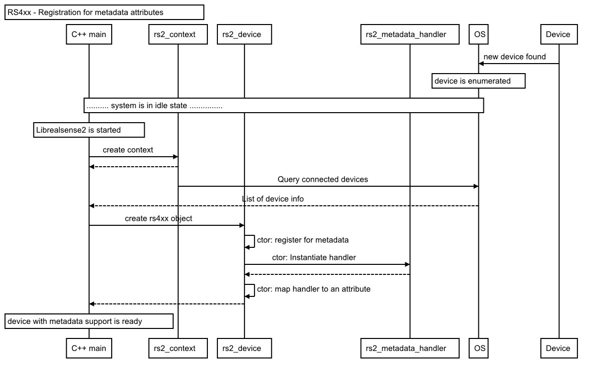
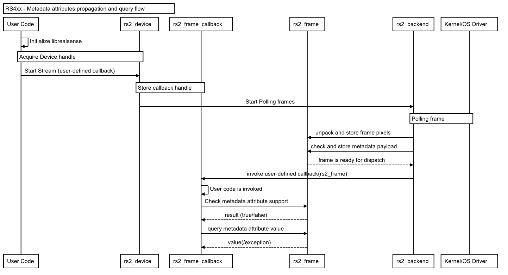
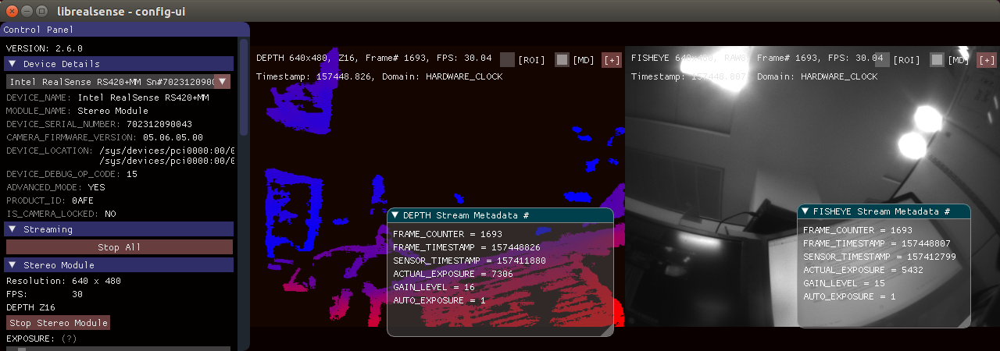

# Frame Metadata

Frame metadata is a set of parameters (or attributes) that provide a snapshot of the sensor configuration and/or system state present during the frame's generation.
The attributes are recalculated and updated on per-frame basis.
`librealsense2` supports querying a set predefined attributes as part of the frame data available to the end-user.
In this explanatory we will overview
- The Design and implementation of frame metadata in `librealsense2`
- The Metadata support by Intel® RealSense™ devices


## Software Design and Implementation
The library's approach on metadata is that any piece of data that provides an unique frame-related info is a potential attribute. Therefore `librealsense2` does not limit itself to hardware-originated data, but establishes an infrastructure to capture and encapsulate  software-originated attributes as well.

The low-level design and implementation follows those two guidelines:
- All the attributes shall be prepared, packed and distributed as an integral part of `rs2_frame` object.
- A metadata handler class is the basic execution unit responsible to parse and provide a single attribute.

# Metadata Registration
When a new device is recognized by `librealsense2` the internal resources for its management, including UVC endpoint classes, are allocated. The UVC endpoints perform registration for the specific metadata attributes. In the process a dedicated metadata parser class will be assigned to handle the actual job of de-serializing and validating an attribute.    
Note that each metadata attribute requires an explicit parser, and querying an unregistered attribute will result in an appropriate exception raised by the library.  
With the metadata handlers in place, the inbound frames for the specific endpoint can be queried for the requested attributes.  

The metadata registration flow is summarized in the following diagram*:  
>**Note** the diagrams present the high-level design. The actual implementation may differ.  



# Metadata Acquisition
When a new frame is received by Host, `librealsense2` backend is responsible to process and attach the metadata attributes.  
For hardware-generated attributes, the backend will checks whether the metadata payload is valid. If positive, the metadata payload will be stored along with the pixels data in `rs2_frame` object. Since querying the attributes is optional and in many cases will not be requested, the payload is stored as raw data, and the library waits for the appropriate API calls to do the actual attribute parsing.  
The backend is also responsible to prepare and attach the software-generated attributes to the frame data. And contrary to hardware-originated data, those attributes will be generated to all frames.

Metadata attributes propagation from the library to the user code is described in the following diagram:  


## Metadata Query API
`librealsense2` introduces two functions into its public API to query metadata attributes:
```cpp
/**
* determine device metadata
* \param[in] frame      frame handle returned from a callback
* \param[in]            the metadata attribute to check for support
* \return               true if device has this metadata
*/
int rs2_supports_frame_metadata(const rs2_frame* frame, rs2_frame_metadata frame_metadata, rs2_error** error);
```
verifies that the hardware and software-applied preconditions for metadata parsing are met:
- the attribute was registered for retrieval
- metadata payload is valid*
- the specific attribute is included in the payload data blocks*
> **Note** * applicable for hardware-originated metadata payload.  

```cpp
/**
* retrieve metadata from frame handle
* \param[in] frame      handle returned from a callback
* \param[in] frame_metadata  the rs2_frame_metadata whose latest frame we are interested in
* \return            the metadata value
**/
 rs2_metadata_t rs2_get_frame_metadata(const rs2_frame* frame, rs2_frame_metadata frame_metadata, rs2_error** error);
```
will invoke the metadata parser to read the actual value from metadata payload. In case the attribute's origin is other than the payload, such as Auto-Exposure for Fisheye stream, then its value will be calculated internally by librealsense2.  

# Librealsense2 API for Metadata
The envisaged mode of querying metadata attribute is `check-then-query`
```cpp
  rs2_metadata_t val = 0;
  ...
  if (rs2_supports_frame_metadata(.., attribute,...))
     val = rs2_get_frame_metadata(.., attribute,...)
 ```
Calling __*rs2_get_frame_metadata*__ without testing for attribute support may result in `librealsense2` generating an exception. This is a design decision consistent with the error-handling model employed by librealsense2.  


## Employing metadata attributes in demos
The samples that demonstrate querying and retrieval of metadata are `rs-save-to-disk` and `rs-config-ui`.
 - `rs-save-to-disk` saves the metadata attributes available for each stream into a comma-separated text file. For instance, for the Depth stream the possible [output ](metadata/rs-save-to-disk-output-DEPTH-metadata.csv) is:  

Stream |Depth
:-----:|------:|
Metadata Attribute|  Value
FRAME_COUNTER |41
FRAME_TIMESTAMP|179708225
SENSOR_TIMESTAMP|179671458
ACTUAL_EXPOSURE|6951
GAIN_LEVEL|16
AUTO_EXPOSURE|1  
TIME_OF_ARRIVAL|1523871918775
BACKEND_TIMESTAMP|1523871918741
ACTUAL_FPS|30

 - `rs-config-ui` includes a checkbox in the upper-right corner of  stream's canvas, clicking on which will bring up an overlay window with the metadata attributes available.  

​

# Metadata Support for Intel® RealSense™ devices
In order for `librealsense2` to get access for device-generated attributes the following system preconditions shall be met:
- OS shall support metadata provision - for Linux the specific kernel patches shall be applied.  
- Device firmware shall declare and implement metadata attributes payload.

## OS support
***Linux OS*** -  the standard Linux UVC driver does not provide metadata support.
`librealsense2` package includes metadata patch for `uvcvideo` kernel object. The patches are intended to be deployed with Ubuntu 14, 16.01/02 LTS with kernel versions 4.4, 4.8 and 4.10, and are applied as part of Linux backend installation . See [Linux installation-guide](./installation.md) for more details.
The patches were also successfully ported to Yocto-based distribution and made available for Yocto Reference Kit based on Poky 2.1.2 with kernel version 4.4.26.

***Windows OS*** - Metadata extraction is supported by Microsoft starting with Windows10. Check [Windows installation  guide](./installation_windows.md) for details.  


## Metadata attributes in RS400 Devices
The device firmware implements a custom metadata payload compatible with [Microsoft Extensions for UVC ](https://docs.microsoft.com/en-us/windows-hardware/drivers/stream/uvc-extensions-1-5) spec, and emits metadata attributes in the frame payload header.

The custom payload comprise of several data chunks ("C" structs) with multiple attributes each. The chunks are categorized as  `calibration/configuration/capture/status`.  
During streaming the chunks are arranged into ordered sets. For instance, given attributes chunks named `a,b,c,d,e,f,g`, the possible sets could be `{a,b,c,d}`, `{a,f,g,d}`,`{d,e,f,g}`.  The design requires ,though, that the *essential frame attributes, such as Frame Number and Timestamp shall be included in all configured sets*, to allow a consistent track of the frames arrived.  

During the regular operation course the firmware internal state machine decides which attributes set to generate for the current frame. For instance, the first frames will be dispatched with `configuration/calibration` payloads, while the rest will carry the `capture` attributes.  
From the user's perspective it means that a properly registered metadata attribute may still not be available for some frames, as metadata generation is governed by firmware design.
