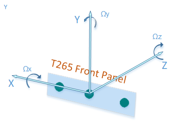
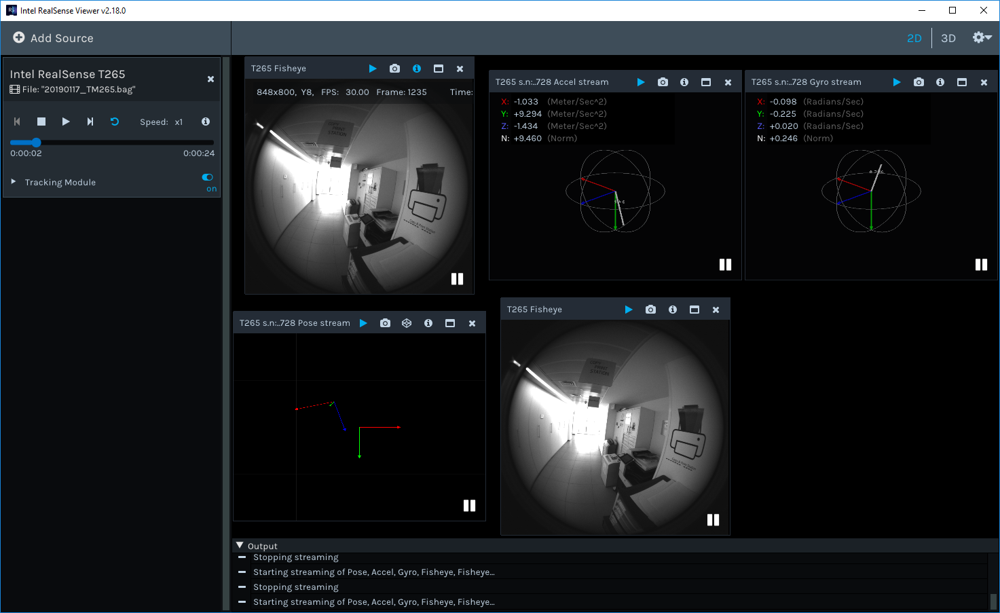
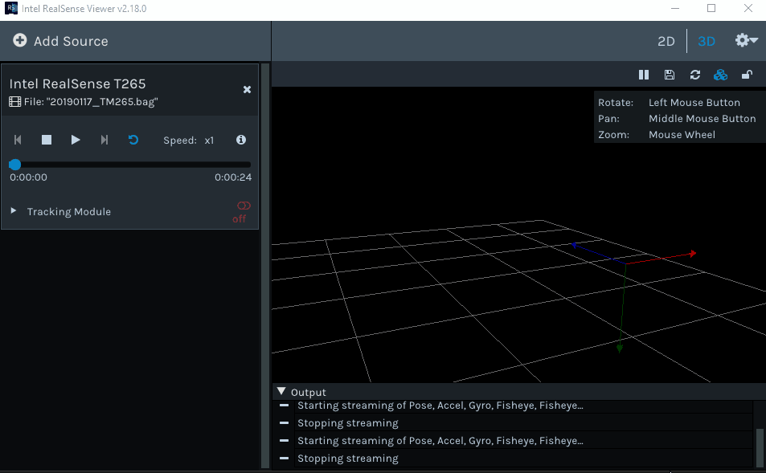

# Inertial Measurement Unit (IMU) and Tracking sensors

With the introduction of Intel D435i and T265 RealSense devices, `librealsense` SDK was
enhanced to support and effectively utilize the functionality provided by the new domain sensors.

## Core Capabillities
The Realsense D435i and T265 models sport a [Bosch BMI055](https://www.bosch-sensortec.com/bst/products/all_products/bmi055) 6-axis inertial sensor.
The sensor is comprised of triaxial 12bit linear acceleration and triaxial 16bit angular velocity gyro sensors.  

The D435i depth camera generates and transmits the gyro and accel samples independently as the inertial sensors exhibit different FPS rates (200/400Hz for gyro, 63/250Hz for accel).  
Each IMU data packet is timestamped using the depth sensor hardware clock to allow temporal synchronization between gyro, accel and depth frames.

The T265 Realsense inside-out tracking camera utilizes the same IMU sensor as the D435i.
However, unlike the D435i, which delivers the raw IMU data directly to the host PC, the T265 redirects IMU readings into a Movidius Myriad 2 Vision Processing Unit (VPU). The intertial sensor data is also complemented by video from two fisheye monochrome sensors that are fed into the VPU as well.  
The VPU employed with T265 is capable of fusing inertial and video sensors to produce a reliable and persistent 6DOF pose, offloading the CPU-intensive calculations from the host PC.  

The following table summarizes the features and capabilities of the two devices:


## <a name="T265vsD435i"></a>T265 vs D435i

Feature   | D435i   | T265 | Notes |
:-------: | :------------: | :-------: | :-------: |
IMU Sensor | Bosch BMI055  | Bosch BMI055 |  
IMU Bias&Scale Correction | Not provided * | Yes | &ast; Feasible with <a href="#imu_calibration">SDK suite</a>
 3DOF acceleration | 62.5/250 Hz | 62.5Hz | meter/sec<sup>2</sup>
3DOF gyro | 200/400 Hz | 200Hz | radian/sec
6DOF Pose  | N/A | HW-generated at 262 Hz <br>  | Each sample contains:<br>   - Position vector [xyz]<br> -  Orientation quaternion [xyzw] <br> - Linear velocity and acceleration vectors<br> - Angular velocity and acceleration vectors <br> - Tracking confidence [hi/med/low] <br> - Mapping confidence [hi/med/low]
Additional sensors | Depth/Left+Right IR/RGB identical to D435 | Two Fisheye sensors at 848X800 resolution/ 30FPS |
Relocalization | N/A | Yes |
Sensors orientation | Aligned to depth | VR-Standard | See <a href="#imu_tracking_orientation">Tracking Sensor Origin and CS</a>

## <a name="imu_tracking_orientation">Tracking Sensor Origin and Coordinate System (CS)</a>
### D435i
The IMU sensor location and orientation, relative to the depth sensor's are conveniently embedded into the sensor's extrinsic data. In order to align and them with SDK-wide established [orientation convention](https://github.com/IntelRealSense/librealsense/wiki/Projection-in-RealSense-SDK-2.0#point-coordinates) using the depth sensor as CS origin, each IMU sample is multiplied internally by the extrinsic matrix.

 The resulted orientation angles and acceleration vectors share the coordinate system with the depth sensor.  
​  
1.  The positive x-axis points to the right.  
2.  The positive y-axis points down.  
3.  The positive z-axis points forward  

The angles are also compatible with [OpenCV convention for pinhole camera model](https://docs.opencv.org/3.4.0/d9/d0c/group__calib3d.html)  


### T265
To aid AR/VR integration, the TM265 tracking device uses the defacto VR framework standard coordinate system instead of the SDK standard:

​  
1.	Positive X direction is towards right imager
2.	Positive Y direction is upwards toward the top of the device
3.	Positive Z direction is inwards toward the back of the device

The center of tracking corresponds to the center location between the right and left monochrome imagers on the PCB

##
## <a name="imu_calibration">Device calibration</a>
The IMU sensor does not include internal calibration, which may manifest itself with non-zero angular velocities produced at idle mode and the gravity (accel) force measured being not equal to 9.80665.  
In order to rectify those inaccuracies, the T265's IMU sensor is calibrated  in the production line.  

For D435i the IMU sensor is not calibrated, hence a [complementary routine and tool](https://github.com/IntelRealSense/librealsense/tree/development/tools/rs-imu-calibration#rs-imu-calibration-tool) were developed and published as part of the SDK.  
Running the calibration routine will calculate IMU intrinsic covariance and zero offsets, and then store them on device's NVRAM for later use in SDK.
The depth<->IMU sensor extrinsic (rigid body transformation) is precalculated based on mechanical drawings and cannot be modified.  
When initialized, the SDK will query the device for the existance of the IMU calibration data, and if present - apply it to the raw IMU samples produced by the device.

## Integration with the SDK
The following `librealsense` tools and demos are IMU and tracking-ready:
 - `rs-capture` - 2D Visualization.  
 - `rs-enumerate-devices` - list the IMU and tracking profiles (FPS rates and formats).  
 - `rs-data-collect` - Store and serialize IMU and Tracking (pose) data in Excel-friendly csv format. The tool uses low-level sensor API to minimize software-imposed latencies. Useful for performance profiling.  
 - `realsense-viewer` - Provides 2D visualization of IMU and Tracking data. 3D visualization is available for Pose samples:  

  ​  
  ​

The IMU and Tracking data streams are fully compatible with SDK's embedded recorder utility.  

## API
The IMU and tracking sensors are treated by the SDK like any other supported sensor. Therefore the sensor access and invocation API calls are similar to those of the depth/rgb sensors of D400 and SR300:

```cpp
rs2::pipeline pipe;

rs2::config cfg;
cfg.enable_stream(RS2_STREAM_GYRO);
cfg.enable_stream(RS2_STREAM_ACCEL);
cfg.enable_stream(RS2_STREAM_POSE);

pipe.start(cfg);

while (app) // Application still alive?
{
    rs2::frameset frameset = pipe.wait_for_frames();

    // Find and retrieve IMU and/or tracking data
    if (rs2::motion_frame accel_frame = frameset.first_or_default(RS2_STREAM_ACCEL))
    {
        rs2_vector accel_sample = accel_frame.get_motion_data();
        //std::cout << "Accel:" << accel_sample.x << ", " << accel_sample.y << ", " << accel_sample.z << std::endl;
        //...
    }

    if (rs2::motion_frame gyro_frame = frameset.first_or_default(RS2_STREAM_GYRO))
    {
        rs2_vector gyro_sample = gyro_frame.get_motion_data();
        //std::cout << "Gyro:" << gyro_sample.x << ", " << gyro_sample.y << ", " << gyro_sample.z << std::endl;
        //...
    }

    if (rs2::pose_frame pose_frame = frameset.first_or_default(RS2_STREAM_POSE))
    {
        rs2_pose pose_sample = pose_frame.get_pose_data();
        //std::cout << "Pose:" << pose_sample.translation.x << ", " << pose_sample.translation.y << ", " << pose_sample.translation.z << std::endl;
        //...
    }
}
```

## Supported platforms:
The IMU and tracking sensors are currently supported on Windows and Linux OS*. MacOS and Android support is planned but there is still no firm timeline.  
&ast; Linux OS requires the kernel patches to applied either [manually](https://github.com/IntelRealSense/librealsense/blob/master/doc/installation.md#linux-ubuntu-installation) or via the [`librealsense2-dkms` package](https://github.com/IntelRealSense/librealsense/blob/master/doc/distribution_linux.md#installing-the-packages)
