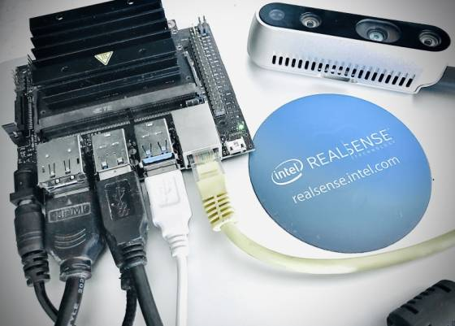
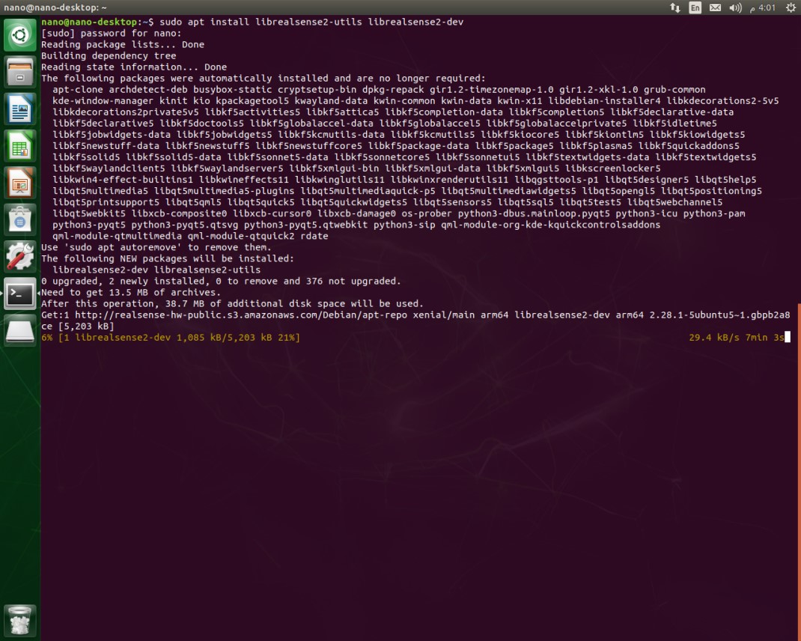
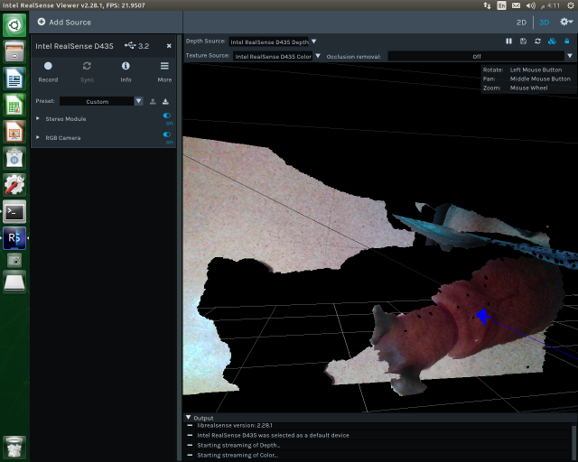
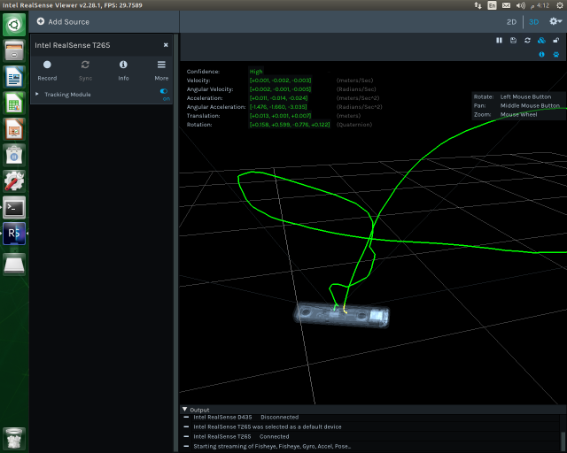

# NVidia Jetson Devices

**NOTE**: See [support-matrix.md](./support-matrix.md) to learn more about Jetson support for RealSense devices.

> Check out [www.jetsonhacks.com](http://www.jetsonhacks.com/) for great content on everything Jetson! (not affiliated with Intel RealSense)

## Getting started

1. **Prerequisites:**

  * **Jetson Nano** or **Jetson TX2** board (may also work on other Jetson devices)
  * RealSense **D415**, **D435**, **D435i**, **SR300** or **T265** Camera


2. Follow [official instructions](https://developer.nvidia.com/embedded/learn/get-started-jetson-nano-devkit) to get your board ready. This guide will assume you are using official **Ubuntu 16.04** image from NVidia. We strongly recommend enabling the Barrel Jack connector for extra power (See [jetsonhacks.com/jetson-nano-use-more-power/](https://www.jetsonhacks.com/2019/04/10/jetson-nano-use-more-power/) to learn how)

  

> **Kernel Patches?** - There is a lot of confusion surrounding kernel patching for NVidia Jetson. [Previous versions](https://github.com/IntelRealSense/librealsense/blob/v2.29.0/doc/installation_jetson.md) of this document as well as [jetsonhacks.com guide](https://www.jetsonhacks.com/2019/05/16/jetson-nano-realsense-depth-camera/) are suggesting different patching strategies. While manual patching is still viable, starting with librealsense 2.24 (and 2.26 for the D435i) there is a better way:

3. Register the server's public key:  
```
sudo apt-key adv --keyserver keys.gnupg.net --recv-key F6E65AC044F831AC80A06380C8B3A55A6F3EFCDE || sudo apt-key adv --keyserver hkp://keyserver.ubuntu.com:80 --recv-key F6E65AC044F831AC80A06380C8B3A55A6F3EFCDE
```

> In case the public key cannot be retrieved, check and specify proxy settings: `export http_proxy="http://<proxy>:<port>"`, and rerun the command. See additional methods in the following [link](https://unix.stackexchange.com/questions/361213/unable-to-add-gpg-key-with-apt-key-behind-a-proxy).  

4. Add the server to the list of repositories:

  * Ubuntu 16:  
  ```
  sudo add-apt-repository "deb http://realsense-hw-public.s3.amazonaws.com/Debian/apt-repo xenial main" -u
  ```

  * Ubuntu 18:
  ```
  sudo add-apt-repository "deb http://realsense-hw-public.s3.amazonaws.com/Debian/apt-repo bionic main" -u
  ```

5. Install the SDK:
```
sudo apt-get install librealsense2-utils
sudo apt-get install librealsense2-dev
```


> With `dev` package installed, you can compile an application with **librealsense** using `g++ -std=c++11 filename.cpp -lrealsense2` or an IDE of your choice. To get started with RealSense using **CMake** check out [librealsense/examples/cmake](https://github.com/IntelRealSense/librealsense/tree/master/examples/cmake)

6. Reconnect the RealSense device and run: `realsense-viewer` to verify the installation:

   

  You can also double-TAB after typing `rs-` to see the full list of SDK examples.

> **What about Building from Source?** - you can still build the SDK from source. To avoid kernel patching prerequisites we recommend building with `-DFORCE_LIBUVC=true` CMake flag. See [libuvc_installation.sh](https://github.com/IntelRealSense/librealsense/blob/master/scripts/libuvc_installation.sh). If you have CUDA dev-kit installed, don't forget to add `-DBUILD_WITH_CUDA=true` for better performance.
