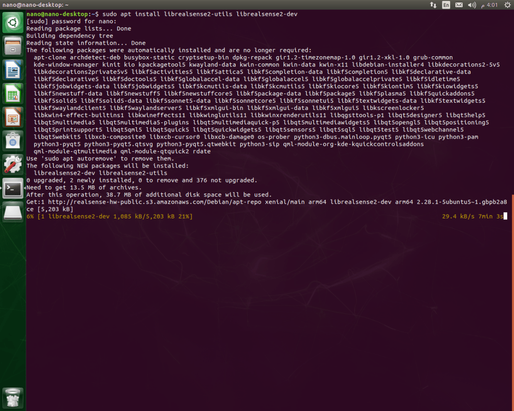
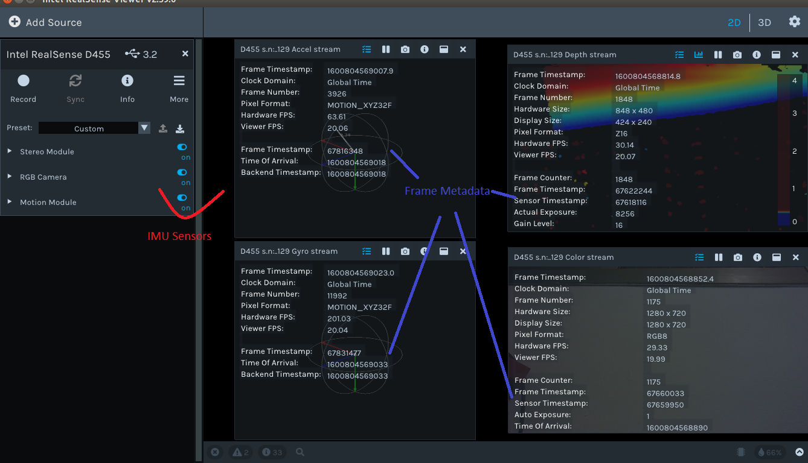

# NVidia Jetson Devices

**NOTE**: See [support-matrix.md](./support-matrix.md) to learn more about Jetson support for RealSense devices.

> Check out [www.jetsonhacks.com](http://www.jetsonhacks.com/) for great content on everything Jetson! (not affiliated with Intel RealSense)

## Getting started

### 1. Prerequisites

* NVIDIA® **Jetson Nano™**, **Jetson TX2™** and **Jetson AGX Xavier™** board (may also work on other Jetson devices)
* RealSense **D415**, **D435**, **D435i**, **D455**, **L515**, **SR300** and **T265** Camera devices.

### 2. Establish Developer's Environment

Follow [official instructions](https://developer.nvidia.com/embedded/learn/getting-started-jetson) to get your board ready. This guide will assume you are using **NVIDIA® L4T Ubuntu 16.04/18.04** image. Note that in most cases it is necessary to install a toll named "SDK Manager" to flash and install **Jetson** boards with both the L4T (Linux for Tegra) and NVIDIA-specific software packages (CUDA, Tensor Flow, AI, etc.)
For **Jetson Nano™** we strongly recommend enabling the Barrel Jack connector for extra power (See [jetsonhacks.com/jetson-nano-use-more-power/](https://www.jetsonhacks.com/2019/04/10/jetson-nano-use-more-power/) to learn how)


### 3. Choose LibRealSense SDK Backend

Librealsense2 SDK supports two API for communication with RealSense device on Linux platforms:

1. Linux native kernel drivers for UVC, USB and HID (Video4Linux and IIO respectively)
2. Using `RSUSB` - user-space implementation of the UVC and HID data protocols, encapsulated and activated by selecting the SDK's `-DFORCE_RSUSB_BACKEND` flag (a.k.a. `-DFORCE_LIBUVC` with SDK versions prior to v.2.30).  

When the second method is selected Librealsense2 communicates with the devices using the standard USB driver, while the higher-level protocols  (UVC/HID) stacks are compiled directly into the SDK.
Currently the two interfaces are mutually-exclusive, thus the choice taken during the SDK configuration stage (CMakes) predefines the selected backend API.

As a general rule it is recommended to use the native kernel drivers, especially in production environment.
The second method augments the native installation and allows for a fully-functional SDK deployment at the expense of certain performance and functional limitations (e.g. multi-cam).
The list of requirements for the second method comprise of a basic USB driver and GCC compiler, thus making it attractive for prototyping and demos in new/previously-unsupported environments.

If that's the case, what is the dilemma?

In order to enable the full capabilities of RealSense devices certain modifications in the kernel (driver) modules shall be applied, such as support of Depth-related streaming formats and access to per-frame metadata attributes. There is a small set of generic kernel changes that are mostly retrofitted with more advanced kernel versions aimed at improving the overall drivers stability.

NVIDIA's L4T delivers an Ubuntu-based distribution with a customized kernel based on version 4.9. The way the kernel is configured and deployed is different from a desktop Ubuntu image with two notable differences being the list of kernel modules included in default configuration and the way a new image is flashed.

And while it is possible to rebuild and flash a new kernel image the procedure can be perceived as challenging and shall be performed with extra caution.
This guide comes with a script that allows to modify the kernel modules with Librealsense2-related patches without replacing the kernel image. The script has been verified with **Jetson AGX Xavier™** board using L4T versions 4.2.3, 4.3 and 4.4 (Sept 2020). Scroll to the end of the guide for details.

### 4. Install with Debian Packages

Note that this method provides binary installation compiled using the `-DFORCE_RSUSB_BACKEND=true` option elaborated above.

1. Register the server's public key:

    ```sh
    sudo apt-key adv --keyserver keyserver.ubuntu.com --recv-key F6E65AC044F831AC80A06380C8B3A55A6F3EFCDE || sudo apt-key adv --keyserver hkp://keyserver.ubuntu.com:80 --recv-key F6E65AC044F831AC80A06380C8B3A55A6F3EFCDE
    ```

  > In case the public key cannot be retrieved, check and specify proxy settings: `export http_proxy="http://<proxy>:<port>"`, and rerun the command. See additional methods in the following [link](https://unix.stackexchange.com/questions/361213/unable-to-add-gpg-key-with-apt-key-behind-a-proxy).  


2. Add the server to the list of repositories:

    ```sh
    sudo add-apt-repository "deb https://librealsense.intel.com/Debian/apt-repo $(lsb_release -cs) main" -u
    ```

3. Install the SDK:

    ```sh
    sudo apt-get install librealsense2-utils
    sudo apt-get install librealsense2-dev
    ```

    

    With `librealsense2-dev` package installed, you can compile an application with **librealsense** using `g++ -std=c++11 filename.cpp -lrealsense2` or an IDE of your choice. To get started with RealSense using **CMake** check out [librealsense/examples/cmake](https://github.com/IntelRealSense/librealsense/tree/master/examples/cmake)

4. Reconnect the RealSense device and run the following to verify the installation: `realsense-viewer`


You can also double-TAB after typing `rs-` to see the full list of SDK examples.

## Building from Source using **RSUSB** Backend

⮕ Use the RSUSB backend without the kernel patching

* In order to build the SDK using the `RSUSB` method and avoid the kernel patching procedure, please refer to [libuvc_installation.sh](https://github.com/IntelRealSense/librealsense/blob/master/scripts/libuvc_installation.sh) script for details. If you have CUDA dev-kit installed, don't forget to add `-DBUILD_WITH_CUDA=true` for optimal performance.

## Building from Source using **Native** Backend

⮕ Use the V4L Native backend by applying the kernel patching

The method was verified with **Jetson AGX** boards with JetPack **4.2.3**[L4T 32.2.1,32.2.3], **4.3**[L4T 32.3.1], **4.4**[L4T 32.4.3] and **4.5.1**[L4T 32.5.1].

The method has not yet been verified on the **Jetson Nano** board.

* **Prerequisite**

  * Verify the board type and Jetpack versions compatibility.  
  * Verify internet connection.  
  * Verify the available space on flash, the patching process requires **~2.5Gb** free space  
    >df -h
  * Configure the Jetson Board into Max power mode (desktop -> see the upper right corner)  
  * Disconnect attached USB/UVC cameras (if any).  

* **Build and Patch Kernel Modules for Jetson L4T**

  * Navigate to the root of libreansense2 directory.  
  * Run the script (note the ending characters - `L4T`)

    ```sh
    ./scripts/patch-realsense-ubuntu-L4T.sh  
    ```

  * The script will run for about 30 minutes depending on internet speed and perform the following tasks:

    a. Fetch the kernel source trees required to build the kernel and its modules.  
    b. Apply Librealsense-specific kernel patches and build the modified kernel modules.  
    c. Try to insert the modules into the kernel.

    

* **Build librealsense2 SDK**  
  
  * Navigate to the SDK's root directory.  
  * Follow the [Ubuntu installation guide](./installation.md) to install the missing components and configuration items:

    ```sh
    sudo apt-get install git libssl-dev libusb-1.0-0-dev libudev-dev pkg-config libgtk-3-dev -y
    ./scripts/setup_udev_rules.sh  
    mkdir build && cd build  
    cmake .. -DBUILD_EXAMPLES=true -DCMAKE_BUILD_TYPE=release -DFORCE_RSUSB_BACKEND=false -DBUILD_WITH_CUDA=true && make -j$(($(nproc)-1)) && sudo make install
    ```

  The CMAKE `-DBUILD_WITH_CUDA=true` flag assumes CUDA modules are installed. If not, please reconnect the board to the Ubuntu Host PC and use NVIDIA `SDK Manager` tool to install the missing components.

* **Connect Realsense Device, run `realsense-viewer` and inspect the results**


