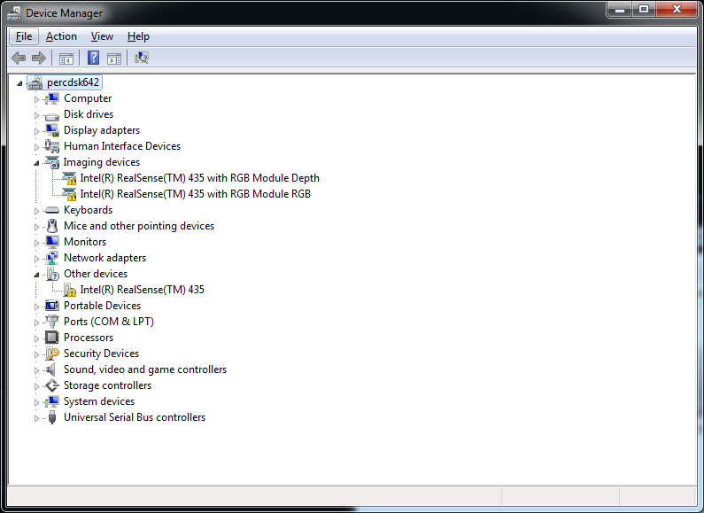
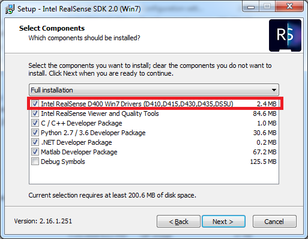
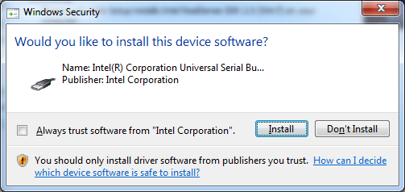

# Windows 7 Installation

> **Note:** Intel RealSense products are being regularly validated and receive official support for Windows 10 and Linux eco-systems. Not all product features are enabled on Windows 7. 

> We are constantly expanding the list of supported platforms, devices and features based on customer and community feedback. If your use case is not yet covered, please open [a new issue](https://github.com/IntelRealSense/librealsense/issues/new)

## Getting Started

1. Download [Intel RealSense SDK Installer for Windows 7](https://github.com/IntelRealSense/librealsense/releases/download/v2.16.1/Intel.RealSense.SDK.Win7.exe)
2. Connect the camera (the device must be connected to install the driver)
3. Check the device manager:  
> Out of the box Windows 7 will not recognize the D4xx cameras using the inbox driver. 
4. Run the installer and make sure to check **Win7 Drivers**: 

5. The installer will prompt to install the driver. This is a one-time step: 

## Supported Devices:
1. Intel(R) RealSense(TM) D410 Module
2. Intel(R) RealSense(TM) D415 Camera
3. Intel(R) RealSense(TM) D430 Module
4. Intel(R) RealSense(TM) D435 Camera

## Known Limitations:
1. Multiple cameras are likely not to work at the moment (not validated)

## Building from Source
The binaries supporting Win7 differ from ones supporting Win10. When building on Win7, CMake will automatically generate binaries for Win7. 
You can also build for Win7 from Win10 by adding `-DFORCE_WINUSB_UVC=true` to CMake flags.
Signed drivers are still required when building from source (can be extracted from the Win7 installer and freely redistributed)
