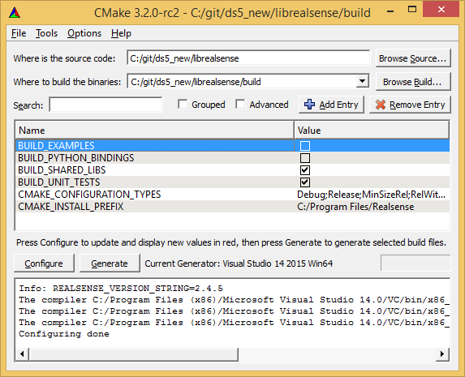

# Windows 8.1 & Windows 10 Installation

**Note:** Due to the USB 3.0 translation layer between native hardware and virtual machine, the librealsense team does not recommend or support installation in a VM.

librealsense can be compiled on Windows using CMake and Visual Studio 2015:

Don't forget to check `BUILD_EXAMPLES` if you wish to use librealsense samples.

**Note:** When working on Windows 8.1, make sure you have [KB3075872](https://support.microsoft.com/en-us/kb/3075872) and [KB2919355](https://support.microsoft.com/en-us/kb/2919355) installed. These patches are addressing issues with 8.1 video drivers, resolved in Windows 10.
