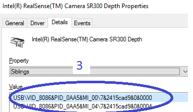
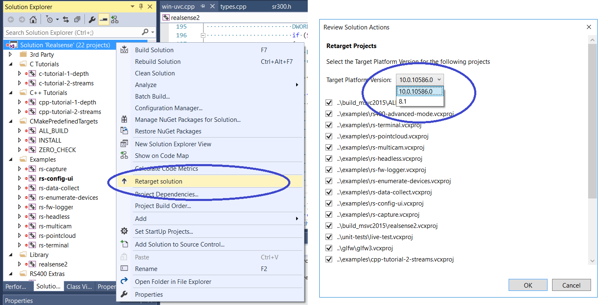

# Windows 8.1 & Windows 10 Installation

**Note:** Due to the USB 3.0 translation layer between native hardware and virtual machine, the librealsense team does not recommend or support installation in a VM.

librealsense shall be built on Windows using CMake and Visual Studio 2015:  
(MSVC2013 and older are not compatible with the C++11 features set).

Don't forget to check `BUILD_EXAMPLES` if you wish to use librealsense samples.

### Enabling per-frame metadata:
Prerequisites:
-  Metadata support is available starting with Windows 10 build 1607 (RedStone1)
- WinSDK ver 10 (10.0.15063)
- A Registry key for metadata buffering shall be manually created.  

#### Installation:
- Verifying OS version:
 - Run "winver" command from desktop/terminal - "Version 1607" or later is expected.  
 

- Installing WinSDK ver10:
 - Navigate to "Control Panel" -> "Programs and Features"
 - Double-click on "Microsoft Visual Studio" and select "Modify"
 - Check that SDK version 10.0.10586 or later is present, install if needed:    
 

- Registering Intel® RealSense™ device for metadata:
Windows OS requires a dedicated registry entry to be present for each unique video device in order to provide metadata support
  - Connect Intel® RealSense™ device to the host
  - Navigate to "Control Panel" -> "Device Manager"
  - Browse for Intel® RealSense™ devices
  - Select the first device from the list, e.g. `Intel® RealSense™ Camera SR300 Depth` (Step 1)
  - Find its path (Step 2) and additional interfaces (Step 3)

    
    
  - Modify Registry
    - For each interface (Steps 2 and 3) perform
      - Using Registry Editing tool such as "regedit" navigate to	`HKLM\SYSTEM\CurrentControlSet\Control\DeviceClasses\{e5323777-f976-4f5b-9b55-b94699c46e44}` branch (Step 1)
      - Browse into the subdirectory with the name identical to the `Device instance path` obtained from the previous step
      - Expand the entry into `#GLOBAL` -> `Device Parameters` (Step 2)
      - Add `DWORD 32bit` value named `MetadataBufferSizeInKB0` with value 4 (Step 3)
        

      - Repeat the last two steps for   
      `HKLM\SYSTEM\CurrentControlSet\Control\DeviceClasses\{65E8773D-8F56-11D0-A3B9-00A0C9223196}` branch
- Repeat the procedure for all the additional RealSense devices (e.g `Intel® RealSense™ Camera SR300 RGB`)

#### Compilation:

During compilation the library will automatically detect and enable/disable metadata functionality according to the WinSDK version selected.
In case the active WinSDK doesn't provide for metadata, the compilation will complete successfully, but the user will be notified that the build does not include metadata.
The user may alter the policy and require that the metadata block will be always included regardless of the active WinSDK by enabling `ENFORCE_METADATA` Cmake option.
When set, the compiler will check for target platform version, and actively interrupt the build if the found version is below 10.0.10586.

When WinSDK10 is installed, CMake will automatically create MSVC project files targeted for the active platform (WinSDK8.1/10). In case it fails to select the required version correctly, it can be manually altered by retargetting the solution for the proper WinSDK version:

## Additional Info
**Note:** When working on Windows 8.1, make sure you have [KB3075872](https://support.microsoft.com/en-us/kb/3075872) and [KB2919355](https://support.microsoft.com/en-us/kb/2919355) installed. These patches are addressing issues with 8.1 video drivers, resolved in Windows 10.
