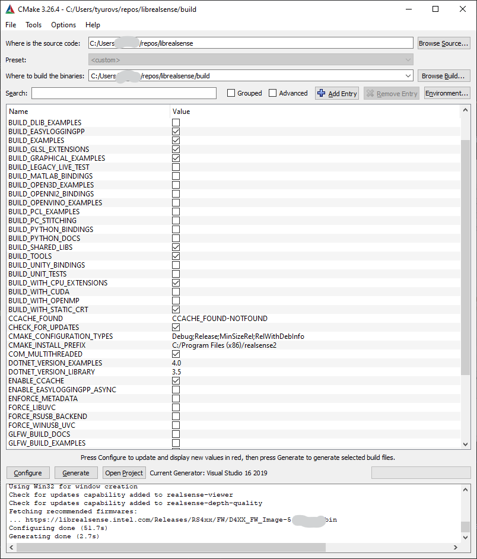

# Windows 8.1 & Windows 10 Installation

**Note:** Due to the USB 3.0 translation layer between native hardware and virtual machine, the librealsense team does not recommend or support installation in a VM.

librealsense shall be built on Windows using [CMake](https://cmake.org/download/) and Visual Studio 2015 / 2017:  
(MSVC2013 and older are not fully compatible with the C++11 feature-set).

![link text][Win_cmake_image]

Don't forget to check `BUILD_EXAMPLES` if you wish to use librealsense samples.

## Windows 8.1:
When working on Windows 8.1, make sure you have [KB3075872](https://support.microsoft.com/en-us/kb/3075872) and [KB2919355](https://support.microsoft.com/en-us/kb/2919355) installed. These patches are addressing issues with 8.1 video drivers, resolved in Windows 10.

## Enabling metadata on Windows
Metadata attributes is an advanced capability provided by librealsense.
Read more on this feature in [link](./frame_metadata.md).  
Follow the instructions to enable metadata generation:  

Prerequisites:
- Windows 10 with administrator login.
- WinSDK ver 10 (10.0.15063)

#### Installation:
- Verify OS version:
 - Run `winver` command from desktop/terminal - "Version 1607" or later is expected.  
 

- Install WinSDK ver10:
 - Navigate to "Control Panel" -> "Programs and Features"
 - Double-click on "Microsoft Visual Studio" and select "Modify"
 - Check that SDK version 10.0.10586 or later is present, install if needed:
 

- Windows OS requires a dedicated registry entry to be present for each unique video device in order to provide metadata support:
  - Connect Intel® RealSense™ device to the host
  - Navigate to "Control Panel" -> "Device Manager"
  - Browse for Intel® RealSense™ devices
  - Select the first device from the list, e.g. `Intel® RealSense™ Camera SR300 Depth` (Step 1)
  - Find device's path (Step 2) and the additional interfaces (Step 3)

    
    
- Modify Windows Registry:
  - For each interface (Steps 2 and 3) perform
    - Using Registry Editing tool such as "regedit" navigate to	`HKLM\SYSTEM\CurrentControlSet\Control\DeviceClasses\{e5323777-f976-4f5b-9b55-b94699c46e44}` branch (Step 1)
    - Browse into the subdirectory with the name identical to the `Device instance path` obtained from the previous step
    - Expand the entry into `#GLOBAL` -> `Device Parameters` (Step 2)
    - Add `DWORD 32bit` value named `MetadataBufferSizeInKB0` with value 4 (Step 3)  
        

    - Repeat the last two steps for   
      `HKLM\SYSTEM\CurrentControlSet\Control\DeviceClasses\{65E8773D-8F56-11D0-A3B9-00A0C9223196}` branch
- Repeat the procedure for all the additional RealSense devices (e.g. `Intel® RealSense™ Camera SR300 RGB`)

#### Compiling Librealsense with Metadata support:
During compilation the library will automatically detect and enable/disable metadata functionality according to the WinSDK version selected.
In case the installed WinSDK doesn't expose metadata the user will be notified that the build does not include metadata generation:  
`Librealsense notification: Featuring UVC Metadata requires WinSDK 10.0.10586.0 toolset.  
The library will be compiled without the metadata support!`

In order to ensure compilation with metadata support check the  `ENFORCE_METADATA` in the [Cmake configuration stage](#cmake_snapshot_win).
When set, the compiler will check the target WinSDK version, and abort the build if it is not compatible with metadata requirements.

**Note** In case of multiple WinSDK version installed, CMake automatically selects the latest version of SDK. In some cases, however, the automatic selection may fail. Then you need to manually retarget the solution for the proper WinSDK version:  

