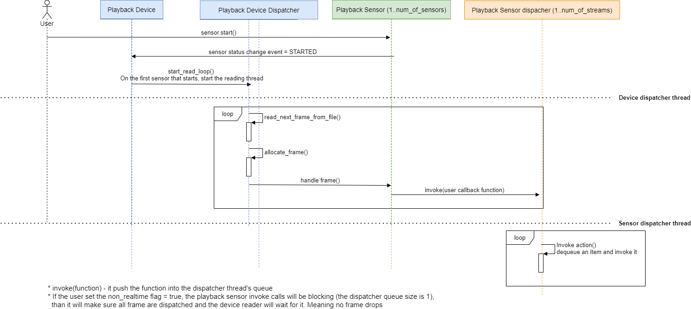

# Playback

`librealsense2` supports playback of frames from rosbag files.
Here you can find the flow of the function calls from the moment the user asked to start the playback until frames are received.

*Note: this flow uses the sensor API; `librealsense2` supports playback with the pipeline API as well, which looks similar inside the playback device.*

## Software Design and Implementation
The library's approach for playback is that a `playback_device` is in charge of reading the frames from the file and distributes them to each of the recorded `playback_sensor` objects.

The reading of the file, as well as each sensor's handling of frames, are done in separate threads. All this is managed via a common `dispatcher` concurrency mechanism: an `invoke()` call enqueues an `action` and is dequeued and run from a worker thread.

## Sequence Diagram

*Created using  [DrawIO](https://app.diagrams.net/)

