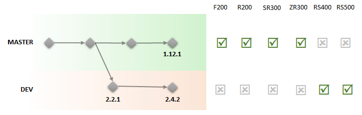

# RS400 Software Support Model

## Overview

Starting with the RS400 RealSense camera, Intel Perceptual Computing group is introducing a number of changes to the RealSense™ Cross-Platform API:
* Software support for RealSense™ will be split between two coexisting lineups of releases: librealsense 1.x and librealsense 2+.
* librealsense 1.x will continue to provide support for the following generations of RealSense devices: F200, R200 and ZR300.
* librealsense 2+ will support the next generation of RealSense devices, starting with the RS400.


## API Changes

librealsense2 brings number of improvements and new capabilities which are incompatible with older RealSense devices.

### Streaming API
* librealsense2 provides more flexible interface for frames acquisition. Instead of a single `wait_for_frames` loop, the API is based on callbacks and queues:
```cpp
// Configure queue of size one and start streaming frames into it
rs2::frame_queue queue(1);
dev.start(queue);
// This call will block until new frame will become available
auto frame = queue.wait_for_frame();
auto pixels = frame.get_data(); // pointer to frame data
```
* The same API can be used in a slightly different way for **low-latency** applications:
```cpp
// Configure direct callback for new frames:
dev.start([](rs2::frame frame){
    auto pixels = frame.get_data(); // pointer to frame data
});
// The application will get notified
// as soon as new frame will become available.
```
This approach allows users to bypass buffering and synchronization that was done by `wait_for_frames`.

*  Users who do need to synchronize between different streams can take advantage of the `rs2::syncer` class:
```cpp
auto sync = dev.create_syncer();
dev.start(sync);
// The following call will block until next coherent set of frames
// based on frame timestamp
auto frames = sync.wait_for_frames();
for (auto&& frame : frames)
{
    auto pixels = frame.get_data(); // pointer to frame data
}
```
* Unlike `wait_for_frames`, new API is **thread-safe** by design. You can safely pass `rs::frame` object to a background thread. This is done without copying the frame data and without extra dynamic allocations.

### Multi-streaming model

librealsense2 gets rid of arbitrary limitations imposed by previous versions with regards to multi-streaming.
* Multiple applications can use librealsense2 simultaneously, as long as no two users try to stream from the same camera endpoint. In practice, this means that you can:
  1. Stream multiple cameras within a single process.
  2. Stream camera A from one process and camera B from another process.
  3. Stream depth from camera A from one process while streaming fisheye / motion from the same camera from another process.
  4. Stream camera A from one process while issuing controls to camera A from another process.
* The following streams of the RS400 act as independent endpoints: Depth, Fisheye, Motion-tracking, Color.
* Each endpoint can be exclusively locked using `open/close` methods:
```cpp
// Configure depth to run at VGA resolution at 30 frames per second
dev.open({ RS2_STREAM_DEPTH, 640, 480, 30, RS2_FORMAT_Z16 });
// From this point on, device streaming is exclusively locked.
dev.close(); // Release device ownership
```
* Alternatively, users can use `rs2::util::config` helper class to configure multiple endpoints at once:
```cpp
rs2::util::config config;
// Declare your preferences
config.enable_all(rs2::preset::best_quality);
// Let the config object resolve it to concrete camera capabilities
auto stream = config.open(dev);
stream.start([](rs2::frame) {});
```

## Motion-tracking
Motion-tracking is a first-class citizen in librealsense2. Motion data can be acquired using the same APIs as depth and visual data:
```cpp
// Configure the accelerometer to run at 500 frames per second
dev.open({ RS2_STREAM_ACCEL, 0, 0, RS2_FORMAT_MOTION_XYZ32F, 500 });
rs2::frame_queue queue(1);
dev.start(queue);
// Wait for next motion sample
auto frame = queue.wait_for_frame();
auto data = frame.get_data();
auto axes = *(reinterpret_cast<const float3*>(data));
std::cout << axes.x << "," << axes.y << "," <<  axes.z << "\n";
```
`rs2::util::config` and `rs2::syncer` can work with motion streams as well.

## New Functionality

* librealsense2 will be shipped with built-in Python bindings for easier integration.
* New troubleshooting tools are now part of the package, including a tool for hardware-logs collection.
* librealsense2 is capable of handling device disconnects and discovery of new devices at runtime.

## Transition to CMake
librealsense2 will no longer provide hand-written Visual Studio, QT-Creator and XCode project files. Instead you can build librealsense with the IDE of your choice using portable CMake scripts.  

## RS400 and the Linux Kernel

* RS400 series does not require any kernel patches for streaming (starting with kernel 4.4.0.59)
* Advanced camera features may still require kernel patches. Currently, getting **hardware timestamps** is dependent on a patch that has not been up-streamed yet. When not applied you can still use the camera, but you are going to receive system-time instead of optical timestamp.
