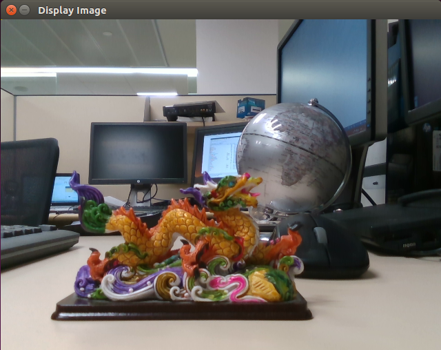
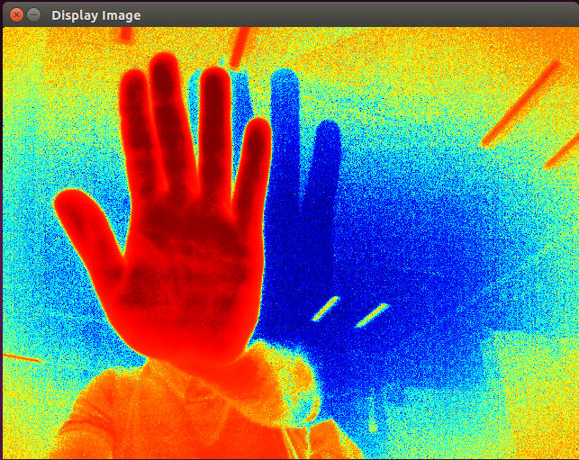

# Getting Started with OpenCV

## Displaying Color Frame

In this demo, you will acquire color frame from the RealSense camera and display it using OpenCV.
Before you start, make sure you have librealsense and OpenCV installed and working properly on your system.
Using the editor of your choice create BGR_sample.cpp and copy-paste the following code-snippet:

```cpp
// include the librealsense C++ header file
#include <librealsense2/rs.hpp>

// include OpenCV header file
#include <opencv2/opencv.hpp>

using namespace std;
using namespace cv;

int main()
{
    //Contruct a pipeline which abstracts the device
    rs2::pipeline pipe;

    //Create a configuration for configuring the pipeline with a non default profile
    rs2::config cfg;

    //Add desired streams to configuration
    cfg.enable_stream(RS2_STREAM_COLOR, 640, 480, RS2_FORMAT_BGR8, 30);

    //Instruct pipeline to start streaming with the requested configuration
    pipe.start(cfg);

    // Camera warmup - dropping several first frames to let auto-exposure stabilize
    rs2::frameset frames;
    for(int i = 0; i < 30; i++)
    {
        //Wait for all configured streams to produce a frame
        frames = pipe.wait_for_frames();
    }

    //Get each frame
    rs2::frame color_frame = frames.get_color_frame();

    // Creating OpenCV Matrix from a color image
    Mat color(Size(640, 480), CV_8UC3, (void*)color_frame.get_data(), Mat::AUTO_STEP);

    // Display in a GUI
    namedWindow("Display Image", WINDOW_AUTOSIZE );
    imshow("Display Image", color);

    waitKey(0);

    return 0;
}
```

Compile and run the application from terminal using the following command line:

```shell
g++ -std=c++11 BGR_sample.cpp -lrealsense2 -lopencv_core -lopencv_highgui -o BGR && ./BGR
```

**Result:**




## Displaying Infrared Frame

Displaying Infrared and Depth data is not very different from Color data. Infrared frame is a single channel, 8 bits-per-pixel image.
Copy the following code snippet into IR_sample.cpp:

```cpp
// include the librealsense C++ header file
#include <librealsense2/rs.hpp>

// include OpenCV header file
#include <opencv2/opencv.hpp>

using namespace std;
using namespace cv;

int main()
{
    //Contruct a pipeline which abstracts the device
    rs2::pipeline pipe;

    //Create a configuration for configuring the pipeline with a non default profile
    rs2::config cfg;

    //Add desired streams to configuration
    cfg.enable_stream(RS2_STREAM_INFRARED, 640, 480, RS2_FORMAT_Y8, 30);
    cfg.enable_stream(RS2_STREAM_DEPTH, 640, 480, RS2_FORMAT_Z16, 30);

    //Instruct pipeline to start streaming with the requested configuration
    pipe.start(cfg);

    // Camera warmup - dropping several first frames to let auto-exposure stabilize
    rs2::frameset frames;
    for(int i = 0; i < 30; i++)
    {
        //Wait for all configured streams to produce a frame
        frames = pipe.wait_for_frames();
    }

    //Get each frame
    rs2::frame ir_frame = frames.first(RS2_STREAM_INFRARED);
    rs2::frame depth_frame = frames.get_depth_frame();

    // Creating OpenCV matrix from IR image
    Mat ir(Size(640, 480), CV_8UC1, (void*)ir_frame.get_data(), Mat::AUTO_STEP);

    // Apply Histogram Equalization
    equalizeHist( ir, ir );
    applyColorMap(ir, ir, COLORMAP_JET);

    // Display the image in GUI
    namedWindow("Display Image", WINDOW_AUTOSIZE );
    imshow("Display Image", ir);

    waitKey(0);

    return 0;
}
```

Compile and run the program from the terminal, with the following command:

```shell
g++ -std=c++11 IR_sample.cpp -lrealsense2 -lopencv_core -lopencv_imgproc -lopencv_highgui -o ir && ./ir
```

**Result :**


