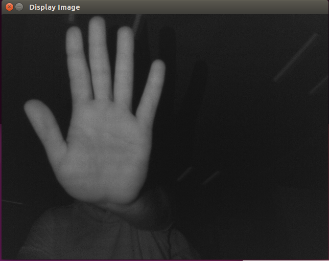
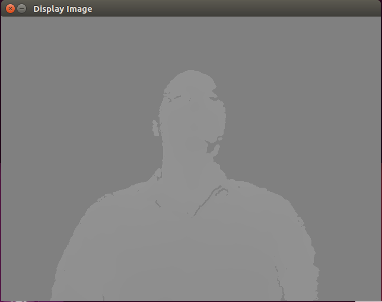

# Sample Applications

The following samples application have been provided:
* [Presenting a BGR Image](#Presenting-a-BGR-Image)
* [Presenting an Infrared Image](#Presenting-an-Infrared-Image)
*	[Presenting a Depth Image](#Presenting-a-Depth-Image)
* [Play Color Streaming](#Play-Color-Streaming)

## Presenting a BGR Image

The following is an implementation of a simple application, BGR_sample.cpp, which uses OpenCV installed on Ubuntu 16.04, to present a BGR image.
The librealsense_sample application does the following:
1. Creates the device context.
2. Configures a BGR stream request.
3. Receives a frame from the device and displays it with OpenCV.

Do not forget to include OpenCV and librealsense headers!

```cpp
// include the librealsense C++ header file
#include <librealsense/rs.hpp>

// include OpenCV header file
#include <opencv2/opencv.hpp>

using namespace std;
using namespace cv;

int main()
{
    // Create a context object. This object owns the handles to all connected realsense devices.
    rs::context ctx;

    // access a single device (it is trivial to extend access to multiple devices)
    rs::device * dev = ctx.get_device(0);

    // Configure Infrared stream to run at VGA resolution at 30 frames per second
    dev->enable_stream(rs::stream::color, 640, 480, rs::format::bgr8, 30);

    // Start device
    dev->start();

    // Camera warmup - Dropped frames to allow stabilization
    for(int i = 0; i < 30; i++)
       dev->wait_for_frames();

    // Creating OpenCV Matrix from BGR image
    Mat color(Size(640, 480), CV_8UC3, (void*)dev->get_frame_data(rs::stream::color), Mat::AUTO_STEP);

    // Display in GUI
    namedWindow("Display Image", WINDOW_AUTOSIZE );
    imshow("Display Image", color);

    waitKey(0);

    return 0;
}
```


After the app is ready, compile and run from terminal with the following command :

```shell
g++ -std=c++11 BGR_sample.cpp -lrealsense –lopencv_core -lopencv_highgui -o BGR && ./BGR
```

**Result:**


## Presenting an Infrared Image

The following is an example of a simple application, IR_sample.cpp, which uses OpenCV installed on Ubuntu 16.04, to present an infrared (IR) image.
The application does the following:
1. Creates the device context.
2. Configures IR and depth streams.
3. Receives an IR image from the device and displays it with OpenCV.

```cpp
// include IO header
#include <iostream>

// include the librealsense C++ header file
#include <librealsense/rs.hpp>

// include OpenCV header file
#include <opencv2/opencv.hpp>

using namespace std;
using namespace cv;

int main()
{
    // Create a context object. This object owns the handles to all connected realsense devices.
    rs::context ctx;

    // access a single device (it is trivial to extend access to multiple devices)
    rs::device * dev = ctx.get_device(0);

    // Configure InfraRed stream to run at VGA resolution at 30 frames per second
    dev->enable_stream(rs::stream::infrared, 640, 480, rs::format::y8, 30);

    // We must configure depth stream in order to IR stream run properly
    dev->enable_stream(rs::stream::depth, 640, 480, rs::format::z16, 30);

    // Start device
    dev->start();

    // Camera warmup - Dropped frames to allow stabilization
    for(int i = 0; i < 40; i++)
    dev->wait_for_frames();

    // Creating OpenCV matrix from IR image
    Mat ir(Size(640, 480), CV_8UC1, (void*)dev->get_frame_data(rs::stream::infrared), Mat::AUTO_STEP);

    // Display image
    namedWindow("Display Image", WINDOW_AUTOSIZE );
    imshow("Display Image", ir);

    waitKey(0);

    return 0;
}
```

Compile and run the program from the terminal, with the following command:

```shell
g++ -std=c++11 IR_sample.cpp -lrealsense -lopencv_core -lopencv_omgproc -lopencv_contrib -o ir && ./ir
```


**Result :**



Optional:  Add  the ```applyColorMap```  option to code to present image with colors, as follows:
```cpp
// include IO header
#include <iostream>

// include the librealsense C++ header file
#include <librealsense/rs.hpp>

// include OpenCV header file
#include <opencv2/opencv.hpp>

using namespace std;
using namespace cv;

int main()
{
    // Create a context object. This object owns the handles to all connected realsense devices.
    rs::context ctx;

    // access a single device (it is trivial to extend access to multiple devices)
    rs::device * dev = ctx.get_device(0);

    // Configure InfraRed stream to run at VGA resolution at 30 frames per second
    dev->enable_stream(rs::stream::infrared, 640, 480, rs::format::y8, 30);

    // We must configure depth stream in order to IR stream run properly
    dev->enable_stream(rs::stream::depth, 640, 480, rs::format::z16, 30);

    // Start device
    dev->start();

    // Camera warmup - Dropped frames to allow stabilization
    for(int i = 0; i < 40; i++)
    dev->wait_for_frames();

    // Creating OpenCV matrix from IR image
    Mat ir(Size(640, 480), CV_8UC1, (void*)dev->get_frame_data(rs::stream::infrared), Mat::AUTO_STEP);

    // Apply Histogram Equalization
    equalizeHist( ir, ir );
    applyColorMap(ir, ir, COLORMAP_JET);

    // Display image
    namedWindow("Display Image", WINDOW_AUTOSIZE );
    imshow("Display Image", ir);

    waitKey(0);

    return 0;
}
```


**Result :**


## Presenting a Depth Image

Below is an example of a simple application, Depth_sample.cpp, which uses OpenCV installed on Ubuntu 16.04, to present Depth image.
The application does the following:
1. Creates the device context.
2. Configures the depth stream.
3. Receives a depth image from the device and displays it with OpenCV.

```cpp
// include IO header
#include <iostream>

// include the librealsense C++ header file
#include <librealsense/rs.hpp>

// include OpenCV header file
#include <opencv2/opencv.hpp>

using namespace std;
using namespace cv;

int main()
{
    // Create a context object. This object owns the handles to all connected realsense devices.
    rs::context ctx;

    // access a single device (it is trivial to extend access to multiple devices)
    rs::device * dev = ctx.get_device(0);

    // Configure Depth stream to run at VGA resolution at 60 frames per second
    dev->enable_stream(rs::stream::depth, 640, 480, rs::format::z16, 30);

    // Start device
    dev->start();

    // Camera warmup - Drop frames to allow stabilization
    for(int i = 0; i < 40; i++)
    dev->wait_for_frames();

    // Creating OpenCV matrix from depth image    
    Mat depth(Size(640, 480), CV_16SC1, (void*)dev->get_frame_data(rs::stream::depth), Mat::AUTO_STEP);

    // Stretch Image  
    depth = (depth * dev->get_depth_scale()) * 0x1FFF;

    // Display Image
    namedWindow("Display Image", WINDOW_AUTOSIZE );
    imshow("Display Image", depth);

    waitKey(0);

    return 0;
}
```

Compile and run the program with the following command:
```shell
g++ -std=c++11 Depth_sample.cpp -lrealsense -lopencv_core -lopencv_omgproc -lopencv_contrib -o dpt && ./dpt
```
**Result :**




## Play Color Streaming
The following is an implementation of simple application, stream.cpp, which uses OpenCV installed on Ubuntu 16.04, to play BGR stream.
The application does the following:
1. Creates the device context.
2. Configures a BGR stream.
3. Displays a series of continuous BGR frames from the device, using OpenCV.
4. The waitKey(1) function displays the image for a millisecond, before refreshing the display window.

```cpp
// First include the librealsense C++ header file
#include <librealsense/rs.hpp>

// include OpenCV header file
#include <opencv2/opencv.hpp>

using namespace std;
using namespace cv;

int main()
{
    // Create a context object. This object owns the handles to all connected realsense devices.
    rs::context ctx;

    // This tutorial will access only a single device, but it is trivial to extend to multiple devices
    rs::device * dev = ctx.get_device(0);

    // Configure all streams to run at VGA resolution at 60 frames per second
    dev->enable_stream(rs::stream::color, 640, 480, rs::format::bgr8, 60);

    // Start device
    dev->start();


    // Initilize display window
    namedWindow("Display Image", WINDOW_AUTOSIZE);

    while(true)
    {      
        // Wait for new frames to arrive
        dev->wait_for_frames();

	// Creating OpenCV Matrix from BGR image
        Mat color(Size(640, 480), CV_8UC3, (void*)dev->get_frame_data(rs::stream::color), Mat::AUTO_STEP);

	// Display Frame
        imshow("Display Image", color);
	waitKey(1);
    }

    dev->stop();
    return 0;
}
```


Compile and run the program with the following command:
```shell
g++ -std=c++11 stream.cpp -lrealsense -lopencv_core -lopencv_omgproc -lopencv_contrib -o stream && ./stream
```
