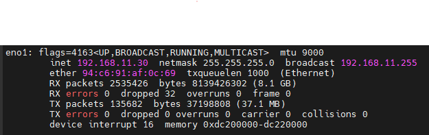

# Setting Ethernet packet size on host

When connecting to Ethernet cameras, using larger Ethernet packets, a.k.a jumbo packets, can reduce transmission time and allow for higher FPS.
On the other hand, when using multi-camera setup maximum size packets can burden the network hardware, such as switches, causing dropped frames.

RealSense Ethernet cameras, such as D555, allow users to set the desired packet size, giving users maximum flexibility in their setup.
Ideally, expected packet size on host should match packet size sent from the camera. In this guide we will show how to set it.

We recommend using 9000 byte packets setting, and it is also the factory setting for the D555 camera.

MTU stands for Maximum Transfer Unit, we may use this to indicate packet size.

Camera parameters can be set using [viewer](../../tools/realsense-viewer) or [rs-dds-config](../../tools/dds/dds-config/) tool.

## Windows

In **start menu** select **View network connections**.
Double click the adapter that is connected to the camera. This will open the **Status Menu**. Select **Properties**.

Select **Configure** and the **Advanced** tab.
Find **Jumbo Packet** property and choose the value best suiting you.

## Linux

In terminal type `ifconfig` and identify the adapter that is connected to the camera.
In this example *eno1*.
Type `sudo ifconfig eno1 mtu 9000` (replace eno1 with your adapter name and 9000 with your desired packet size)

