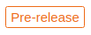
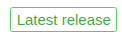

# Software Support Matrix

## Release Process

RealSense devices pass validation and stability cycles. Every firmware + librealsense release is going through several levels of validation, from automated unit-tests to longer validation cycles.  

After passing unit-tests and basic functional testing release is made available under [librealsense/releases](https://github.com/IntelRealSense/librealsense/releases) and marked as a .

Once full validation report is internally reviewed and approved, release is promoted to  and published at [www.intelrealsense.com/developers/](https://www.intelrealsense.com/developers/).

We recommend certain combinations (see **RECOMMENDED CONFIGURATIONS** at the link above) of firmware and software we have tested, but there is significant effort to keep maximum backward and forward compatibility between firmware and software versions.

Validation is done on x86 NUC machines running Windows 10 and Ubuntu 16.04 LTS.

Additional platforms are tested and supported on demand, driven by community requests and feedback.

## D400 Stereoscopic Depth Cameras' Features
Please check the Supported Features matrix at https://dev.intelrealsense.com/docs/sdk-knowledge-base

### SR300 Notes:

* Global Timestamp mechanism is not yet available for the SR300
* D400 JSON presets are not applicable to SR300 devices, since they rely on completely different technology
* Multicamera is technically supported similar to D400 but SR300 devices suffer from destructive interference, hence should not share field of view
* On-Chip Calibration is not applicable to the SR300 since the structured light module does not lose depth calibration over time

### T265 Tracking Module Notes:

* Tracking module is currently not available on Android
