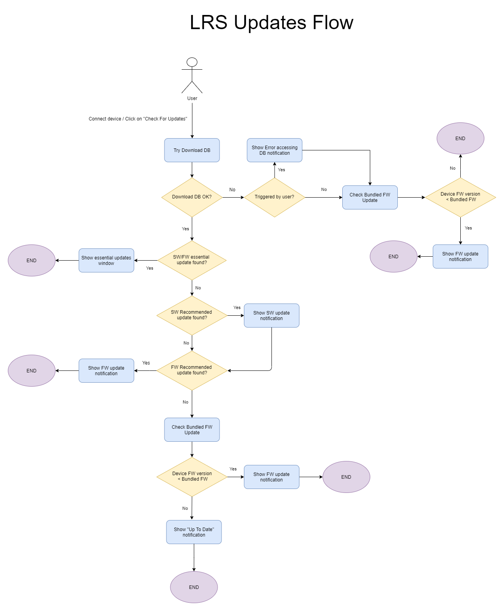

# Viewer tool SW/FW updates

The `librealsense Viewer` supports several ways of notifying the user that a software or firmware update is available.
Both manual (clicking the `Check for updates` button) and automatic (when connecting a new device) triggers are possible, and may or may not include online updates depending on how the Viewer was built.

## Online updates

The Viewer will try to download and query a versions database from the Internet and will create a version update notification based on the connected device's recommended version.

*The online versions database may be behind the [GitHub SW releases webpage](https://github.com/IntelRealSense/librealsense/releases) or [RealSense FW releases webpage](https://dev.intelrealsense.com/docs/firmware-updates).
We recommend checking those links for getting the latest released versions.

## Offline updates

`librealsense` also contains a fallback "bundled" recommended firmware version inside the compiled library.

When the device is in recovery mode and no suitable version can be found online (or no Internet access detected) the Viewer will notify the user to update the device firmware to a recommended version.

## Updates notifications logic flow

### Sequence Diagram

*Created using  [DrawIO](https://app.diagrams.net/)

