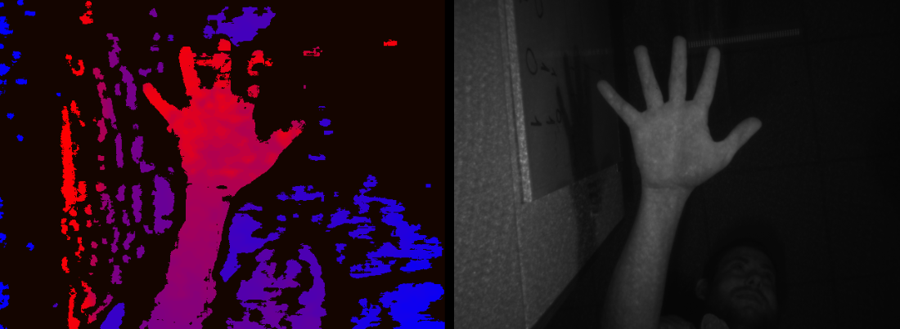

# What's New

## DS5 B0 Support

DS5 is the next generation in the family of Intel® RealSense™ cameras.
This branch will provide continuous support for everyone for all new features as they become available.

## Enabled functionality
Demos:
- cpp-tutorial-2-streaming
- cpp-config-ui

Supported stream types:
- Linux and Windows:
    - Depth
    - Left imager Infrared + UYVY
    - Depth + Infrared
    - Calibration profiles (Advanced Mode):
      - L/R Infrared Full HD unrectified
      - L/R Infrared rectified

Controls:
- Project Mode
- Projector Power
- Manual Exposure
- Manual Gain

Extrinsic and Intrinsic API

Camera Advanced Mode API

## Known Issues
- Camera often fails when changing stream configuration on Linux. Requires physical reconnection
- Stopping multiple stream configuration takes about two seconds.
