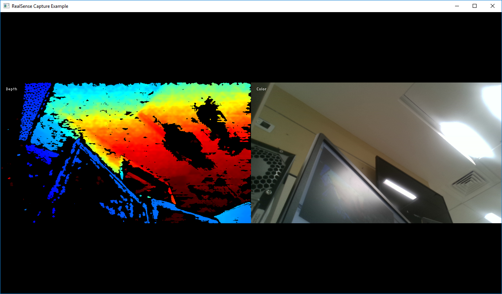

# rs-capture Sample

## Overview

This sample demonstrates how to configure the camera for streaming and render depth and RGB data to the screen. 
We will use OpenGL for cross-platform rendering and GLFW for window management. If you are using OpenCV, `imshow` is a good alternative. 

## Expected Output


## Code Overview 

We start by including Intel® RealSense™ Cross-Platform API. All but advanced functionality is provided through a single header:
```cpp
#include <librealsense2/rs.hpp> // Include RealSense Cross Platform API
```

Next, we include a [very short helper library](../example.hpp) for encapsulation of OpenGL rendering and window management:
```cpp
#include "example.hpp"          // Include short list of convenience functions for rendering
```

This header lets us easily open a new window and prepare textures for rendering. `texture` class is designed to hold video frame data for rendering. 
```cpp
// Create a simple OpenGL window for rendering:
window app(1280, 720, "RealSense Capture Example");
// Declare two textures on the GPU, one for color and one for depth
texture depth_image, color_image;
```

Our C++ API resides under the `rs2` namespace:
```cpp
using namespace rs2;
```

Depth data is provided as 10-bit grayscale values, which is not very useful for visualization. To overcome this, we offer an API to convert this grayscale image to RGB:
```cpp
// Declare depth colorizer for pretty visualization of depth data
colorizer color_map; 
```

The API entry point for SDK is the `pipeline` class:
```cpp
// Declare RealSense pipeline, encapsulating the actual device and sensors
pipeline pipe;
// Start streaming with default recommended configuration
pipe.start(); 
```

Next, we wait for the next set of frames, effectively blocking the program:
```cpp
auto data = pipe.wait_for_frames(); // Wait for next set of frames from the camera
```

Using the `frameset` object we look up the first depth frame in the set and the first color frame:
```cpp
auto depth = color_map(data.get_depth_frame()); // Find and colorize the depth data
auto color = data.get_color_frame();            // Find the color data
```

Finally, `texture` class from [example.hpp](../example.hpp) takes care of the rendering
```cpp
// Render depth on to the first half of the screen and color on to the second
depth_image.render(depth, { 0,               0, app.width() / 2, app.height() });
color_image.render(color, { app.width() / 2, 0, app.width() / 2, app.height() });
```
