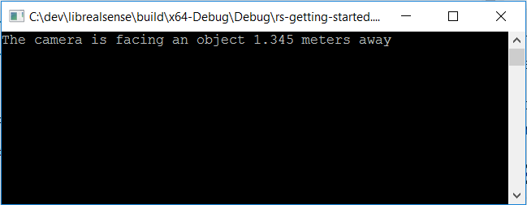

# Getting Started Example

## Overview

The Getting Started example is a self-contained project template that requires only librealsense headers and library without additional third party dependencies.

You can take this project as is, build and compile it in a separate directory and it should simply work and allow you to play with the code.

> Note that you must have Intel RealSense SDK 2.0 installed for this to successfully build
> 
## Expected Output

The application should open console and print a single line indicating the distance of the center pixel from the camera.

## How to start?

### Linux

>Note: This example assumes that `librealsense development` (headers and library) are installed.
, either using [`make && sudo make install`](../../doc/installation.md) or via [debian distribution](../../doc/distribution_linux.md)

1. Copy the `rs-getting-started` folder to your desired location
2. open terminal in your folder
3. run:
   - `mkdir build`
   - `cd build`
   - `cmake ../`
   - `make -j4`
   - `./rs-getting-started`

### Windows

>Note: This example assumes that `librealsense development` (headers and library) are installed via [windows installer](../../doc/distribution_windows.md).

> The [`CmakeLists.txt`](CmakeLists.txt) file contains cmake variables that should help Cmake find the library and headers.

1. Copy the `rs-getting-started` folder to your desired location
2. Open CmakeLists.txt file and update the following variables to the correct path:
   - `PROJECT_BINARY_OUTPUT` - The path to where the binaries of your project compile (used for post build script of copying the realsense2.dll)
3. open terminal in your folder
4. Build the example:
   - `mkdir build`
   - `cd build`
   - `cmake ../`
   - `make -j4`
5. If the `make` was successful then there should be an executable called `rs-getting-started` in the build folder (or a subfolder of that).
   Verify that `realsense2.dll` was copied next to the `rs-getting-started` you have just built.
   If it is not there, the cmake post build failed for some reason, to workaround this - simply manually copy the `realsense2.dll` next to the `rs-getting-started` you have just built.
6. Run: `./rs-getting-started`