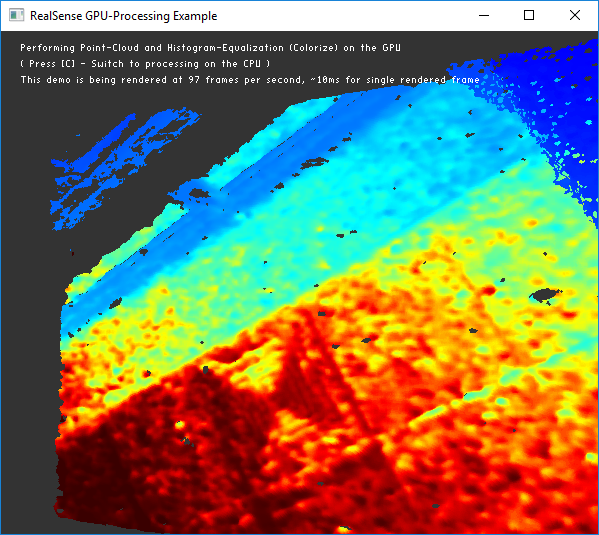

# rs-gl Sample

## Overview

> Due to driver limitations built-in GPU capabilities are not available at the moment on Mac-OS

This sample demonstrates how one could utilize the GPU for processing of depth data.

## Expected Output
The application should open a window with a pointcloud. Using your mouse, you should be able to interact with the pointcloud, rotating and zooming.

**In addition, you can switch between CPU / GPU processing mode and see the difference in FPS**



## Code Overview

In addition to core `realsense2` this example also depends on an auxiliary `realsense2-gl` library. 
This is not strictly part of core RealSense functionality, but rather a useful extension.

### Setup

To enable this functionality, in addition to standard `#include <librealsense2/rs.hpp>` you need to include:
```cpp
#include <librealsense2-gl/rs_processing_gl.hpp> // Include GPU-Processing API
```

> In order to allow texture sharing between processing and rendering application, `rs_processing_gl.hpp` needs to be included **after** including `GLFW`.

After defining some helper functions and `window` object, we need to initialize GL processing and rendering subsystems:
```cpp
// Once we have a window, initialize GL module
// Pass our window to enable sharing of textures between processed frames and the window
rs2::gl::init_processing(app, use_gpu_processing);
// Initialize rendering module:
rs2::gl::init_rendering();
```

When using GL-processing, resulting frames will be stored in GPU memory as an OpenGL texture.

These frames can still be tracked via regular `rs2::frame` objects. The fact that these frames reside on the GPU is transparent to the application. Once `get_frame_data()` on a GPU-frame gets called frame content will be copied to main memory.

> To maintain optimal performance, it is best to reduce copying data between main and GPU memory. Combining multiple GPU processing blocks together will ensure data is kept on the GPU, while mixing GPU and CPU processing blocks will create potentially costly copy operations. 

We define two frames for pointcloud and texture data:
```cpp
// Every iteration the demo will render 3D pointcloud that will be stored in points object:
rs2::points points;
// The pointcloud will use colorized depth as a texture:
rs2::frame  depth_texture;
```

Next, we define GL processing blocks:
```cpp
rs2::gl::pointcloud pc;         // similar to rs2::pointcloud
rs2::gl::colorizer  colorizer;  // similar to rs2::colorizer
rs2::gl::uploader   upload;     // used to explicitly copy frame to the GPU
```
`rs2::gl::pointcloud` and `rs2::gl::colorizer` behave exactly like their CPU counterparts.
`rs2::gl::upload` is a new processing block that is designed to convert regular frames into GPU-frames (copy data to the GPU).

If you don't use the `upload` block, the `pointcloud` and the `colorizer` will **both** implicitly copy depth frame to the GPU. 
Using `upload` explicitly lets you preemptively convert depth frame to a GPU-frame, saving future conversions. 

Next, we define a new type of processing-block that takes `rs2::points` object and renders it to the screen.
```cpp
rs2::gl::pointcloud_renderer pc_renderer; // Will handle rendering points object to the screen
```
Rendering blocks are designed to offer optimized common building blocks that take advantage of GPU processing. 

Rendering blocks are controlled via a set of standard matrices defining how to render the data:
```cpp
// We will manage two matrices - projection and view
// to handle mouse input and perspective
float proj_matrix[16];
float view_matrix[16];
```

### Frame Loop

Since this application is trying to show the effect of GPU / CPU processing on performance, we don't want to be using `wait_for_frame` as it will limit application's rendering rate to the camera FPS.
Instead we will use **non-blocking** `poll_for_frames`:
```cpp
// Any new frames?
rs2::frameset frames;
if (pipe.poll_for_frames(&frames))
{
    auto depth = frames.get_depth_frame();

    // Since both colorizer and pointcloud are going to use depth
    // It helps to explicitly upload it to the GPU
    // Otherwise, each block will upload the same depth to GPU separately 
    // [ This step is optional, but can speed things up on some cards ]
    // The result of this step is still a rs2::depth_frame, 
    // but now it is also extendible to rs2::gl::gpu_frame
    depth = upload.process(depth);

    // Apply color map with histogram equalization
    depth_texture = colorizer.colorize(depth);

    // Tell pointcloud object to map to this color frame
    pc.map_to(depth_texture);

    // Generate the pointcloud and texture mappings
    points = pc.calculate(depth);
}
```
> **Note:** Invoking GPU processing and rendering blocks is done via standard `process` and `apply_filter` methods. 

Next, we check if the `depth_texture` is already in GPU memory:
```cpp
if (auto gpu_frame = depth_texture.as<rs2::gl::gpu_frame>())
```
> **Note:** If we would skip this check and try to use it as a regular frame, `depth_texture` would be implicitly converted to a "regular" frame. Everything would work, but we would have lost the opportunity to take advantage of it being a GPU-frame.

Each GPU-frame holds-on to several OpenGL textures. The exact layout of these depends on frame type. 
To access the first texture (colorized depth data) we use `get_texture_id`:
```cpp
texture_id = gpu_frame.get_texture_id(0);
```

Rendering the pointcloud is handled by `pc_renderer`:
```cpp
// Inform pointcloud-renderer of the projection and view matrices:
pc_renderer.set_matrix(RS2_GL_MATRIX_PROJECTION, proj_matrix);
pc_renderer.set_matrix(RS2_GL_MATRIX_TRANSFORMATION, view_matrix);

// If we have something to render, use pointcloud-renderer to do it
if (points) pc_renderer.process(points);
```

If during the application we decide to switch between GPU / CPU modes, we first need to shutdown previous GL subsystem:
```cpp
rs2::gl::shutdown_rendering();
rs2::gl::shutdown_processing();
```
And reinitialize it with updated settings:
```cpp
rs2::gl::init_processing(app, use_gpu_processing);
rs2::gl::init_rendering();
```
> **Note:** No need to destroy existing `rs2::gl` objects prior to this operation. When processing / rendering is shut-down or `use_gpu_processing` becomes `false`, GL processing blocks will fall-back to their default CPU implementation, while GL rendering blocks will do nothing.

Depending on the CPU & GPU hardware, you can expect different results when running this demo.

In addition, take note of the CPU and GPU utilization counters. Since we are using `poll_for_frames` and `glfwSwapInterval` the demo will always try to max-out utilization of both resources. If you constrain the FPS, however, this technique can be used to control CPU / GPU utilization.

