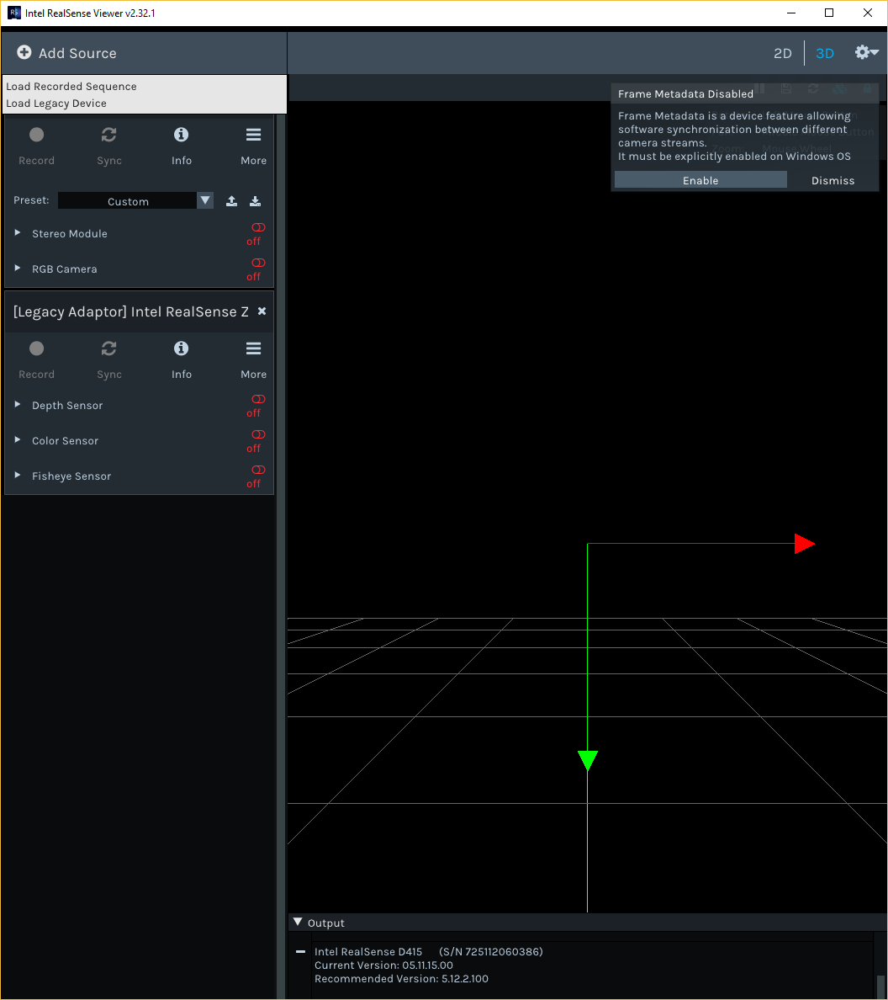
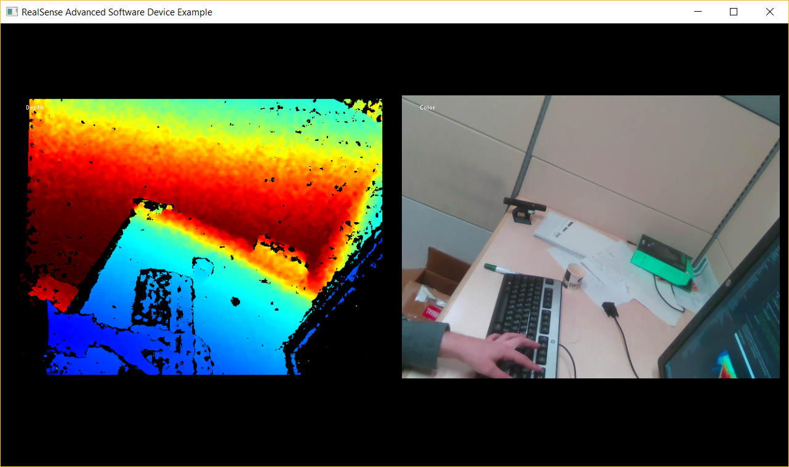

# Advanced Software Device Sample

## Overview

This sample demonstrates usage of the `rs2::software_device` object in tandem with a polling thread, which allows users to create and control custom SDK device dependent on 3rd Party hardware. This allows for comparison of other hardware with Intel RealSense.

`software_device` can be used to generate frames from synthetic or external sources and pass them into SDK processing functionality: 
* Record and playback services
* Post-processing filters
* Spatial alignment of streams
* Temporal synchronizion of streams
* Point-cloud generation

In this example we will show how to:
* Create a `software_device` object and populate it based on discovery in a 3rd Party API
* Create a polling thread that translates between the two APIs
* Combine these two objects into a fully functional adaptor.
* Adapt [rs-capture example](../capture) to use our adaptor device.

## Expected Output

* A DLL that can create `software_device` instances that exposes a Legacy Intel Realsense camera to the modern API.
* A Modified version of [Realsense Viewer](../../tools/realsense-viewer) that can stream Legacy Intel Realsense cameras

* A simple program to capture Depth and Color streams from a legacy device

## Code Overview

The core of the translation logic is in [`active_obj.cpp`](./active_obj.cpp). [`conversions.hpp`](./conversions.hpp) serves to translate the various enums in the two APIs and was assembled manually by going through the documentation of both and finding where both APIs were representing the same logical thing (e.g. `RS2_STREAM_DEPTH` and `rs::stream::depth`)
 
An overview of each function is given:
* `legacy_active_obj::map_infos()`: We check every legacy option to see if the physical device supports it. If so, we query it's current state, and using helper functions from `conversions.hpp` we register the corresponding option on the `rs2::software_device` instance.
* `legacy_active_obj::map_profiles()`: The bulk of the discovery occurs here. We check which streams the physical device supports and create a `rs2::software_sensor` for each. We then iterate over all the different streaming modes and create a `rs2::stream_profile` for each, opening the physical device in each mode momentarily to extract the stream's intrinsics from the legacy API so they can be registered in the corresponding `rs2::stream_profile` instance. We also make sure to register identity extrinsics between every profile of the same stream, and also the relevant extrinsics between the first stream profiles of each different stream. Since the library uses a tree traversal algorithm to generate extrinsics, we don't need to generate the entire dense graph. This function also takes care of a few other minor things like registering recommended processing blocks.
* `legacy_active_obj::map_options()`: This function is very similar to `map_infos()` but runs over the options. It is slightly more complex because the legacy API has device-global options, while the modern API has sensor-specific options. There is additional care around `RS2_OPTION_DEPTH_UNITS` since the modern and legacy APIs don't use the same units.
* `legacy_active_obj::finalize_binding()`: Since only the `rs2::software_device` instance is passed to the modern SDK, we create the `legacy_active_obj` instance on the heap. The `shared_from_this()` function doesn't work during object construction, so the final binding code is separated out to a function that runs after the constructor has completed.
* `legacy_active_obj::on_frame()`: This function is registered with the legacy API and is in charge of translating frames between the APIs and making sure they are reported by the correct sensor.
* `legacy_active_obj::heartbeat()`: Since the Software Device API doesn't provide async callbacks for most things, we need a polling thread to listen to changes to either the device options or streaming settings in the modern API and convey them to the physical device. This function is in charge of that.

Additional details of note:
* in `rs2_create_legacy_adaptor_device` the `rs2::software_device` is instantiated with a nop deleter so that the underlying library object isn't deleted when the C++ wrapper is released at end of scope, and can be managed by the user application.
* `rs2_legacy_adaptor_get_json_format` describes the JSON object that should be passed to `rs2_create_legacy_adaptor_device` for it to work properly.
* by keeping only a vector of `rs2::software_sensor`s in `legacy_active_object` we avoid a circular dependancy that would otherwise prevent the objects from being released by C++'s smart pointers.