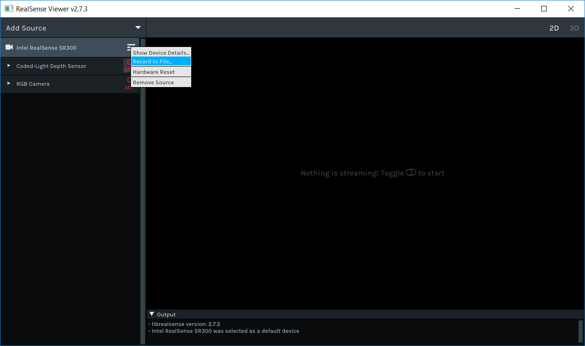
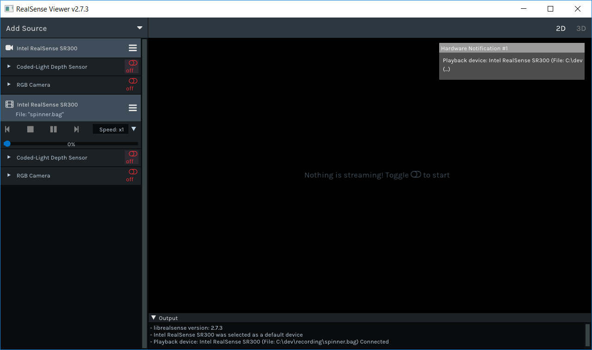

Realsense Record and Playback
===================


Overview
-------------
In addition to streaming video and other data from devices and sensors, the realsense SDK provides the ability to record a live session of streaming to a file. The recorded files can later be loaded by the SDK and to create a device with "read-only" abilities of the recorded device ( we will explain what "read-only" abilities mean later on).
The SDK is recording a single device to a single [rosbag file](http://wiki.ros.org/rosbag), using mostly standard ROS messages. This allows files recorded by the SDK to be replayed using any ROS tools \ application.


Quick Start
-------------

#### `rs2::recorder`

> :exclamation: If you are not familiar with the basic streaming [examples](../../examples), please follow them before moving on

To enable recording of any device, simply create a **rs2::recorder** from it and provide a path to the desired output file:
```cpp
//Create a context and get the first device
rs2::context ctx;
auto devices = ctx.query_devices();
if (devices.size() > 0)
{
	//Create a rs2::recorder from the first device, and desired file name
	//'.bag' is the common extension for rosbag files
	rs2::recorder device("my_file_name.bag", devices[0]); 	
	//recorder "is a" device, so just use it like any other device now
}
```
A `recorder` has the same functionality as a "real" device, with additional control for recording, such as pausing and resuming record.


#### `rs2::playback`

> :exclamation: If you are not familiar with the basic streaming [examples](../../examples), please follow them before moving on

Recorded files can be loaded and used to create a playback device by simply loading a file to the context:
```cpp
//Create a context
rs2::context ctx;
//Load the recorded file to the context
rs2::playback device = ctx.load_device("my_file_name.bag");
//playback "is a" device, so just use it like any other device now
```
The above code creates a playback device, which can be used as any device, but has the obvious limitation of only playing the recorded streams. 
Playback devices can be used to query information on the device and it sensors, and can be extended to which ever extension the "real" device could.
A `playback` provides additional functionalities such as seek, pause, resume and playback speed.


Playback and Record in RealSense Viewer
-------------

Among its many features, the [RealSense Viewer](../../tools/realsense-viewer) allows recording a device, and loading a file to playback.

To record a streaming session, simply click the "bars" icon next to the device name, choose "Record to File...", and select the destination for the file.



After choosing a file destination, a red dot will appear next to the device's name, indicating that it is recording.
Starting a stream will save its frames to the file, and once all streams are stopped, recording will complete automatically.

To replay a file, click "Add Source", choose "Load Recorded Sequence" and select the file you want to play.
Once you select the file, the Viewer will automatically add it the the list of source, and a popup should appear stating that the file was loaded:


>Notice that devices that were loaded from file have a "movie" icon next to their name.  

After loading the file, you can start streaming its streams, view its controls (with the values at time of record), pause the playback, choose speed, and use the seek bar to navigate trough frames.


Under the Hood
------

#### Basics Terminology

A **Device** is a container of Sensors with some correlation between them (e.g - all sensors are on a single board, sensors are mounted on a robot and share calibration information, etc.). A **Sensor** is a data streaming object, that provides one or more Streams.
**Stream** is a sequence of data items of a single data type, which are ordered according to their time of creation or arrival. The Sensor provides the Streams frames to the user. 

We call the device's sensors and stream, the **topology** of the device. 

Devices and Sensors can have **Extensions** that provide additional functionalities. A **Snapshot** of an Extension is a snapshot of the data that is available by the extension at some point of time, it is a sort of "read-only" version of the extension. For example, say we have a `DigitalClockExtension`, that can set and show the time. If we take a snapshot of that extension at noon, then whenever we ask the snapshot to show the time it will show "12:00", and trying to set its time will fail.

Finally, we will refer to a an actual implementation of devices and sensors as "live" or "real" devices and sensors.

#### Rosbag

##### Overview on ROSBAG file structure

The Rosbag file consists of data records, each data that is written to the file is represented by a topic that represents the data content, message that is the data definition, and capture time.
Any topic can be coupled with any message, in our file each topic will be represented by a single message. However, we will have different topics with the same message such as property.  
A bag file consists of a list of records, each record can be one of the following types:

- Bag header. Stores information about the entire bag, such as the offset to the first index data record, and the number of chunks and connections.
- Chunk. Stores (possibly compressed) connection and message records.
- Connection. Stores the header of a ROS connection, including topic name and full text of the message definition (message structure).
- Message data. Stores the serialized message data (which can be zero-length) with the ID of the connection.
- Index data. Stores an index of messages in a single connection of the preceding chunk.
- Chunk info. Stores information about messages in a chunk.

Each message that we write is stored in a chunk, each chunk consists of a number of messages based on the chunk size. In addition to the message data, the chunk stores also the connections of the messages, the connection describes the topic name and message definition to be able to serialize the message data. 
The flow to find a message on topic “A”: 

- Check in all chunk info’s what kind of connections can be found in the chunk.
- Access the chunk with the wanted connection, chunk info contains an offset to the paired chunk.
- Access the message from the relevant index data.

##### Dependencies
The SDK depends on ROS packages that are used for recording and playing the bag file.
The dependencies are:
- rosbag_storage
- roscpp_serialization
- cpp_common
- rostime
- boost_system
- lz4

> **Note:** The above dependencies are embedded into the source files, there is no need for additional installations.

##### Topics

The rosbag file requires messages to be associates with Topics
> Topics are [named](http://wiki.ros.org/Names) buses over which [nodes](http://wiki.ros.org/Nodes) exchange [messages](http://wiki.ros.org/Messages). [[ROS Wiki\Topics]](http://wiki.ros.org/Topics)

The following table depicts the Topics that are supported by RealSense file format:

<table>
  <tr>
    <th>Topic</th>
    <th>Published Name</th>
    <th>Message Type</th>
    <th>Description</th>
  </tr>
  <tr>
    <td>File Version</td>
    <td>/file_version</td>
    <td><a href="http://docs.ros.org/api/std_msgs/html/msg/UInt32.html">std_msgs::UInt32</a></td>
    <td>version of file format<br>A single message for entire file</td>
  </tr>
  <tr>
    <td>Device Information</td>
    <td>/device_&lt;device_id&gt;/info</td>
    <td><a href="http://docs.ros.org/api/diagnostic_msgs/html/msg/KeyValue.html">diagnostic_msgs/KeyValue.msg</a></td>
    <td>device information<br>Many messages to a single topic</td>
  </tr>
  <tr>
    <td>Sensor Information</td>
    <td>/device_&lt;device_id&gt;/info</td>
    <td><a href="http://docs.ros.org/api/diagnostic_msgs/html/msg/KeyValue.html">diagnostic_msgs/KeyValue.msg</a></td>
    <td>sensor information<br>Many messages to a single topic</td>
  </tr>
  <tr>
    <td>Stream Information</td>
    <td>/device_&lt;device_id&gt;/sensor_&lt;sensor_id&gt;/&lt;stream_type&gt;_&lt;stream_id&gt;/info</td>
    <td><a href="#stream-info">realsense_msg::StreamInfo</a></td>
    <td>generic-stream information<br>A single messages to a single topic</td>
  </tr>
  <tr>
    <td>Video Stream Info</td>
    <td>/device_&lt;device_id&gt;/sensor_&lt;sensor_id&gt;/&lt;stream_type&gt;_&lt;stream_id&gt;/info/camera_info</td>
    <td><a href="http://docs.ros.org/api/sensor_msgs/html/msg/CameraInfo.html">sensor_msgs::camera_info</a></td>
    <td>Image information<br>A single messages to a single topic</td>
  </tr>
  <tr>
    <td>IMU Intrinsics</td>
    <td>/device_&lt;device_id&gt;/sensor_&lt;sensor_id&gt;/&lt;stream_type&gt;_&lt;stream_id&gt;/info/imu_intrinsic</td>
    <td><a href="#motion-intrinsic">realsense_msgs::ImuIntrinsic</a></td>
    <td>Intrinsic of a motion stream<br>A single messages to a single topic</td>
  </tr>
  <tr>
    <td>Properties</td>
    <td>/device_&lt;device_id&gt;/sensor_&lt;sensor_id&gt;/property</td>
    <td><a href="http://docs.ros.org/api/diagnostic_msgs/html/msg/KeyValue.html">diagnostic_msgs/KeyValue.msg</a></td>
    <td><br>Properties of a sensor<br>Many messages to a single topic<br></td>
  </tr>
  <tr>
    <td>Image Data</td>
    <td>/device_&lt;device_id&gt;/sensor_&lt;sensor_id&gt;/&lt;stream_type&gt;_&lt;stream_id&gt;/image/data</td>
    <td><a href="http://docs.ros.org/api/sensor_msgs/html/msg/Image.html">sensor_msgs::Image</a></td>
    <td>The data of a single image. A single messages to a single topic</td>
  </tr>
  <tr>
    <td>Image Information</td>
    <td>/device_&lt;device_id&gt;/sensor_&lt;sensor_id&gt;/&lt;stream_type&gt;_&lt;stream_id&gt;/image/metadata</td>
    <td><a href="http://docs.ros.org/api/diagnostic_msgs/html/msg/KeyValue.html">diagnostic_msgs/KeyValue.msg</a></td>
    <td>Additional information of a single image. Many message to a single topic</td>
  </tr>
  <tr>
    <td>IMU Data</td>
    <td>/device_&lt;device_id&gt;/sensor_&lt;sensor_id&gt;/&lt;stream_type&gt;_&lt;stream_id&gt;/imu/data</td>
    <td><a href="http://docs.ros.org/api/sensor_msgs/html/msg/Imu.html">sensor_msgs::Imu</a></td>
    <td>The data of a single imu frame.<br>A single messages to a single topic</td>
  </tr>
  <tr>
    <td>IMU Information</td>
    <td>/device_&lt;device_id&gt;/sensor_&lt;sensor_id&gt;/&lt;stream_type&gt;_&lt;stream_id&gt;/imu/metadata</td>
    <td><a href="http://docs.ros.org/api/diagnostic_msgs/html/msg/KeyValue.html">diagnostic_msgs/KeyValue.msg</a></td>
    <td>Additional information of a single imu frame. Many message to a single topic</td>
  </tr>
  <tr>
    <td>6DOF Data</td>
    <td>/device_&lt;device_id&gt;/sensor_&lt;sensor_id&gt;/&lt;stream_type&gt;_&lt;stream_id&gt;/6dof/data</td>
    <td>realsense_msgs::6DoF (TBD)</td>
    <td>Six DOF data</td>
  </tr>
  <tr>
    <td>6DOF Information</td>
    <td>/device_&lt;device_id&gt;/sensor_&lt;sensor_id&gt;/&lt;stream_type&gt;_&lt;stream_id&gt;/6dof/metadata</td>
    <td><a href="http://docs.ros.org/api/diagnostic_msgs/html/msg/KeyValue.html">diagnostic_msgs/KeyValue.msg</a></td>
    <td>Additional information of a single image. Many message to a single topic</td>
  </tr>
  <tr>
    <td>Occupancy Map Data</td>
    <td>/device_&lt;device_id&gt;/sensor_&lt;sensor_id&gt;/&lt;stream_type&gt;_&lt;stream_id&gt;/occupancy_map/data</td>
    <td><a href="http://docs.ros.org/api/nav_msgs/html/msg/OccupancyGrid.html">nav_msgs/OccupancyGrid</a></td>
    <td></td>
  </tr>
  <tr>
    <td>Occupancy Map Information</td>
    <td>/device_&lt;device_id&gt;/sensor_&lt;sensor_id&gt;/&lt;stream_type&gt;_&lt;stream_id&gt;/occupancy_map/metadata</td>
    <td><a href="http://docs.ros.org/api/diagnostic_msgs/html/msg/KeyValue.html">diagnostic_msgs/KeyValue.msg</a></td>
    <td>Additional </td>
  </tr>
  <tr>
    <td>Time Stream</td>
    <td>/device_&lt;device_id&gt;/sensor_&lt;sensor_id&gt;/time</td>
    <td><a href="http://docs.ros.org/jade/api/sensor_msgs/html/msg/TimeReference.html">sensor_msgs::TimeReference</a></td>
    <td></td>
  </tr>
  <tr>
    <td>Log</td>
    <td>/log</td>
    <td><a href="http://docs.ros.org/jade/api/rosgraph_msgs/html/msg/Log.html">rosgraph_msgs::Log</a></td>
    <td>Log messages</td>
  </tr>
  <tr>
    <td>Stream Exntrinsics</td>
    <td>/device_&lt;device_id&gt;/sensor_&lt;sensor_id&gt;/&lt;stream_type&gt;_&lt;stream_id&gt;/tf/&lt;group_index&gt;</td>
    <td><a href="http://docs.ros.org/jade/api/geometry_msgs/html/msg/Transform.html">geometry_msgs/Transform Message</a></td>
    <td>Extrinsic transformation between some point of reference (indexed by group_index) to the stream in the topic</td>
  </tr>
  <tr>
    <td>Additional Info</td>
    <td>/additional_info</td>
    <td><a href="http://docs.ros.org/api/diagnostic_msgs/html/msg/KeyValue.html">diagnostic_msgs/KeyValue.msg</a></td>
    <td>Additinal information of any kind. Can be useful for application that require additional metadata on the recorded file (such as program name, version etc...)</td>
  </tr>
</table>


##### Messages
ROS uses a simplified messages description language for describing the data values (aka messages) that ROS nodes publish. This description makes it easy for ROS tools to automatically generate source code for the message type in several target languages. Message descriptions are stored in .msg files.
There are two parts to a .msg file: fields and constants. Fields are the data that is sent inside of the message. Constants define useful values that can be used to interpret those fields (e.g. enum-like constants for an integer value).

--------------

#### RealSense Proprietary  Messages

In addition to the standard ROS messsages, the SDK writes additional proprietary messages (available in the [3rd party folder](../../third-party/realsense-file/rosbag/msgs/realsense_msgs)) for new data types that are recorded.
The following are the new messages created by the SDK:

 - [realsense_msgs::StreamInfo](#stream-info)
 - [realsense_msgs::ImuIntrinsic](#motion-intrinsic)

--------------
##### **Stream Info**

<table>
  <tr>
    <th>Name</th>
    <th>Description</th>
    <th>Format</th>
  </tr>
    <tr>
      <td>is_recommended</td>
      <td>Indicates if this stream is recommended by RealSense SDK</td>
      <td>bool</td>
    </tr>
  <tr>
    <td>fps</td>
    <td>Frame per second value</td>
    <td>uint32</td>
  </tr>
  <tr>
    <td>encoding</td>
    <td>Stream's data format<br>
    [Supported encodings are listed below](#supported-encoding)</td>
    <td>string</td>
  </tr>
</table>

###### Supported Encoding

For video streams, the supported encoding types can be found at <a href="http://docs.ros.org/jade/api/sensor_msgs/html/namespacesensor__msgs_1_1image__encodings.html">ros documentation</a><br>

--------------

##### Motion Intrinsic

<table>
   <tbody>
      <tr>
         <th>Name</th>
         <th>Description</th>
         <th>Format</th>
      </tr>
      <tr>
         <td>&nbsp;data</td>
         <td>
            <p>Interpret data array values. <br>3x4 Row-major matrix:</p>
            <table>
               <tbody>
                  <tr>
                     <td>Scale X</td>
                     <td>Cross Axis</td>
                     <td>Cross Axis</td>
                     <td>Bias X</td>
                  </tr>
                  <tr>
                     <td>Cross Axis</td>
                     <td>Scale Y</td>
                     <td>Cross Axis</td>
                     <td>Bias Y</td>
                  </tr>
                  <tr>
                     <td>Cross Axis</td>
                     <td>Cross Axis</td>
                     <td>Scale Z</td>
                     <td>Cross Axis</td>
                  </tr>
               </tbody>
            </table>
         </td>
         <td>float32[12]</td>
      </tr>
      <tr>
         <td>noise_variances</td>
         <td>Variance of noise for X, Y, and Z axis</td>
         <td>float32[3]</td>
      </tr>
      <tr>
         <td>bias_variances</td>
         <td>Variance of bias for X, Y, and Z axis</td>
         <td>float32[3]</td>
      </tr>
   </tbody>
</table>

----------


Recording
----------
Recording is performed at the Device level, meaning that the device, its sensors, their streams' data (frames) and all extensions are saved to file.
To allow for a seamless experience when switching between a live device and a record or playback device we save the device's topology and all of the extensions' snapshots to the file, in addition to the streaming frames. 

A record device is like a wrapper around a real device, that delegates actions to the device and sensors while recording new data in between actions. 
When a record device is created, a record sensor is created per real sensor of the real device. 
A record sensor will record newly arriving frames for each of its streams, and changes to extensions' data (snapshots). 

#### Recording Frames
Frame are usually merely a container of raw data. 
Each frames is stored to file with all of its additional information (such as metadata, timestamp, etc...).


#### Recording Snapshots 
Upon creation, the record device goes over all of the extensions of the real device and its sensors, and saves snapshots of those extensions to the file. These snapshots will allow the playback device to recreate the topology of the recorded device, and will serve as the initial data of their extensions.
To allow record sensors to save changes to extensions' data over the life time of the program, when a user asks a record sensor for an extension, a record-able extension would be provided. 
A record-able version of an extension holds an action to perform whenever the extension's data changes. This action is provided by the record sensor, and will usually be the action of writing the extension's snapshot to file.
Note: After resuming a paused recordig, the states of the device and its extensions are not updated to their current state. Thus, only changes made after resuming recording will appear in the file when playing it.

----------


## Playback

Playback device is an implementation of device interface which reads from a 
file to simulate a real device.                                              
                                                                          
Playback device holds playback sensors which simulate real sensors.         
                                                                          
When creating the playback device, it will read the initial device snapshot from the file in order to map itself and 
its sensors in matters of functionality and data provided.                              
When creating each sensor, the device will create a sensor from the         
sensor's initial snapshot.                            
Each sensor will hold a single thread for each of the sensor's streams which is used to raise frames to the user.
The playback device holds a single reading thread that reads the next frame in a loop and dispatches the frame to the relevant sensor.
