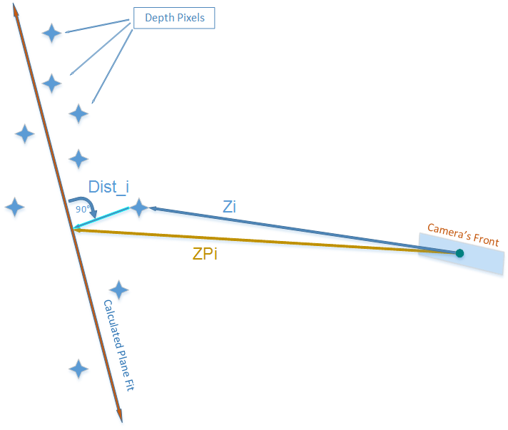
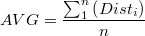
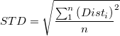
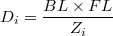
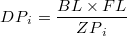
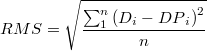

# Depth Quality Tool

## Overview

This application allows you to test the camera’s depth quality, including: average distance to plane accuracy, standard deviation from plane, Z (distance) accuracy and fill rate.
You should be able to easily get and interpret several of the depth quality metrics and record and save the data for offline analysis.

## Quick Start
* Position the depth camera within a range of 0.5 -3 meter from a flat non-reflective surface.
* Aim the camera to the target and hold it steady for several seconds till the tool is able to recognize the surface (the yellow grid in 3D view).
* Adjust the camera using the "Angle" metric to minimize the skew and make it as  perpendicular to the surface as possible.
* Inspect the calculated depth quality metrics, expand the metric properties to get more in-depth info.

## Features
* 2D/3D Depth View
* Plane Fitting - using reconstructed surface
* User-defined Region of Interest
* Depth Quality metrics:
  * Depth Error Average
  * Depth Error Standard Deviation
  * Fill-Rate
  * Subpixel RMS
  * Distance to target
* Export metrics and device configuration
* Depth Sensor controls

## Metrics elaborated

### Depth Error Average & STD
_Disti_ - Distance from pixel coordinates to the Plane Fit (mm)  
  

### Subpixel RMS Metric
_Zi_ - Depth value of i-th pixel in the ROI (mm)  
_ZPi_ - Depth value of the i-th pixel projected onto the plane fit (mm)  
_BL_ - Stereoscopic Baseline (mm)  
_FL_ -Focal Length as a multiple of pixel width (pixels)  
_Di_ - Disparity value of i-th pixel in the ROI (pixel)  
 _DPi_ - Disparity value of i-th plane-projected pixel (pixel)

    

<!---
Math expressions generated with
http://www.numberempire.com/texequationeditor/equationeditor.php
{D}_{i}=\frac{BL\times FL}{{Z}_{i}}  
{DP}_{i}=\frac{BL\times FL}{{ZP}_{i}}  
RMS = \sqrt{\frac{\sum_{1}^{n}{\left({D}_{i} -{DP}_{i}\right)}}{n}^{2}}
AVG = \frac{\sum_{1}^{n}{\left({Dist}_{i}\right)}}{n}
STD = \sqrt{\frac{\sum_{1}^{n}{\left({Dist}_{i}\right)}}{n}^{2}}  
--->
