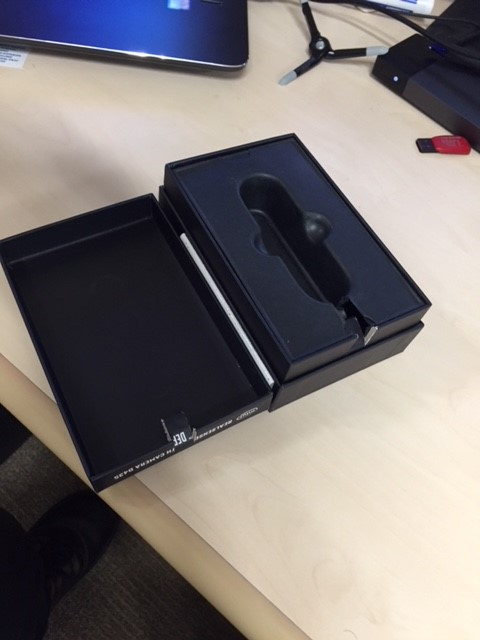
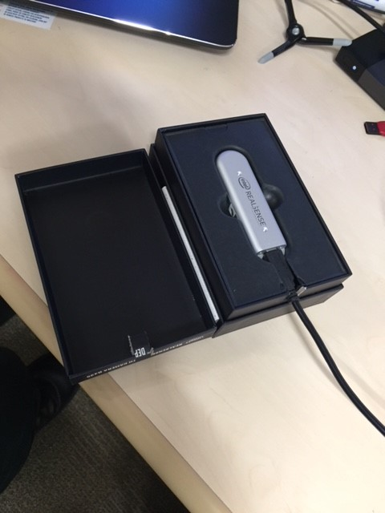
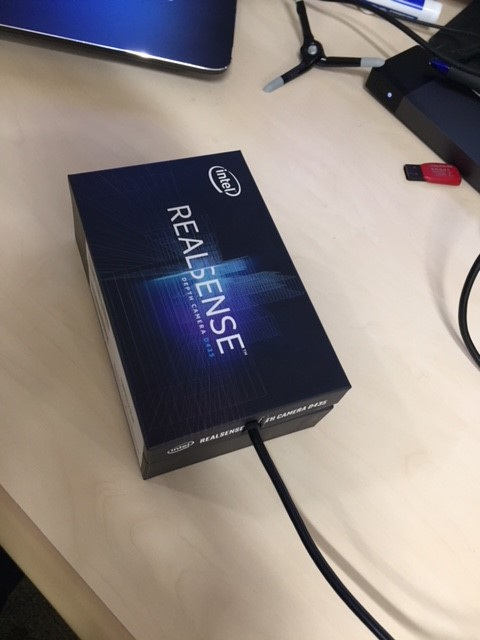
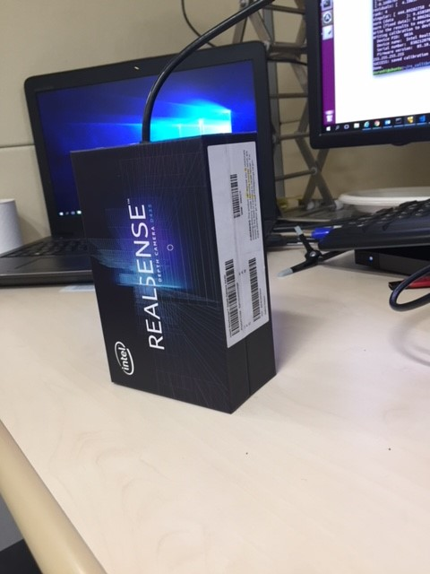
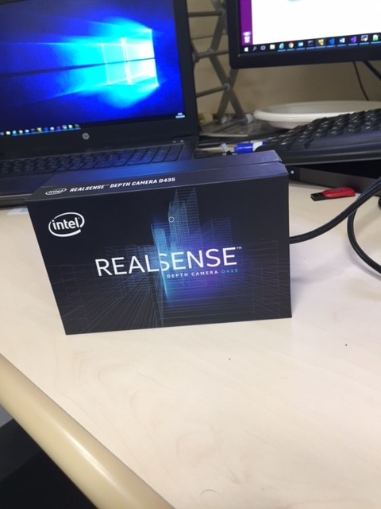
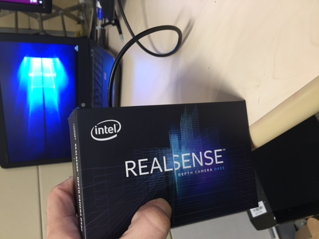
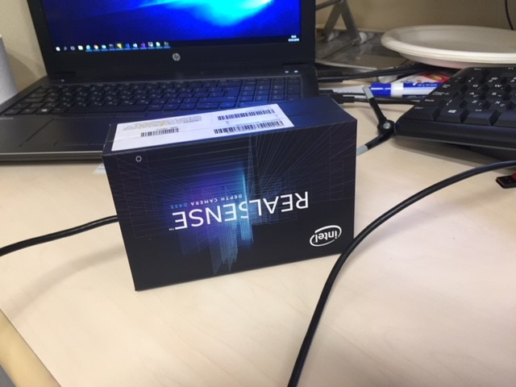

# rs-imu-calibration Tool:

## Goal
The tool is intended to calibrate the IMU built in D435i and L515 cameras

## Description
D435i and L515 cameras arrive from the factory with a calibrated IMU device. However the calibration accuracy can be further imporved by a calibration procedure.

The rs-imu-calibration tool is a code example that walks you through the calibration steps and saves the calibration coefficients to the EEPROM, to be applied automatically by the driver.

Detailed information, including installation, procedure, and sample calibration demonstration, is described in the following white paper:
  IMU Calibration Tool for Intel® RealSense™ Depth Camera White Paper
  https://dev.intelrealsense.com/docs/imu-calibration-tool-for-intel-realsense-depth-camera

## Limitations
While the tool achieves good overall results, it has limitations that may impact accuracy. Please refer to the above white paper for further information.

## Command Line Parameters

|Flag   |Description   |Default|
|-----|---|---|
|`-h `|Show help. ||
|`-i <accel_filename> [gyro_filename]`| Load previously saved results to EEPROM| |
|`-s serial_no`| calibrate device with given serial_no| calibrate first found device|
|`-g `|show graph of data before and after calibration| ||

# Calibration Procedure:
Running:

`python rs-imu-calibration.py`

The script runs you through the 6 main orientations of the camera.
For each direction there are the following steps:
*	**Rotation:** 
  *	The script prints the following line, describing how to orient the camera: 
`Align to direction:  [ 0. -1.  0.]   Mounting screw pointing down, device facing out` 
  *	Then it prints the status (rotate) and the difference from the desired orientation: 
  `Status.rotate:           [ 1.0157 -0.1037  0.9945]:                 [False False False]` 
  *	You have to bring the numbers to [0,0,0] and then you are in the right direction and the script moves on to the next status.  

*	**Wait to Stablize:** 
  *	The script waits for you to be stable for 3 seconds. Meanwhile there is a countdown message: 
  `Status.wait_to_stable: 2.8 (secs)` 
  *	When waited for 3 seconds, the script begin to <b>collect data:  

*	**Collecting data:** 
  *	Status line is a line of dots. When reaching 20 dots, enough data is collected and script carries on to next orientation. 
  *	If camera is no longer in the precise orientation, data is not collected.
  *	If camera is moved too much, going back to <b>Rotation status.

When done all 6 orientations, the following message appears, suggesting you to save the raw data gathered: 
`Would you like to save the raw data? Enter footer for saving files (accel_<footer>.txt and gyro_<footer>.txt)` 
`Enter nothing to not save raw data to disk. >` 

Either press “Enter” not to save or an ending (like 2 or <serial_no>_1) to save the accel.txt, gyro.txt. 

The files can be loaded using the “-i” option.

Then the script will ask to save the data to the Device. 
Choose Y (or any other combination with Y or y in it) to save.

That’s it. At the end a confirmation message appears: 
`SUCCESS: saved calibration to camera.`

**NOTICE:** 
Press ESC key to abort the calibration process.
CTRL-C isn’t working so press CTRL-Z and then `kill -9 %1` if you want to terminate in the middle…

**Appendix A:** 
I found it a little challenging to hold the camera in the precise 90 degrees angle needed.
Therefor I used my original camera's box as a camera holder.
I cut a little piece so the cord may come out, and that's it: 
***open box image:*** 
 

***camera in box:*** 
 

***face down position:*** 
 

***cord up position:*** 
 

***upright facing out (or upside down facing out, depends on which side the cord is..):*** 
 

***cord down position:*** 
 

***upside down (or upright) facing out:*** 

