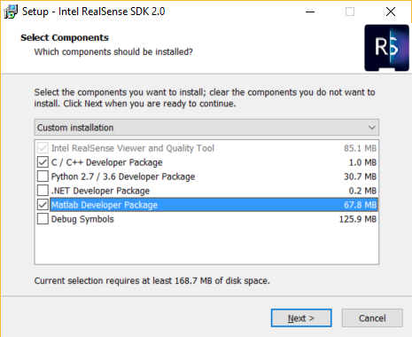

# Getting Started with RealSense™ SDK2.0 for Matlab®

## Introduction:
The latest generation of RealSense Depth Cameras can be controlled via the RealSense SDK2.0, also referred to as libRealSense 2.x.x, or LibRS for short. This includes stereo depth cameras D415 and D435 as well as their corresponding modules, such as D410 and D430.

To get started controlling the RealSense Cameras with Matlab® in Windows 10, we have created a package that wraps some of the core functions of the realsense2.dll, and we have also created a simple “Hello World” function to get started capturing depth data. This uses Matlab  R2017b and requires a Windows 10 laptop with a USB3 port.

## Getting Started
### Building from Source
1. Download the Git repository. Opt in the Matlab wrapper for LibRs with `cmake .. -D... -DBUILD_MATLAB_BINDINGS:BOOL=ON` when configuring CMake.
2. Build the `librealsense_mex` target.
3. After compiling the project, set [build/Debug](../../build/Debug) or [build/Release](../../build/Release) as your Matlab working directory. Alternatively copy the `+realsense` folder from there to a place where Matlab can find it.
4. Start exploring with Realsense devices by typing at the Matlab prompt:  
[`realsense.depth_example`](./depth_example.m)  -  Capture and render Depth frame with a live device .  
[`realsense.rosbag_example`](./rosbag_example.m)  - Playback pre-recorded video and data streams stored in [rosbag](http://wiki.ros.org/rosbag) format.
[`realsense.pointcloud_example`](./depth_example.m)  -  Generate and visualize 3D point cloud from live stream.  

### Windows Installer
1. Run the Windows Installer and select the Matlab Developer Package checkbox.

    
2. Allow the installer to complete
3. The package will be installed to `C:\Program Files (x86)\Intel RealSense SDK 2.0\matlab\+realsense\`. You can copy it from here to a place where Matlab can find it or add it to Matlab's path

## Examples
#### Displaying a frame using _realsense.pipeline_
```Matlab
function depth_example()
    % Make Pipeline object to manage streaming
    pipe = realsense.pipeline();
    % Make Colorizer object to prettify depth output
    colorizer = realsense.colorizer();

    % Start streaming on an arbitrary camera with default settings
    profile = pipe.start();

    % Get streaming device's name
    dev = profile.get_device();
    name = dev.get_info(realsense.camera_info.name);

    % Get frames. We discard the first couple to allow
    % the camera time to settle
    for i = 1:5
        fs = pipe.wait_for_frames();
    end
    
    % Stop streaming
    pipe.stop();

    % Select depth frame
    depth = fs.get_depth_frame();
    % Colorize depth frame
    color = colorizer.colorize(depth);

    % Get actual data and convert into a format imshow can use
    % (Color data arrives as [R, G, B, R, G, B, ...] vector)
    data = color.get_data();
    img = permute(reshape(data',[3,color.get_width(),color.get_height()]),[3 2 1]);

    % Display image
    imshow(img);
    title(sprintf("Colorized depth frame from %s", name));
end
```
