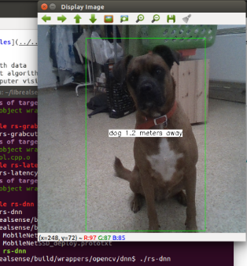

# rs-dnn Sample

## Overview
This example shows how to use Intel RealSense cameras with existing [Deep Neural Network](https://en.wikipedia.org/wiki/Deep_learning) algorithms. The demo is derived from [MobileNet Single-Shot Detector example](https://github.com/opencv/opencv/blob/3.4.0/samples/dnn/ssd_mobilenet_object_detection.cpp) provided with `opencv`. We modify it to work with Intel RealSense cameras and take advantage of depth data (in a very basic way). 


The demo will load existing [Caffe model](https://github.com/chuanqi305/MobileNet-SSD) (see another tutorial [here](https://docs.opencv.org/3.3.0/d5/de7/tutorial_dnn_googlenet.html)) and use it to classify objects within the RGB image. Once object is detected, the demo will calculate approximate distance to the object using the depth data:

<p align="center"></p>

## Implementation Details

Unlike the other samples, this demo requires access to the exact depth values. We generate a matrix of floating point values (in meters) using the following helper function:
```cpp
auto depth_mat = depth_frame_to_meters(pipe, depth_frame);
```

