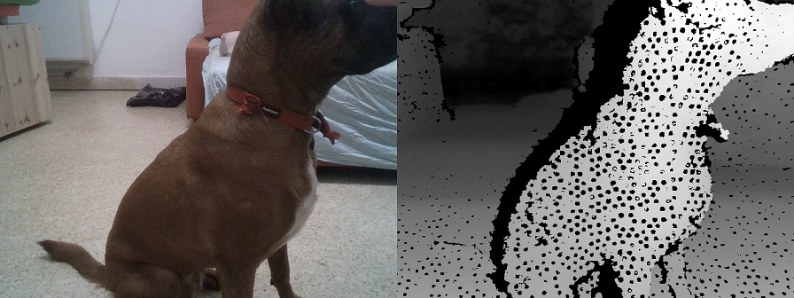
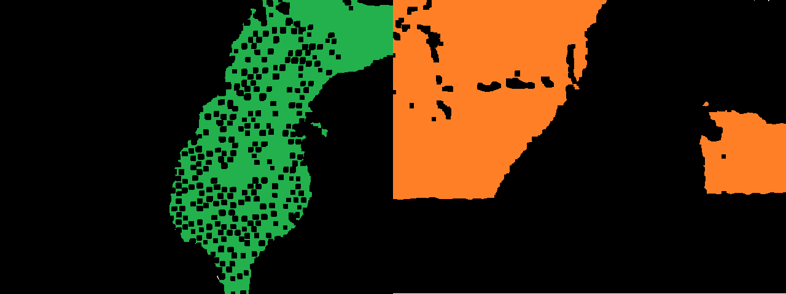
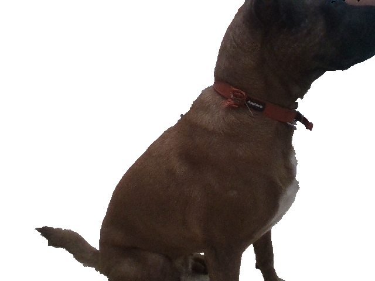

# rs-grabcuts Sample

## Overview
This example demonstrates how to enchance existing 2D algorithms with 3D data: [GrabCut algorithm](https://docs.opencv.org/trunk/d8/d83/tutorial_py_grabcut.html) is commonly used for interactive, user-assisted foreground extraction. 
In this demo we replace user input with initial guess based on depth data. 

> **How is it different from [rs-align example](../../../examples/align)?**
> **rs-align** is doing real-time background removal using simple masking and thresholding. This results in fast but not very clean results. 
> This demo is performing pixel-level optimization to cut the foreground in the 2D image. The depth data serves only as an initial estimate of what is near and what is far. 

## Example Flow

### Get Aligned Color & Depth
We start by getting a pair of spatially and temporally synchronized frames:
```cpp
frameset data = pipe.wait_for_frames();
// Make sure the frameset is spatialy aligned 
// (each pixel in depth image corresponds to the same pixel in the color image)
frameset aligned_set = align_to.process(data);
frame depth = aligned_set.get_depth_frame();
auto color_mat = frame_to_mat(aligned_set.get_color_frame());
```
<p align="center"><br/><b>Left:</b> Color frame, <b>Right:</b> Raw depth frame aligned to Color</p>

### Generate Near / Far Mask
We continue to generate pixel regions that would estimate near and far objects. We use basic [morphological transformations](https://docs.opencv.org/2.4/doc/tutorials/imgproc/erosion_dilatation/erosion_dilatation.html) to improve the quality of the two masks:
```cpp
// Generate "near" mask image:
auto near = frame_to_mat(bw_depth);
cvtColor(near, near, CV_BGR2GRAY);
// Take just values within range [180-255]
// These will roughly correspond to near objects due to histogram equalization
create_mask_from_depth(near, 180, THRESH_BINARY);

// Generate "far" mask image:
auto far = frame_to_mat(bw_depth);
cvtColor(far, far, CV_BGR2GRAY);
// Note: 0 value does not indicate pixel near the camera, and requires special attention:
far.setTo(255, far == 0);
create_mask_from_depth(far, 100, THRESH_BINARY_INV);
```
<p align="center"><br/><b>Left:</b> Foreground Guess in Green, <b>Right:</b> Background Guess in Red</p>

### Invoke `cv::GrabCut` Algorithm

The two masks are combined into a single guess:
```cpp
// GrabCut algorithm needs a mask with every pixel marked as either:
// BGD, FGB, PR_BGD, PR_FGB
Mat mask;
mask.create(near.size(), CV_8UC1); 
mask.setTo(Scalar::all(GC_BGD)); // Set "background" as default guess
mask.setTo(GC_PR_BGD, far == 0); // Relax this to "probably background" for pixels outside "far" region
mask.setTo(GC_FGD, near == 255); // Set pixels within the "near" region to "foreground"
```
We run the algorithm:
```cpp
Mat bgModel, fgModel; 
cv::grabCut(color_mat, mask, Rect(), bgModel, fgModel, 1, cv::GC_INIT_WITH_MASK);
```
And generate the resulting image:
```cpp
// Extract foreground pixels based on refined mask from the algorithm
cv::Mat3b foreground = cv::Mat3b::zeros(color_mat.rows, color_mat.cols);
color_mat.copyTo(foreground, (mask == cv::GC_FGD) | (mask == cv::GC_PR_FGD));
cv::imshow(window_name, foreground);
```
<p align="center"></p>