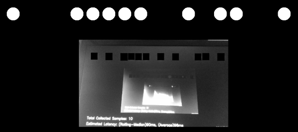

# rs-latency-tool Sample

## Overview

The goal of this sample to show how we could estimate visual latency with computer vision. 

> This method has a lot of unknowns and should not serve substitute to proper latency testing with dedicated equipment, but can offer some insights into camera performance and provide framework for comparison between devices / configurations.

## Why is Latency Important? 
Visual latency (for our use-case) is defined as the time between an event and when it is observed as a frame in the application. Different types of events have different ranges of acceptable latency. 


USB webcams usually provide latencies in the order of tens-hundreds of milliseconds, since the video data is expensive to transmit, decode and process. 

## How this sample works?

The demo relies on the idea that if you look at a clock and a video-stream of the same clock side-by-side, the clock in the video will "lag" behind the real one by exactly the visual latency:
<p align="center"></p>

The demo will encode current clock value into binary form and render the bits to screen (circle = bit is on):
<p align="center"></p>

The user is asked to point the camera back at the screen to capture the pattern.


Next, we will use [Hough Transform](https://docs.opencv.org/2.4/doc/tutorials/imgproc/imgtrans/hough_circle/hough_circle.html) to identify sent bits in the `rs2::frame` we get back from the camera (marked as black squares)
<p align="center"></p>

The demo filters-out bad detections using basic 2-bit [Checksum](https://en.wikipedia.org/wiki/Checksum).

Once it detects bits and decodes the clock value embedded in the image, the sample compares it to the clock value when `rs2::frame` was provided by the SDK.

## Implementation Details

To make sure expensive detection logic is not preventing us from getting the frames in time, detection is being done on a seperate thread. Frames are being passed to this thread, alongside their respective clock measurements, using a concurrent queue. 
We ensure that the queue will not spill, by emptying it after each successful or unsuccessful detection attempt. 
Please refer to [Frame Buffer Management](https://github.com/IntelRealSense/librealsense/wiki/Frame-Buffering-Management-in-RealSense-SDK-2.0) for further information.

## Controlling the Demo

Uncomment one of the following lines to select a configuration:
```cpp
//cfg.enable_stream(RS2_STREAM_COLOR, RS2_FORMAT_BGR8);
//cfg.enable_stream(RS2_STREAM_COLOR, 640, 480, RS2_FORMAT_BGR8, 30);
//cfg.enable_stream(RS2_STREAM_COLOR, 1920, 1080, RS2_FORMAT_BGR8, 30);
//cfg.enable_stream(RS2_STREAM_INFRARED, 640, 480, RS2_FORMAT_Y8);
//cfg.enable_stream(RS2_STREAM_INFRARED, 1280, 720, RS2_FORMAT_Y8);
```
You can add more than one stream to check how multiple streams are affecting each other. The demo will however just use the first frame out of every frame-set. 


This method will not work for the depth stream. 
**D400** will produce readable results for both `RS2_STREAM_COLOR` and `RS2_STREAM_INFRARED`. **SR300** infrared stream doesn't seem to capture the content of a screen.


In addition, if you want to run this demo with a regular web-cam, use the following code instead of using the `pipeline` object:
```cpp
context ctx;
auto dev = ctx.query_devices().front();
auto sensor = dev.query_sensors().front();
auto sps = sensor.get_stream_profiles();
stream_profile selected;
for (auto& sp : sps)
{
    if (auto vid = sp.as<video_stream_profile>())
    {
        if (vid.format() == RS2_FORMAT_BGR8 &&
            vid.width() == 640 && vid.height() == 480 &&
            vid.fps() == 30)
            selected = vid;
    }
}
sensor.open(selected);
syncer pipe;
sensor.start(pipe);
```
