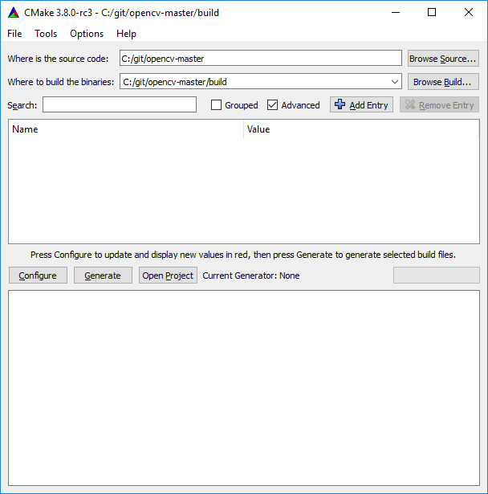
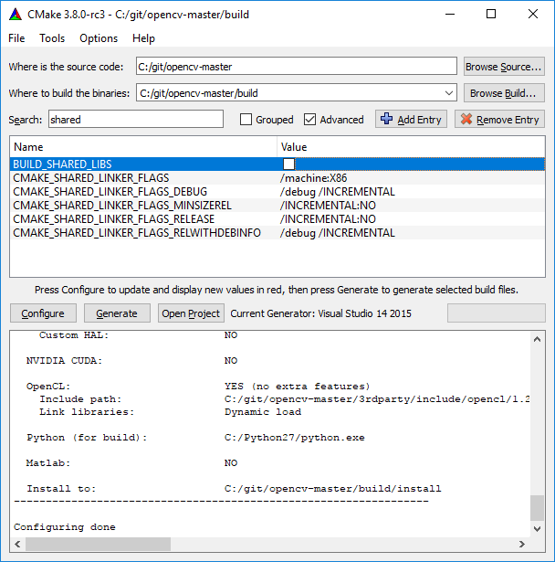
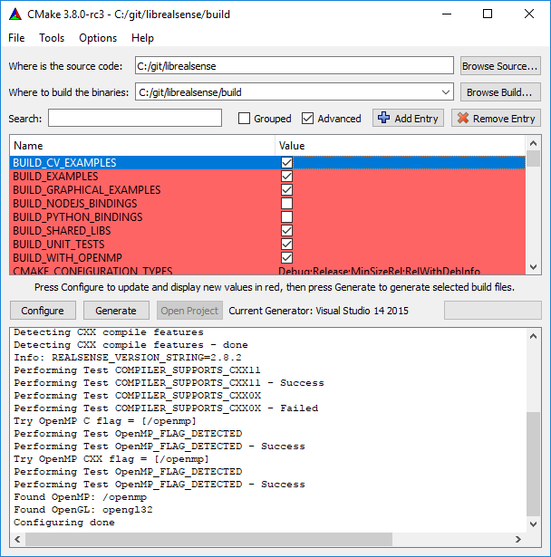
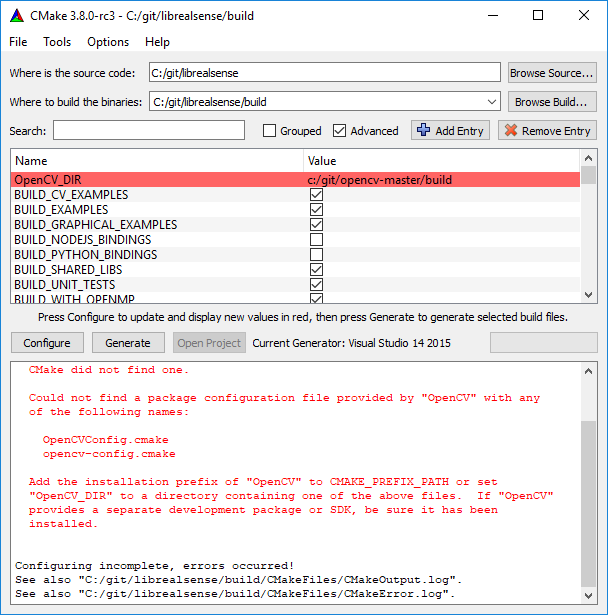
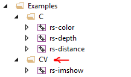

# OpenCV Samples for Intel® RealSense™ cameras
Examples in this folder are designed to complement existing [SDK examples](../../examples) and demonstrate how Intel RealSense cameras can be used together with `opencv` in domain of computer-vision. 

> RealSense examples have been designed and tested with OpenCV 3.4,
> Working with latest OpenCV 4 requires minor code changes
 
## List of Samples:
1. [ImShow](./imshow) - Minimal OpenCV application for visualizing depth data
2. [GrabCuts](./grabcuts) - Simple background removal using the GrabCut algorithm
3. [Latency-Tool](./latency-tool) - Basic latency estimation using computer vision
4. [DNN](./dnn) - Intel RealSense camera used for real-time object-detection
5. [Depth Filter](./depth-filter) - Depth Filtering for Collision Avoidance

## Getting Started:
This page is certainly **not** a comprehensive guide to getting started with OpenCV and CMake, but it can help get on the right track. 

* [Windows Installation](#windows)
* [Linux Installation](#linux)

### Windows
This section describes how to use CMake to generate a VisualStudio project to build the OpenCV library and a VisualStudio project to build the OpenCV samples.

First, download and install `CMake` from [cmake.org/download](https://cmake.org/download/)

#### Building the OpenCV library VisualStudio project
1. Clone or download OpenCV sources from [github.com/opencv/opencv/tree/3.4](https://github.com/opencv/opencv/tree/3.4) into a local directory (`C:/git/opencv-3.4`)
2. Run `cmake-gui`, input source code and binaries locations: 

3. Click `Configure`
> When working behind a firewall, you might want to consider unchecking `WITH_FFMPEG` and `WITH_IPP` to avoid additional downloads
4. Uncheck `BUILD_SHARED_LIBS`: 

5. Click `Generate`
6. Click `Open Project` to open Visual Studio
7. Press `Ctrl+Shift+B` to build solution

#### Building the OpenCV Samples VisualStudio project
1. Clone or download librealsense sources from [github.com/IntelRealSense/librealsense](https://github.com/IntelRealSense/librealsense) into a local directory (`C:/git/librealsense`)
2. Run `cmake-gui` and fill source code and binaries locations and press `Configure`
3. Make sure you check the `BUILD_CV_EXAMPLES` flag and click `Configure` again:

4. Specify CMake binaries folder for OpenCV as `OpenCV_DIR` (`c:/git/opencv-3.4`)

5. Click `Generate` and `Open Project`
6. Locate CV solution-folder under Examples

15. Right-click on one of the examples to `Set as StartUp Project`
16. Press `F5` to compile and run the example

### Linux

1. Build `opencv` from source using the [official guide](https://docs.opencv.org/trunk/d7/d9f/tutorial_linux_install.html)
> Please use `git checkout 3.4` to use version 3.4

2. Run `export OpenCV_DIR=~/opencv/build` (`~/opencv/build` is the folder containing `OpenCVConfig.cmake`)
3. Follow [the instructions](https://github.com/IntelRealSense/librealsense/blob/master/doc/installation.md) to build `librealsense` from source
4. Add `-DBUILD_CV_EXAMPLES=true` to your `cmake` command
