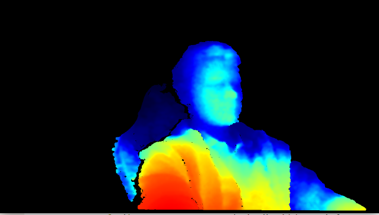
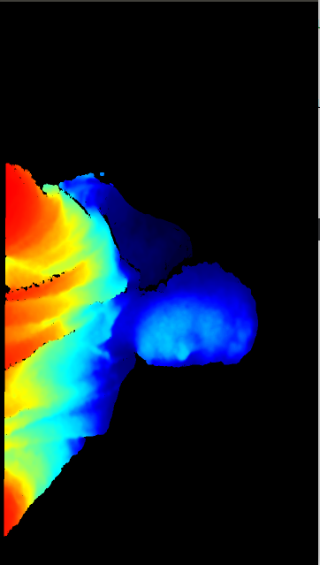
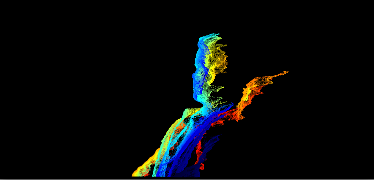

# rs-rotate-ps sample

## Overview
This example shows how to rotate point cloud before colorization.
Current examples requires OpenCV.

## Usage:
    - press 'c' for change mode
    - press 'q' for exit

## Examples:
1. Ordinary colorization

2. Rotate point cloud by roll angle for 90 degrees

3. Rotate point cloud by yaw angle for 90 degrees

