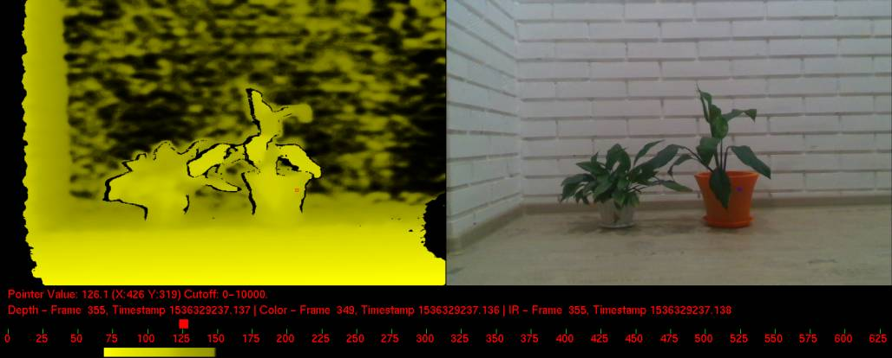
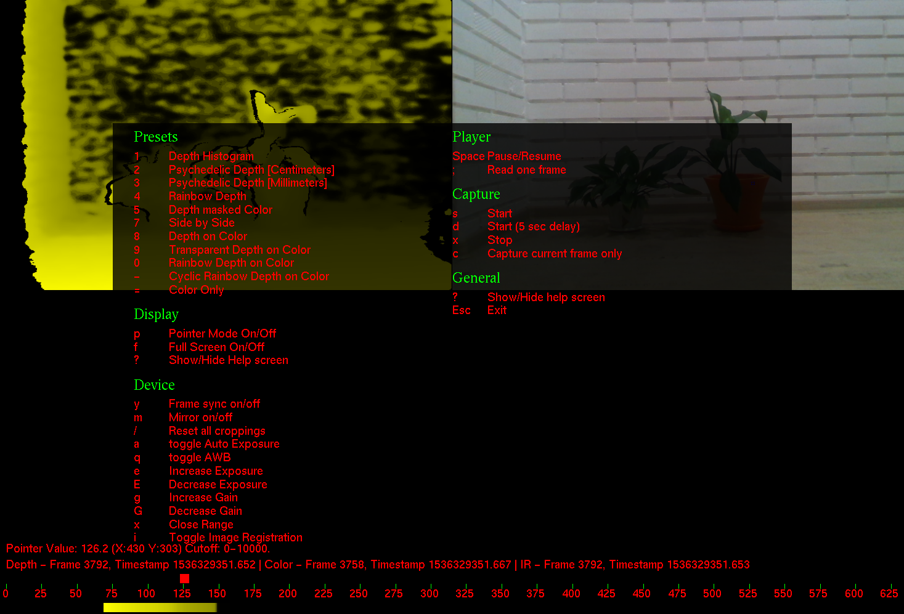
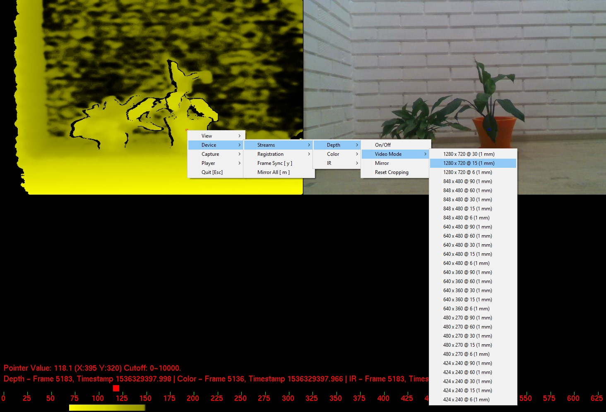
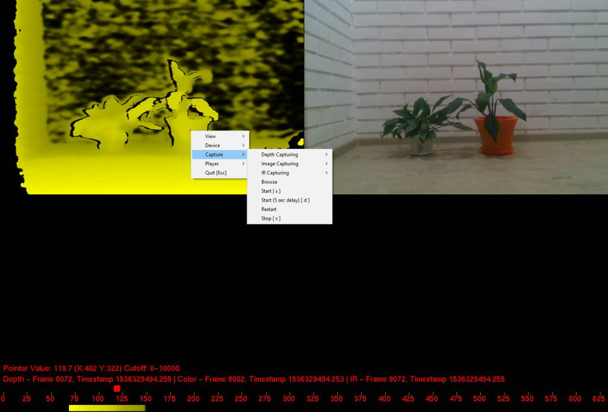

# RealSense2 OpenNI2 driver

_Picture:_ _An_ _example_ _of_ _OpenNI2_ _work_ _with_ _RealSense_

Allows to use RealSense2 hardware with OpenNI2

Current features:
* configure stream modes
* access live data (color/depth/IR)
* record and playback files
* depth to color mapping
* user tracking with NiTE2
* no code changes required

## Getting started

Download [OpenNI2 SDK](https://structure.io/openni)

Download [RealSense2 SDK](https://github.com/IntelRealSense/librealsense/releases)

Run CMake on driver and configure SDK's:
* OPENNI2_DIR (For linux, the path may be "/usr/include/openni2")
* REALSENSE2_DIR

Generate project files and compile driver

For Windows, copy rs2driver.dll and realsense2.dll to OPENNI2_DIR/Samples/Bin/OpenNI2/Drivers/
For Linux, copy librs2driver.so and librealsense2.so to OPENNI2_DIR/Samples/Bin/OpenNI2/Drivers/

Launch any OpenNI2 example (SimpleRead SimpleViewer NiViewer) located at OPENNI2_DIR/Samples/Bin/

## Examples

_Picture:_ _Show_ _hotkeys_

_Picture:_ _Configuring_ _streams_

_Picture:_ _Configuring_ _capture_

## License

This project is licensed under the [Apache](https://github.com/IntelRealSense/librealsense/blob/master/LICENSE) License, Version 2.0.
