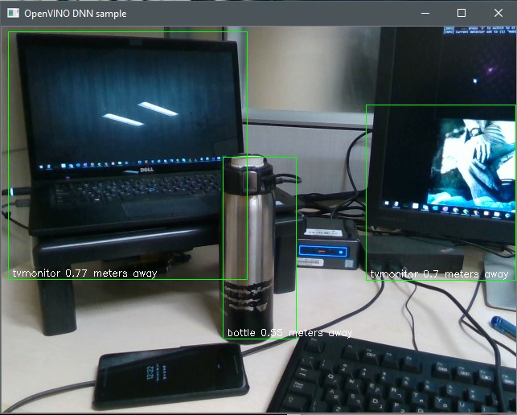

# rs-dnn-vino Sample

## Overview
This example demonstrates OpenVINO™ toolkit integration with object detection, using
basic depth information to approximate distance.

The same exact neural network is used here as in the OpenCV DNN sample, for
comparison.

## Requirements

A camera with both depth and RGB sensors is required.

This sample makes use of OpenCV. You can use the OpenCV that is packaged
with OpenVINO by pointing OpenCV_DIR to `${INTEL_OPENVINO_DIR}/opencv/cmake`.

## Implementation

Though we are detecting general objects in the neural network, the inputs and
outputs are the same as those for facial detections. We can therefore reuse the
`openvino_helpers::face_detection` code we used in the [rs-face-vino example](../face).

There is a single trained model with two Intermediate Representation files
(`mobilenet-ssd.xml` and `.bin`) provided with the sample. The sample
will, however, load any model present in the current directory and is able to
switch between them at runtime, allowing some experimentation.

> The `face_detection` class does have requirements from the model: it is
> expected to have **a single input and output!!!** (bounding box, classification,
> confidence, etc.), and will be rejected otherwise.

> You can see the inputs and outputs of a model listed in the .xml file. Search
> for a layer with `type="Input"` to find the inputs. Similarly, the expected
> output layer is of `type="DetectionOutput"`.

> Some neural networks (e.g., the version of Faster R-CNN available with
> OpenVINO) have two inputs, adding an additional layer for more information. It
> is fairly simple to make `face_detection` provide this information and work
> with two inputs, though it fails at this time.

Each model can optionally provide a `.labels` classification file to help map
the output "label" integer into a human-recognizable name such as "person",
"bottle", etc.
These are not provided by the OpenVINO model zoo and need to be created
manually according to the classes used when training the model.
See the format in `mobilenet-ssd.labels` for an example: one line per
classification, starting at 0 (which is expected to be the background).

## Speed

The MobileNet models are intended for use on mobile devices and so their
performance is high and they are suitable for use on the CPU. More advanced
models can be more accurate or provide better classification but may require
acceleration using a GPU or other device.
