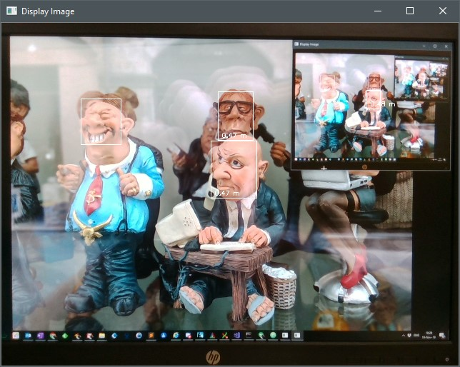

# rs-face-vino Sample

## Overview
This example demonstrates OpenVINO™ toolkit integration with facial detection, using
depth information to approximate distance.

<p align="center"></p>


## Requirements

A camera with both depth and RGB sensors is required.

This sample makes use of OpenCV. You can use the OpenCV that is packaged
with OpenVINO by pointing OpenCV_DIR to `${INTEL_OPENVINO_DIR}/opencv/cmake`.


## Implementation

A helper namespace `openvino_helpers` is used, with a helper class
`object_detection` encapsulating much of the OpenVINO details:

```cpp
    openvino_helpers::object_detection faceDetector(
        "face-detection-adas-0001.xml",
        0.5     // Probability threshold -- anything with less confidence will be thrown out
    );
```

There are two trained model Intermediate Representation files
(`face-detection-adas-0001.xml` and `.bin`) that need to be loaded. Pointing to
the `.xml` is enough. These are automatically installed into your build's
`wrappers/openvino/face` directory.

> The `object_detection` class checks that the model includes the required
> input/output layers, so feel free to substitute different models.

Each detection has a `confidence` score. You can specify how confident you
want the results to be.

Asynchronous detection takes place by queueing a frame and only processing its
results when the next frame is available:

```cpp
    // Wait for the results of the previous frame we enqueued: we're going to process these
    faceDetector.wait();
    auto results = faceDetector.fetch_results();

    // Enqueue the current frame so we'd get the results when the next frame comes along!
    faceDetector.enqueue( image );
    faceDetector.submit_request();

    // Process the results...
```

Detected faces are placed into a container and assigned IDs. Some basic effort
is made to keep the creation of new faces to a minimum: previous faces are
compared with new detections to see if the new are simply new positions for the
old. An "intersection over union" (IoU) quotient is calculated and, if over a
threshold, an existing face is moved rather than a new face created.

```cpp
    rect = rect & cv::Rect( 0, 0, image.cols, image.rows );
    auto face_ptr = openvino_helpers::find_object( rect, prev_faces );
    if( !face_ptr )
        // New face
        face_ptr = std::make_shared< openvino_helpers::detected_object >( id++, rect );
    else
        // Existing face; just update its parameters
        face_ptr->move( rect );
```

### Depth calculation

We make sure to align the depth and color frames, such that the center of each
face's bounding box in the color frame corresponds to the same pixel in the
depth. Then it is easy to simply get the depth:

```cpp
    auto center_x = r.x + r.width / 2;
    auto center_y = r.y + r.height / 2;
    auto d = depth_frame.get_distance( center_x, center_y );
```
