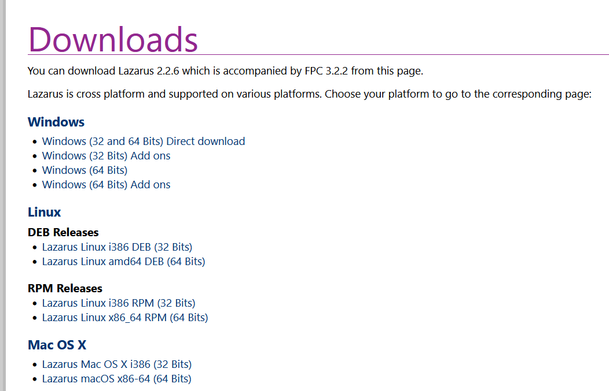
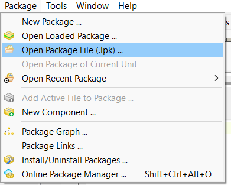

# Pascal-LibreSense

## Table of contens

* [Introduccion](#introduccion)
* [Requirements](#requirements)
* [Install](#install)
* [Examples](#examples)
* [License](#license)

## Introduccion

This proyect is a warpping  for modern pascal of [librealsense library from intel](https://github.com/IntelRealSense/librealsense).

Why modern free Pascal?. Here there is a good [article](https://castle-engine.io/modern_pascal).

## Requirements

You need a modern pascal compiler. 

* Lazarus is a free, cross-platform, integrated development environment (IDE) for rapid application development (RAD) using the Free Pascal compiler. Its goal is to provide an easy-to-use development environment for programmers developing with the Object Pascal language, which is as close as possible to Delphi. 

## Install

* [Lazarus](#lazarus)

### Lazarus

If you don't have a copy of lazarus download Lazarus for 64 bits from here: https://www.lazarus-ide.org/index.php?page=downloads

Make sure you download the correct version for your operating system.

Download or clone the repository in a folder where you like.

From Lazarus, open a package.

Navigate to the folder where you downloaded or cloned the repository. Open the folder wrappers, free pascal, Lazarus package. And select the file laz_realsense.

Now compile the package.

After it compiles you can close the window. 

Now we are ready to create applications. Create a new project.

Can be a console program or a application.

Add the realsense package to your project. In menu project, select project inspector.

Now add a new requirement. 

Search for laz_realsense, and select it.

Now you are ready start writing your code. For more information, see the examples in the examples folder.

Note. In windows, be sure that Realsense2.dll file can be found in the path or is in the same folder of your executable.

## Examples

From the Lazarus environment, use the Project menu, Open Project. Navigate to the folder where you have installed the repository, and select the Examples folder.

Select an example. To test the library for the first time, I suggest you open the TestLib example. In the Examples folder there is more information about how each example works.

Now simply press run on the Lazarus toolbar, or just press the F9 key

.

If you get the following error, it means that your program cannot find the Realsense2 library.

.

Make sure the Realsense2 file is in the same folder where your program is running. Or in a path where your operating system can find it

## License

This project is licensed under the [Apache License, Version 2.0.](https://github.com/IntelRealSense/librealsense/blob/master/LICENSE)

