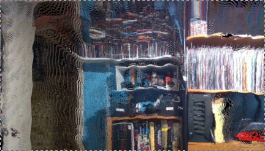

# rs-pcl-color Sample

## Overview
This example provides color support to PCL for Intel RealSense cameras. The demo will capture a single depth frame from the camera, convert it to `pcl::PointCloud` object and perform basic `PassThrough` filter, but will capture the frame using a tuple for RGB color support. All points that passed the filter (with Z less than 1 meter) will be removed with the final result in a Captured_Frame.pcd ASCII file format. Below is an example of the final output.

