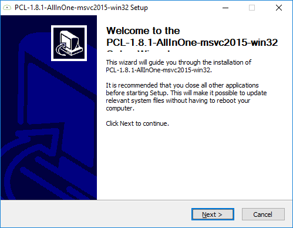
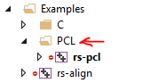
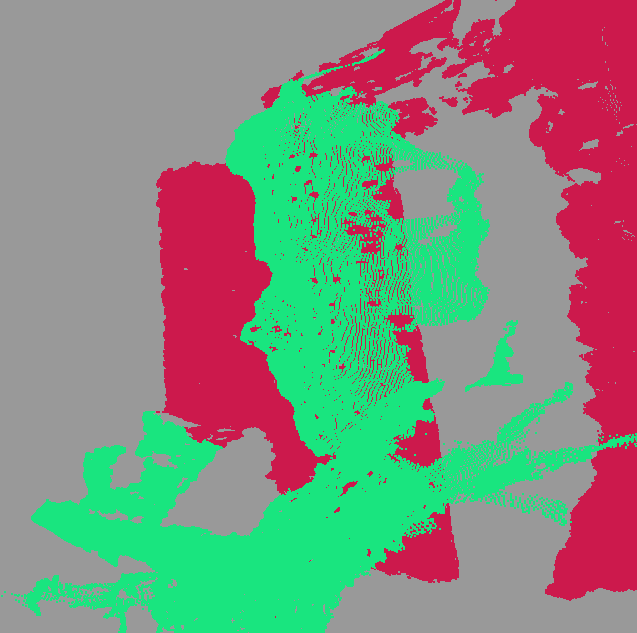

# PCL Samples for Intel® RealSense™ cameras
Examples in this folder are designed to complement existing [SDK examples](../../examples) and demonstrate how Intel RealSense cameras can be used together with `PCL` (Point-Cloud Library). 
 
## List of Samples:
1. [PCL](./pcl) - Minimal Point-cloud viewer that includes PCL processing
2. [PCL-COLOR](./pcl-color) - Point-cloud viewer that includes RGB PCL processing

## Getting Started:
This page is certainly **not** a comprehensive guide to getting started with PCL, but it can help get on the right track. 

* [Windows Installation](#windows)
* [Linux Installation](#linux)

### Windows
1. Download and install `CMake` from [cmake.org/download](https://cmake.org/download/)
2. Download prebuilt binaries for PCL ([official link](http://pointclouds.org/downloads/windows.html)). For Visual Studio 2015 / 2017, use the [following link](http://unanancyowen.com/en/pcl181).
3. Follow the installation procedure:

<p align="center"></p>

4. Open the **Command Prompt** and execute:
```
set PCL_ROOT="C:\Program Files (x86)\PCL 1.8.1"
set PATH=%PATH%;%PCL_ROOT%\bin;%OPENNI2_REDIST%
```
Or if you have install the 64-bit version:
```
set PCL_ROOT="C:\Program Files\PCL 1.8.1"
set PATH=%PATH%;%PCL_ROOT%\bin;%OPENNI2_REDIST64%
```

5. If you had Visual Studio openned, please restart it to make sure new environment variables are in effect. 

6. Clone or download librealsense sources from [github.com/IntelRealSense/librealsense](https://github.com/IntelRealSense/librealsense) into a local directory (`C:/git/librealsense`)
7. Run `cmake-gui` and fill source code and binaries locations and press `Configure`
8. Make sure ``BUILD_SHARED_LIBS` is checked (linking to librealsense staticly will cause problems with PCL linkage)
9. Check the `BUILD_PCL_EXAMPLES` flag and click `Configure` again:

<p align="center"></p>

13. Click `Generate` and `Open Project`
14. Locate PCL solution-folder under Examples



15. Right-click on one of the examples to `Set as StartUp Project`
16. Press `F5` to compile and run the example

<p align="center"></p>


### Linux

1. Install PCL from [official PPA](http://pointclouds.org/downloads/linux.html):
```shell
sudo add-apt-repository ppa:v-launchpad-jochen-sprickerhof-de/pcl
sudo apt-get update
sudo apt-get install libpcl-all
```
2. Follow [the instructions](https://github.com/IntelRealSense/librealsense/blob/master/doc/installation.md) to build `librealsense` from source
3. Add `-DBUILD_PCL_EXAMPLES=true` to your `cmake` command
4. Run `./wrappers/pcl/pcl/rs-pcl` or just `rs-pcl` if you have previously executed `sudo make install`

> The demo seem to **Seg-Fault** in Debug configuration. This is very troubling, but it seem to be somewhat of a [known issue with PCL](https://stackoverflow.com/questions/26346690/debug-seg-fault-in-boostmathlanczos-with-libpcl-surface). As a work-around add `-DCMAKE_BUILD_TYPE=RelWithDebInfo` to your `cmake` command

