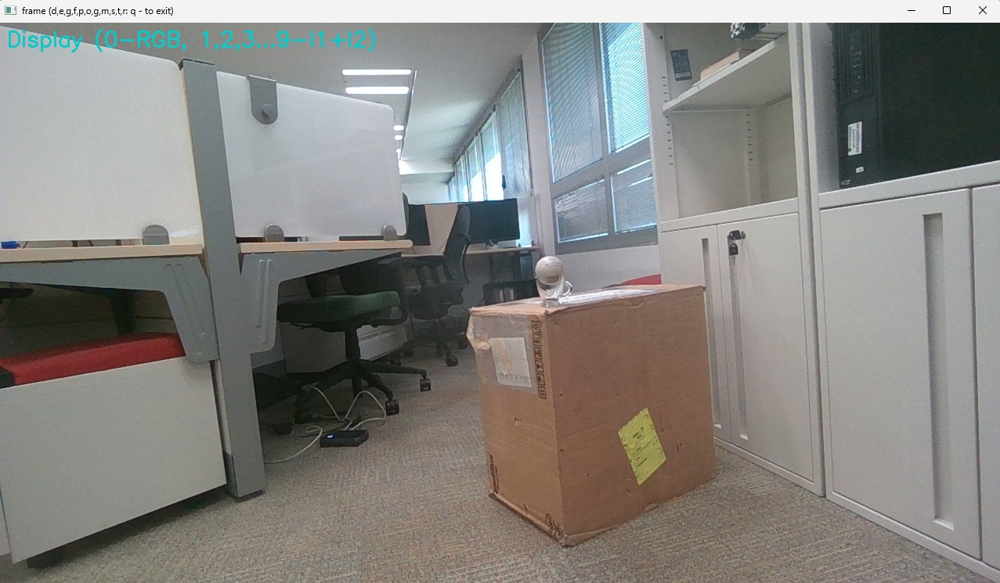
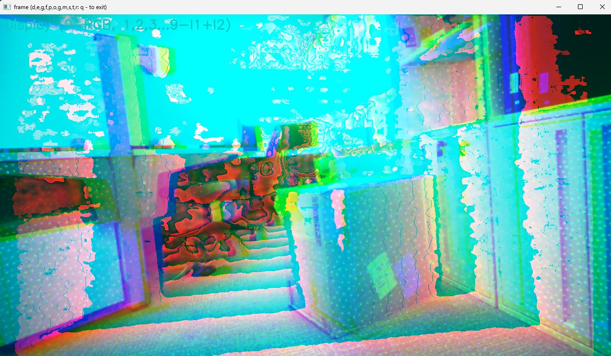

# Intel RealSense - Object Camera

Objects are everywhere!

This package supports object data extraction from the intel Realsense camera RGB or Depth streams in real time.

The list of the supported objects, frameworks, platforms and applications are below. Click on each image to find out more.

# Objects

-  Barcodes, QR Codes, Aruco Markers - well defined objects detected by using RGB camera data. 

Barcodes   | QR Codes | Aruco Markers |
:------------: |  :----------: | :-------------:  |
  |   |   |

-  Planes, Edges, Corners - 3D geometric objects detected using depth camera information. 

Planes | Edges | Corners |
:------------: |  :----------: | :-------------:  |
  |   |   |

# Applications

User level applications supported by the Camera software

Region Detection | Object Counting | Motion Detection |
:------------: |  :----------: | :-------------:  |
 |  |  |

VSLAM/Localization | Plane Detection | Body Detection |
:------------: |  :----------: | :-------------:  |
 |   |  |

# Utilities

OpenCV Like Camera Wrapper - controls low level camera features like exposure, gain, laser power, provides access to left and right sensor images and additional features. 
It can be used to connect to Real Sense camera in real time. It provides a simple UI to store videos and images in different formats.

 |  |  |
:------------: |  :----------: | :-------------:  |
 |  |  |
 |  |  |

Depth Noise measurement tool - a simple UI to measure noise in the depth data. It supports measurement of the temporal noise per pixel, spatial noise per image ROI and fitted plane noise. In addition, it reports the number/percent of the non valid pixels. The results are visualized and alo printed in the console window. 

Temporal/Spatial ROI | Plane Fit ROI | 
:------------: |  :----------: | 
 |  |

Logger -  to monitor and print console information, errors and processing time of the applications. 

 

# Request Camera Feature
If you want to run the application or object detection on the camera hardware - check this [link](https://docs.google.com/forms/d/e/1FAIpQLSdduDbnrRExDGFQqWAn8pX7jSr8KnwBmwuFOR9dgUabEp0F1A/viewform).

# Supported Platforms and Compute Environments

The following is the check list of supported environments and functionality:
- Windows
- Ubuntu
- Jetson (NVIDIA)  - TBD
- Raspeberry PI    - TBD

# How to Contribute

We greatly appreciate contributions from the community, including examples, applications, and guides. If you'd like to contribute, please follow these guidelines:

1. **Create a pull request (PR)** with the title prefix `[RS]`, adding your new example folder to the `root/` directory within the repository.

2. **Ensure your project adheres to the following standards:**
   - Makes use of the `vision` package.
   - Includes a `README.md` with clear instructions for setting up and running the example.
   - Avoids adding large files or dependencies unless they are absolutely necessary for the example.

