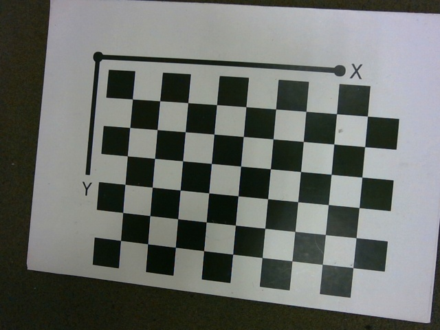

# Introduction

This is a collection of the examples to facilitate camera robot integration.

-   moving camera  : cameras mounted on a robotic arm
-   on board camera : camera mounted on AGV/AMR mobile platform
-   stationary camera  : camera mounted on the fixed structure  

This code could be integrated in your robotics and video processing pipe line.


## Hand-Eye Calibration


The dataset:

:------------: |  :----------: | :-------------:  |
[] | [] | [] |
 |  |  |
 |  |  |

Json file that describes robot arm positions for each image above is here (data/calibration_hand_eye/camera_robot_calibration.json) and looks like this:

```json

{"imageName": "calib_robot_0001.jpg", "robotPose": [127.763,355.406,5.45674,-0.1392,-3.05356,-0.138536]},     
{"imageName": "calib_robot_0002.jpg", "robotPose": [131.589,356.447,5.63756,-0.005102,-3.0533,-0.133261]}, 
{"imageName": "calib_robot_0003.jpg", "robotPose": [135.368,357.804,5.62477,0.127749,-3.04725,-0.127267]}, 
{"imageName": "calib_robot_0004.jpg", "robotPose": [128.667,362.151,9.00709,-0.133892,-3.05282,-0.005054]}, 
{"imageName": "calib_robot_0005.jpg", "robotPose": [131.855,363.293,9.13366,0.000735,-3.05593,-9e-06]}, 
{"imageName": "calib_robot_0006.jpg", "robotPose": [135.003,364.624,9.10671,0.133818,-3.05301,0.005782]}, 
{"imageName": "calib_robot_0007.jpg", "robotPose": [129.61,369.24,12.0069,-0.128087,-3.04711,0.127505]}, 
{"imageName": "calib_robot_0008.jpg", "robotPose": [132.029,370.418,12.0255,0.006511,-3.05289,0.133136]}, 
{"imageName": "calib_robot_0009.jpg", "robotPose": [134.556,371.645,11.9296,0.139922,-3.05326,0.139578]}, 
{"imageName": "calib_robot_0010.jpg", "robotPose": [121.154,356.088,6.52716,0.136842,3.13027,0.136899]}, 
{"imageName": "calib_robot_0011.jpg", "robotPose": [124.967,356.443,6.52796,-0.000734,3.13673,0.13713]}, 


```

## Installation Windows/Ubuntu

1. 

## Usage


