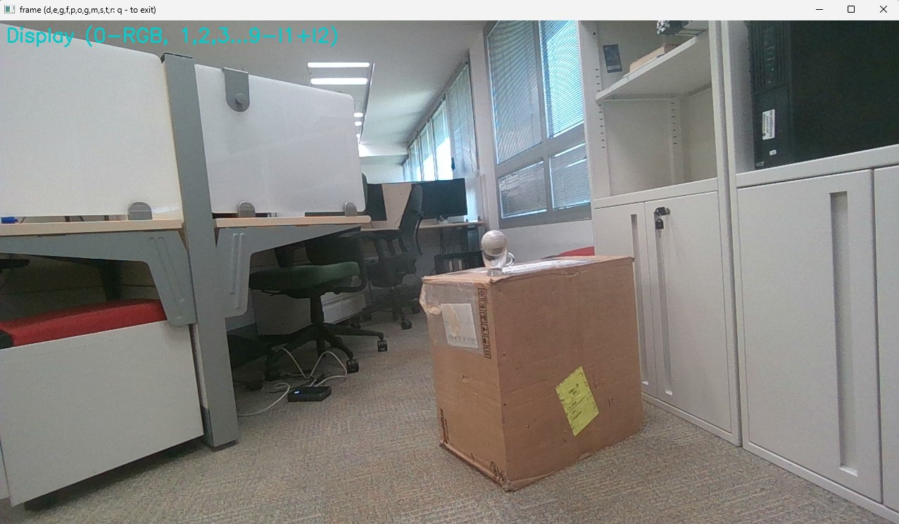
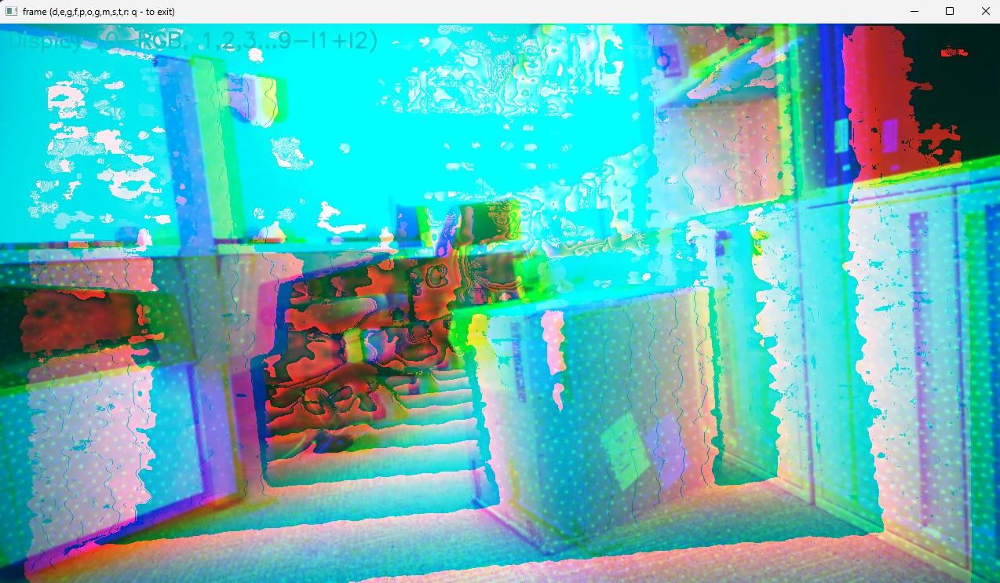
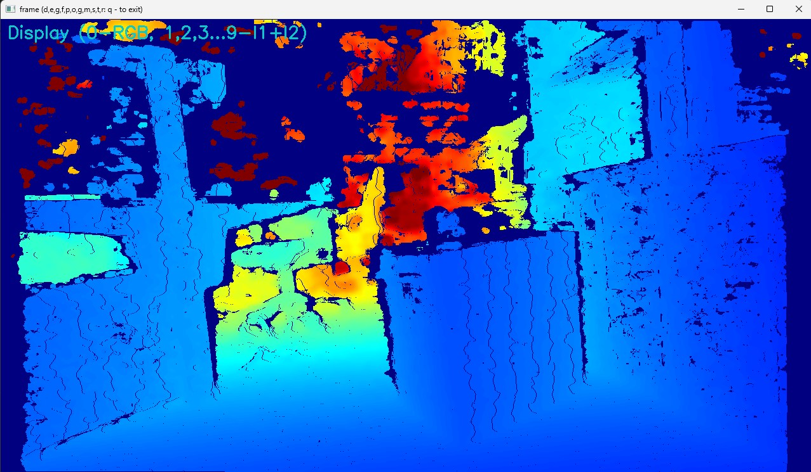
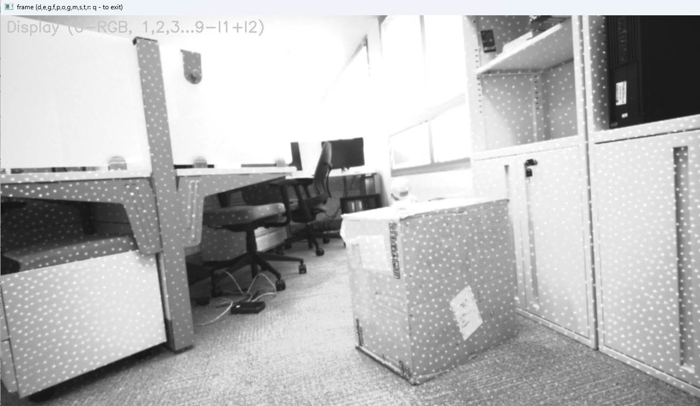
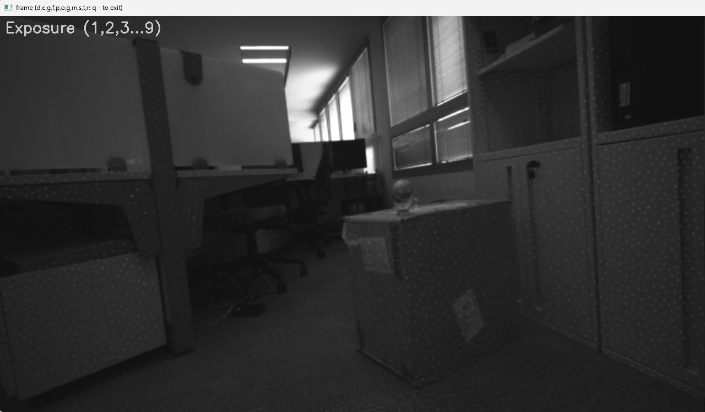
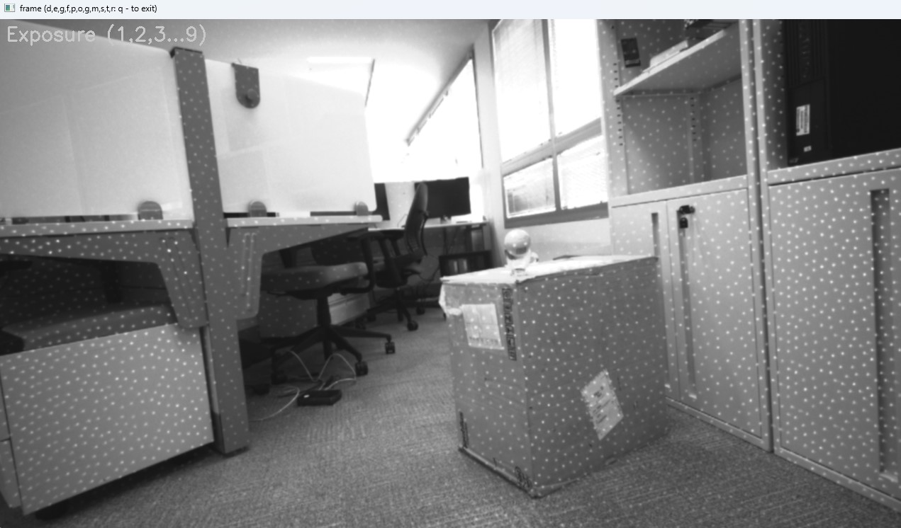
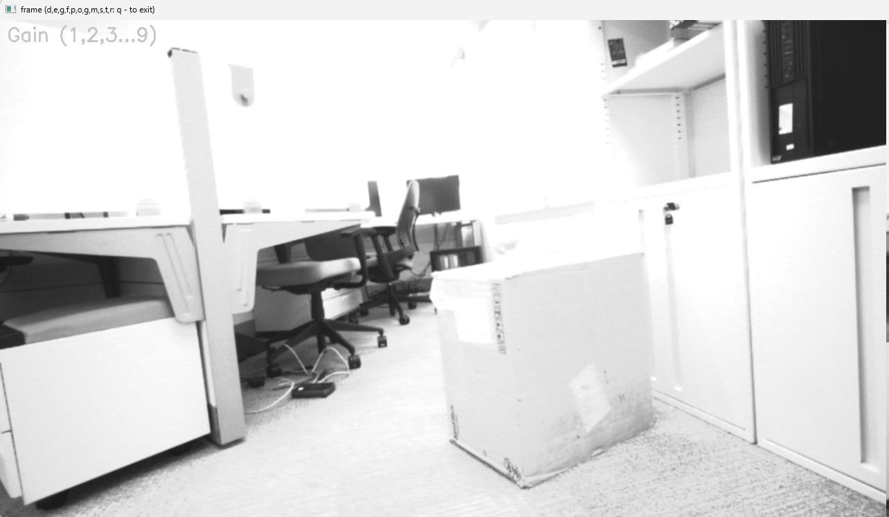
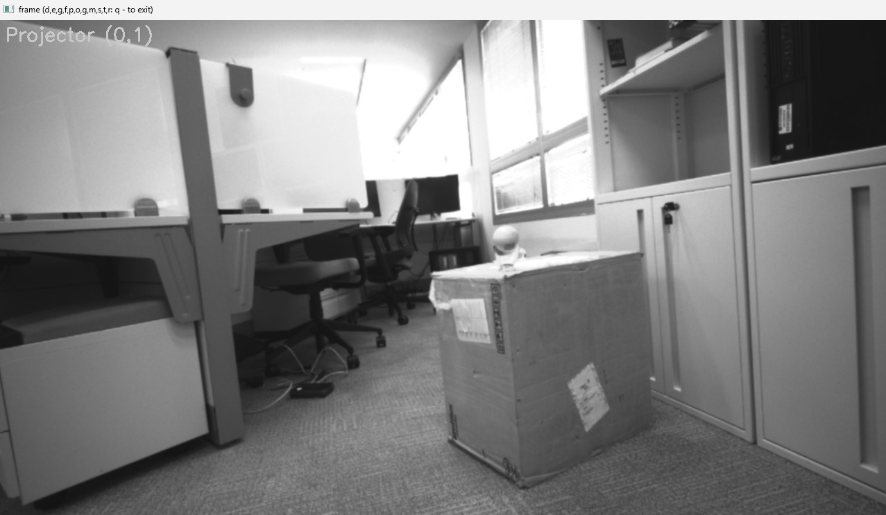

[](https://pypi.python.org/pypi/scikit-spatial)


# Introduction

This module provides some useful utilities and functions for RealSense camera usage.
The object detection is based on RGB values of the camera.
The following functions are supported:

-   OpenCV like camera usage
-   RGB and depth information alignments
-   Extraction of IR images from left and right sensor
-   Saving and recording of the RGB, Depth and RGD data

These functions are reused in other RealSense object detection modules.


# Modules

- opencv_realsense_camera : camera wrapper with multiple internal features exposed like opencv interface 
- measure_camera_noise    : tool to measure depth camera noise


# RealSense Camera Wrapper

-  Display Modes - different image data that could be extracted from the camera. 

Display Image   | Mode |  Explanations | 
:------------: |  :----------: | :----------: | 
 | Display - Option 0 | simple RGB output with display control on | 
 |   Display -Option 3 | simple 16  bit data with Left, Right and Depth images stacked as RGB planes | 
 |   Display - Option 5 | Depth image mapped to a color space using specific scaling factor to fit 12 bit depth to uint8 range | 
 |   Display - Option 9 | Left Right IR images stacked in x axis | 
 |   Exposure - Option 2 | reduced exposure value | 
 |   Exposure - Option 9 | different exposure value | 
 |   Gain - Option 2 | different camera gain value | 
 |   Projector - Option 0 | turn projector on-off | 


# Installation Windows

Python is a self contained development environment. We use PIP to manage the package installation.
You can use Conda, Miniconda or other package managers.

1. Install python 3.10 from Python Release Python 3.10.0 | <https://www.python.org/>

2. Create virtual environment. In Windows PowerShell:

    python -m venv <your path>\Envs\utils

3. Activate virtual environment. In Windows CMD shell:

    <your path>\Envs\utils\Scripts\activate.bat

4. Installing realsense driver. For example, download pyrealsense2-2.55.10.6089-cp310-cp310-win_amd64.whl:

    pip install pyrealsense2-2.55.10.6089-cp310-cp310-win_amd64.whl


# Usage

```py
>>> from opencv_realsense_camera import RealSense

>>> rs_cap = RealSense('rgb')

```