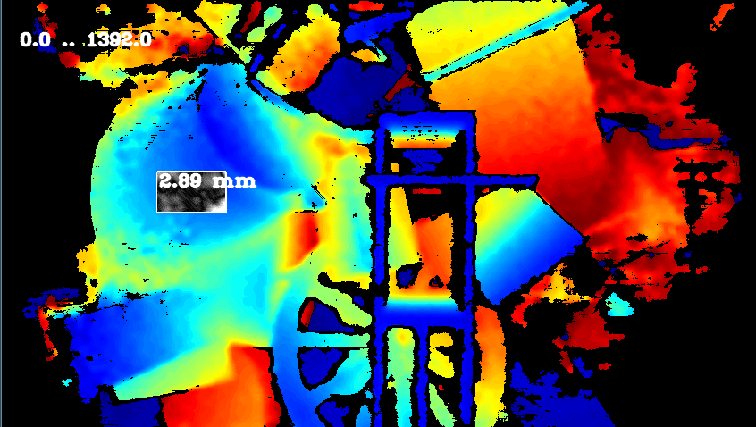
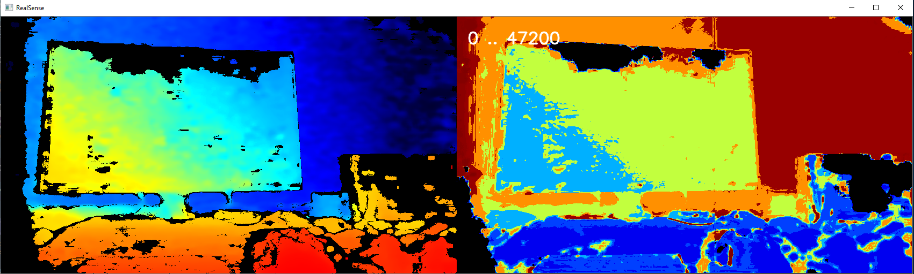
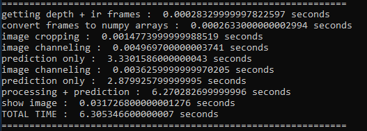

# Introduction
# Installation
To install all relevant python packages, run the following command by using the package manager pip :

	pip install -r "...\requirements.txt"

Find requirements.txt in installation folder. If you have GPU, install Tensorflow with GPU:

	pip install tensorflow-gpu
	pip install keras
### Versions
	Tensorflow-gpu - 2.2.0
	Keras - 2.4.3

# Examples
Set of example showing the use of Tensorflow.

## Example 1 
explain how to download cocoset etc

## Example 2
like 1, for each object from RGB (ex 1 - bounding box) take its depth (take example from sergey)

## Example 3
like #1 but with opencv

## Example 4

#### Problem Statement
TODO

#### Unet Network Architecture
Unet is a deep learning architecture commonly used in image segmentation, denoising and inpainting applications. For original paper please refer to [U-Net: Convolutional Networks for Biomedical Image Segmentation](https://arxiv.org/pdf/1505.04597.pdf).
For the problem of depth post-processing, we are looking to solve a combination of denoising and inpaiting (hole-filling) problems making Unet architecture very appropriate. 

Additional information on Unet:

- [github.com/zhixuhao/unet](https://github.com/zhixuhao/unet) - Open-source implementation of Unet architecture with Keras 
- [Introduction to image segmentation with Unet](https://towardsdatascience.com/understanding-semantic-segmentation-with-unet-6be4f42d4b47)

Unet offers significant advantages compared to classic autoencoder architecture, improving edge fidelity. (TODO: picture comparison?)
		
(TODO: Replace with an illustration with map of layers)

In the left pathway of Unet, the number of filters (features) increase as we go down, it means that it becomes
very good at detecting more and more features, the first few layers of a convolution network capture a very small semantic information and lower level
features, as you go down these features become larger and larger, but when we throw away information the CNN
knows only approximate location about where those features are.
When we upsample we get the lost information back (by the concatination process)
so we can see last-layer features in the perspective of the layer above them.
		
#### Training Dataset
The dataset is located here: https://drive.google.com/file/d/1cXJRD4GjsGnfXtjFzmtLdMTgFXUujrRw/view?usp=drivesdk
It containes 4 types of 848x480 images in uncompressed PNG format: 

###### 1. Simulated Left Infrared:
- Syntethic view from left infrared sensor of the virtual camera, including inrared projection pattern
- 3-channel grayscale image of 8 bits per channel
- Name Filter: left-*.png
###### 2. Simulated Right Infrared:
- Syntethic view from right infrared sensor of the virtual camera, including inrared projection pattern
- 3-channel grayscale image of 8 bits per channel
- Name Filter: right-*.png
###### 3. Ground Truth Depth:
- Ground truth depth images 
- Single channel 16-bits per pixel values in units of 1mm
- Name filter : gt-*.png
###### 4. Generated Depth: 
- Depth images generated from Left and Right pairs using D400 stereomatching algorithm configured with parameters similar to the D435 camera
- Single channel 16-bits per pixel values in units of 1mm
- Name filter: res-*.png
		
#### Data Augmentation
To help the neural network learning image features we decide to crop input images into tiles of 128x128 pixels. 

Each ground truth image has a corressponding depth and infrared image. Given that, the dataset is augmented as following:

###### 1. Cropping 

Each image in the dataset is padded to get a size of 896x512 then each of them is cropped to 128x128. In total, each image is cropped to 28 images of size 128x128.  
Each cropped image is saved with the original image name, adding to it information about the column and row the image was cropped from. It helps corresponding to each ground-truth cropped-image, the IR and depth image from the cropped set.

###### 2. Channeling
We expand left infrared image to 16-bits and attach it as second channel to network input and output. This gives the network additional visual features to learn from. 

Eventually, the data that is fed to Unet network contains:
- Noisy images: 
2 channels: first channel is a depth image and second channel is the corressponding IR image
- Pure images: 
2 channels: first channel is a ground truth image and second channel is the corressponding IR image

#### Training Process
In order to start a training process, the following is required:
- Unet Network Implementation: choosing the sizes of convolutions, max pools, filters and strides, along downsampling and upsampling.
- Data Augmentation: preparing dataset that contains noisy and pure images as explained above.
- Old model (optional): there is an option of training the network starting from a previously-trained model. 
- Epochs: epoch is one cycle through the full training dataset (forth and back). The default value of epochs number is 100, it could be contolled by an argument passed to the application.

#### File Tree 
The application will create automatically a file tree:
- `images` folder: contains original and cropped images for training and testing, and also the predicted images
- `logs` folder: all tensorflow outputs throughout the training are stored in txt file that has same name as the created model. It contains also a separate log for testing statistics.
- `models` folder: each time a training process starts, it creates a new folder for a model inside models folder. If the traing starts with old model, 
				 it will create a folder with same name as old model adding to it the string "_new"
		
		.
		├───images
		│   ├───denoised
		│   ├───test
		│   ├───test_cropped
		│   ├───train
		│   ├───train_cropped
		│   └───train_masked
		├───logs
		└───models
			└───DEPTH_20200910-203131.model
				├───assets
				└───variables
		
####  Testing Process
The tested images should be augmented like trained images, except the cropping size should be 480x480 (each image is cropped to 2 images) (TODO:Why??), considering performance improvement.
For testing, there is no need to ground truth data, only depth and IR images are required.
The relevant folders in file tree are: 
- `test`: original images to test of sizes 848x480
- `test_cropped`: cropped testing images, size: 480x480
- `denoised`: the application stores predicted images in this folder.
		
#### Monitoring with Tensorboard 
		
# Tools
There are several helper tools located under `tools` folder: 

##  RMSE

RMSE tool can be use to show surface smoothness by showing plane-fit RMS of pixels inside a selected rectangle inside the image.
The tools is approximating best fit plane passing through selected points, ignoring zero depth and calculates how far on average points are from that plane. 
When evaluated on planar surface, this gives good metric for surface smoothness. In addition, noise distribution within the selected bounding box is color coded: 
Black pixels correspond to low deviation from predicted plane-fit with white pixels corresponding to points further aways from the plane, normalized by standard deviation. 

 
## Convert to Bag
This tool runs on a folder that contains:

	1. depth images as captured by ds5 camera
	
	2. ground truth of depth images from #1
	
	3. IR images from left sensor corresponding to #1 and #2
	
	4. denoised images : Unet network model prediction of noisy images from #1
	
The output is a BAG file that could be opened by RealSense viewer.

## Example 5:
In this example, we show a prediction of live scense captured by ds5 camera.

To make it work, connect a ds5 camera and prepare a trained Tensorflow model. 
It could be the trained model from example #4 or any model from this path: \\ger\ec\proj\ha\RSG\SA_3DCam\Noha\Tensorflow\models
Pass the selected model as argument to the tool:
	
	python camera_simulation.py <path to the model>

It will display original frame captured by the camera, and right to it a frame as predicted by the selected model.

It shows also time statistics for each frame :

## Example 6
How covert keras to frozen graph --> camera simulation as #5 but use only opencv

https://cocodataset.org/#home 
https://drive.google.com/file/d/1ZCnqb7OB5fkk4ba4lK2WZry3qu0RUZfZ/view?usp=sharing 
