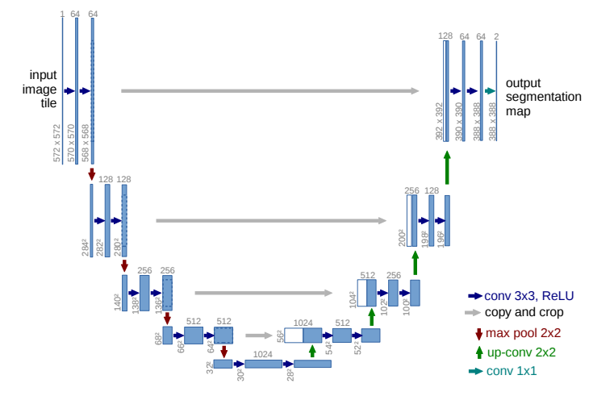
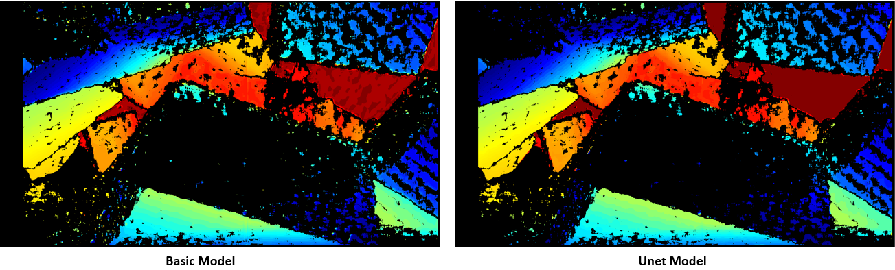
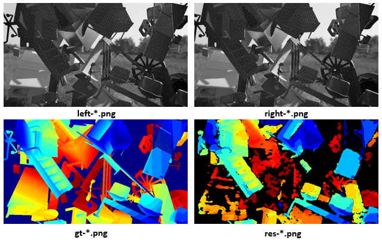
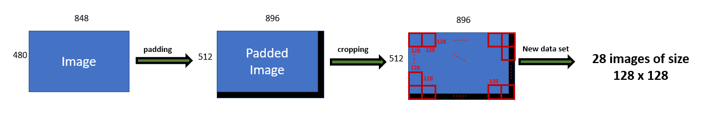
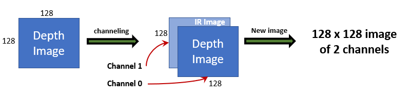
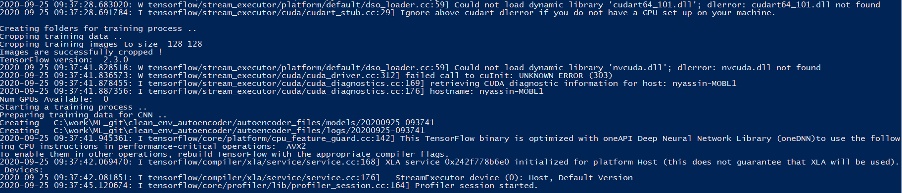
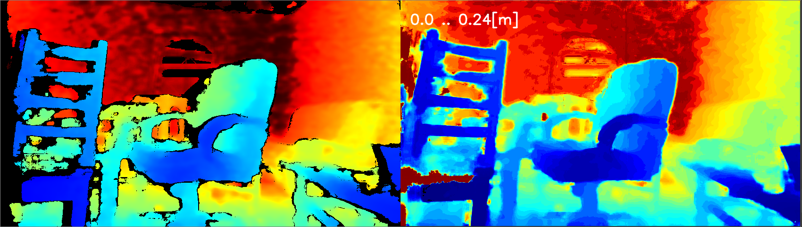

# TensorFlow with Intel RealSense Cameras

## Introduction

TensorFlow is extremely popular open source platform for machine learning. This tutorial series will highlight different ways TensorFlow-based machine learning can be applied with Intel RealSense Depth Cameras. We'll be using python as language of choice, but same concepts can be easily ported to other languages.

## Installation

We'll need the following components:

1. `python 3.6` - [download page](https://www.python.org/downloads/release/python-360/). Version 3.6 was chosen due to its compatibility with components below
2. `pyrealsense2` - on x86 Linux and Windows platforms can be installed by running `pip install pyrealsense2`. For additional installation instructions please see [official documentation](https://github.com/IntelRealSense/librealsense/tree/master/wrappers/python#installation). We'll be using `pyrealsense2` to communicate with the camera and fetch frames from the device.
3. `numpy` - We'll be using Numpy for image storage and manipulation. Install via `pip install numpy`
4. `opencv` - We'll be using OpenCV for loading and saving images, basic image processing, and inference in some examples. OpenCV can be installed via `pip install opencv-python`
5. `tensorflow` - TensorFlow is the main focus of this set of tutorials. We'll be using TensorFlow version 2.3.0, or TensorFlow-GPU version 2.2.0. We'll also be using a version of Keras library bundled inside TensorFlow installation. Keras is offering set of declarative APIs simplifying network declaration and improving readability. 

> **Note on GPU Support**: In order to run TensorFlow with GPU acceleration on NVidia GPUs you need to install `tensorflow-gpu` python package and compatible versions of CUDA and cuDNN libraries. [List of compatible combinations](https://www.tensorflow.org/install/source_windows#gpu)

We assume you are already familiar with the basics of operating Intel RealSense devices in python. Please see [official documentation](https://github.com/IntelRealSense/librealsense/tree/development/wrappers/python#python-wrapper) for more information and code samples. 

## Part 1 - Object Detection and Classification
Intel RealSense Camera can be used for object detection and classification with TensorFlow like any other video source. [Example 1](example1%20-%20object%20detection.py) is showing standard object detection using TensorFlow and data from the RGB sensor. 

In order to run this example, you will need model file. Please download and extract one of the models from [TensorFlow-Object-Detection-API](https://github.com/opencv/opencv/wiki/TensorFlow-Object-Detection-API#use-existing-config-file-for-your-model) page. We are using [Faster-RCNN Inception v2](https://arxiv.org/pdf/1611.10012.pdf) for this example, but other networks can be easily swapped-in. Extracted `frozen_inference_graph.pb` is expected to be in the working directory when running the script. 

The code should be familiar with anyone who worked with TensorFlow before. We start by creating Graph object and loading it from file:

```py
# Load the Tensorflow model into memory.
detection_graph = tf.Graph()
with detection_graph.as_default():
    od_graph_def = tf.compat.v1.GraphDef()
    with tf.compat.v1.gfile.GFile(PATH_TO_CKPT, 'rb') as fid:
        serialized_graph = fid.read()
        od_graph_def.ParseFromString(serialized_graph)
        tf.compat.v1.import_graph_def(od_graph_def, name='')
    sess = tf.compat.v1.Session(graph=detection_graph)
```

Next, we will initialize the relevant input and output vectors needed in this sample:

```py
# Input tensor is the image
image_tensor = detection_graph.get_tensor_by_name('image_tensor:0')
# Output tensors are the detection boxes, scores, and classes
# Each box represents a part of the image where a particular object was detected
detection_boxes = detection_graph.get_tensor_by_name('detection_boxes:0')
# Each score represents level of confidence for each of the objects.
# The score is shown on the result image, together with the class label.
detection_scores = detection_graph.get_tensor_by_name('detection_scores:0')
detection_classes = detection_graph.get_tensor_by_name('detection_classes:0')

# Number of objects detected
num_detections = detection_graph.get_tensor_by_name('num_detections:0')
```

We'll start the camera by specifying the type of stream and its resolution:

```py
pipeline = rs.pipeline()
config = rs.config()
config.enable_stream(rs.stream.color, 1280, 720, rs.format.bgr8, 30)
```

Inside the main loop we will get color data from the camera and convert it into a NumPy array:

```py
frames = pipeline.wait_for_frames()
color_frame = frames.get_color_frame()
color_image = np.asanyarray(color_frame.get_data())
```

Next we can perform inference using our TensorFlow session:

```py
(boxes, scores, classes, num) = sess.run([detection_boxes, detection_scores, detection_classes, num_detections],
                                         feed_dict={image_tensor: image_expanded})
```

Finally, we will assign random persistent color to each detection class and draw a bounding box around the object. We filter out low confidence predictions using `score` output. 

```py
for idx in range(int(num)):
    class_ = classes[idx]
    score = scores[idx]
    box = boxes[idx]
    if class_ not in colors_hash:
        colors_hash[class_] = tuple(np.random.choice(range(256), size=3))
    if score > 0.8:
        left = box[1] * W
        top = box[0] * H
        right = box[3] * W
        bottom = box[2] * H

        width = right - left
        height = bottom - top
        bbox = (int(left), int(top), int(width), int(height))
        p1 = (int(bbox[0]), int(bbox[1]))
        p2 = (int(bbox[0] + bbox[2]), int(bbox[1] + bbox[3]))
         # draw box
        r, g, b = colors_hash[class_]
        cv2.rectangle(color_image, p1, p2, (int(r), int(g), int(b)), 2, 1)
```

Expected output: 


## Part 2 - Augmenting output using Depth data

Since Intel RealSense Cameras also offer per-pixel depth information, we can use this extra data to solve additional problems related to our detection and classification example. In [Example 2](example2%20-%20person%20height.py) we'll use color data to detect people and depth data to quickly estimate the height of each person.

In this example we will configure depth stream in addition to color:
```py
config.enable_stream(rs.stream.depth, 848, 480, rs.format.z16, 30)
```

We'll also need `pointcloud` and `align` helper objects for depth data manipulation:

```py
aligned_stream = rs.align(rs.stream.color) # alignment between color and depth
point_cloud = rs.pointcloud()
```

Inside the main loop we will first make sure depth data is aligned to color sensor viewport and next generate an array of XYZ coordinates instead of raw depth:
```py
frames = aligned_stream.process(frames)
depth_frame = frames.get_depth_frame()
points = point_cloud.calculate(depth_frame)
verts = np.asanyarray(points.get_vertices()).view(np.float32).reshape(-1, W, 3)  # xyz
```

This allows us to query XYZ coordinates of each detected object and to separate individual coordinates (in meters):

```py
obj_points = verts[int(bbox[1]):int(bbox[1] + bbox[3]), int(bbox[0]):int(bbox[0] + bbox[2])].reshape(-1, 3)
zs = obj_points[:, 2]
ys = obj_points[:, 1]
```

To avoid outliers we will delete any Y values corresponding to Z values far away from Z median. This makes sure the background has minimal interference with our calculation. 

```py
z = np.median(zs)
ys = np.delete(ys, np.where((zs < z - 1) | (zs > z + 1)))
```

Assuming camera is horizontal, persons height can be approximated by its length in Y direction. This can be easily calculated using max and min Y:

```py
my = np.amin(ys, initial=1)
My = np.amax(ys, initial=-1)
height = (My - my)
```

Expected output: 


## Part 3 - Deploying TensorFlow model using OpenCV

While TensorFlow is convenient to install and use, it is not as convinient as OpenCV. OpenCV is ported to most platforms and is well optimised for various types of CPUs. It also comes with built-in DNN module capable of loading and using TensorFlow models without having TensorFlow (or its dependencies) installed.

[Example 3](example3%20-%20opencv%20deploy.py) is functionally equal to Example 2, but instead of using TensorFlow APIs directly it is loading and running inference using OpenCV.

In addition to the model file, you will need `pbtxt` file accompanying the model. This file can be found [at this link](https://github.com/opencv/opencv_extra/blob/master/testdata/dnn/faster_rcnn_inception_v2_coco_2018_01_28.pbtxt).

```py
net = cv2.dnn.readNetFromTensorflow(r"frozen_inference_graph.pb", 
                                    r"faster_rcnn_inception_v2_coco_2018_01_28.pbtxt")
```

After converting color image to NumPy array, inference can be done as follows:

```py
scaled_size = (int(W), int(H))
net.setInput(cv2.dnn.blobFromImage(color_image, size=scaled_size, swapRB=True, crop=False))
detections = net.forward()
```

Resulting `detections` array will capture all detections and associated information. 

## Part 4 - Training on Depth data using TensorFlow

#### Problem Statement
In this tutorial we'll show how to train a network for depth denoising and hole filling. Please note this project is provided for education purposes and resulted depth is not claimed to be superior to camera output. Our goal is to document end-to-end process of developing new network using depth data as its input and output. 

#### Unet Network Architecture
Unet is a deep learning architecture commonly used in image segmentation, denoising and inpainting applications. For original paper please refer to [U-Net: Convolutional Networks for Biomedical Image Segmentation](https://arxiv.org/pdf/1505.04597.pdf).
For the problem of depth post-processing, we are looking to solve a combination of denoising and inpaiting (hole-filling) problems making Unet architecture very appropriate. 

Additional information on Unet:

- [github.com/zhixuhao/unet](https://github.com/zhixuhao/unet) - Open-source implementation of Unet architecture with Keras 
- [Introduction to image segmentation with Unet](https://towardsdatascience.com/understanding-semantic-segmentation-with-unet-6be4f42d4b47)

Unet offers significant advantages compared to classic autoencoder architecture, improving edge fidelity (see image below).
		

###### The image is taken from the article referred above.

Edge comparison between Unet and basic convolution network:



In the left pathway of Unet, the number of filters (features) increase as we go down, it means that it becomes
very good at detecting more and more features, the first few layers of a convolution network capture a very small semantic information and lower level
features, as you go down these features become larger and larger, but when we throw away information the CNN
knows only approximate location about where those features are.
When we upsample we get the lost information back (by the concatenation process)
so we can see last-layer features in the perspective of the layer above them.
		
#### Training Dataset
Download [part 1](https://librealsense.intel.com/rs-tests/ML/Depth_Learning/Dataset/part1_1_4000.zip) and [part 2](https://librealsense.intel.com/rs-tests/ML/Depth_Learning/Dataset/part2_4001_8375.zip) of the dataset. It contains 4 types of 848x480 images in uncompressed PNG format: 

###### 1. Simulated Left Infrared:
- Synthetic view from left infrared sensor of the virtual camera, including infrared projection pattern
- 3-channel grayscale image of 8 bits per channel
- Name Filter: left-*.png
###### 2. Simulated Right Infrared:
- Synthetic view from right infrared sensor of the virtual camera, including infrared projection pattern
- 3-channel grayscale image of 8 bits per channel
- Name Filter: right-*.png
###### 3. Ground Truth Depth:
- Ground truth depth images 
- Single channel 16-bits per pixel values in units of 1mm
- Name filter : gt-*.png
###### 4. Generated Depth: 
- Depth images generated from Left and Right pairs using D400 stereo matching algorithm configured with parameters similar to the D435 camera
- Single channel 16-bits per pixel values in units of 1mm
- Name filter: res-*.png



#### Data Augmentation
To help the neural network learning image features we decide to crop input images into tiles of 128x128 pixels. 

Each ground truth image has a corresponding depth and infrared image. Given that, the dataset is augmented as following:

###### 1. Cropping 

Each image in the dataset is padded to get a size of 896x512 then each of them is cropped to 128x128. In total, each image is cropped to 28 images of size 128x128.  
Each cropped image is saved with the original image name, adding to it information about the column and row the image was cropped from. It helps corresponding to each ground-truth cropped-image, the IR and depth image from the cropped set.



###### 2. Channeling
We expand left infrared image to 16-bits and attach it as second channel to network input and output. This gives the network additional visual features to learn from. 

Eventually, the data that is fed to Unet network contains:
- Noisy images: 
2 channels: first channel is a depth image and second channel is the corresponding IR image
- Pure images: 
2 channels: first channel is a ground truth image and second channel is the corresponding IR image



#### Training Process
In order to start a training process, the following is required:
- Unet Network Implementation: choosing the sizes of convolutions, max pools, filters and strides, along downsampling and upsampling.
- Data Augmentation: preparing dataset that contains noisy and pure images as explained above.
- Old model (optional): there is an option of training the network starting from a previously-trained model. 
- Epochs: epoch is one cycle through the full training dataset (forth and back). The default value of epochs number is 100, it could be controlled by an argument passed to the application.

###### console output



#### File Tree 
The application will create automatically a file tree:
- `images` folder: contains original and cropped images for training and testing, and also the predicted images
- `logs` folder: all tensorflow outputs throughout the training are stored in txt file that has same name as the created model. It contains also a separate log for testing statistics.
- `models` folder: each time a training process starts, it creates a new folder for a model inside models folder. If the training starts with old model, 
				 it will create a folder with same name as old model adding to it the string "_new"
		
		.
		├───images
		│   ├───denoised
		│   ├───test
		│   ├───test_cropped
		│   ├───train
		│   ├───train_cropped
		│   └───train_masked
		├───logs
		└───models
			└───DEPTH_20200910-203131.model
				├───assets
				└───variables
		
####  Testing Process
The tested images should be augmented like trained images, except the cropping size should be as big as possible in order to improve prediction performance. The cropped image size should be squared, because Unet is trained on squared images, so rectangled images don't get good prediction. Also, the cropped size shouldn't exceed original image limits, that's why tested image is cropped to 480x480 (each image is cropped to 2 images).
For testing, there is no need to ground truth data, only depth and IR images are required.
The relevant folders in file tree are: 
- `test`: original images to test of sizes 848x480
- `test_cropped`: cropped testing images, size: 480x480
- `denoised`: the application stores predicted images in this folder.
		
#### Monitoring with Tensorboard 
		
# Tools
There are several helper tools located under `tools` folder: 


##  RMSE

RMSE tool can be use to show surface smoothness by showing plane-fit RMS of pixels inside a selected rectangle inside the image.
The tools is approximating best fit plane passing through selected points, ignoring zero depth and calculates how far on average points are from that plane. 
When evaluated on planar surface, this gives good metric for surface smoothness. In addition, noise distribution within the selected bounding box is color coded: 
Black pixels correspond to low deviation from predicted plane-fit with white pixels corresponding to points further always from the plane, normalized by standard deviation. 


 
## Convert to Bag
This tool runs on a folder that contains:

	1. depth images as captured by ds5 camera
	
	2. ground truth of depth images from #1
	
	3. IR images from left sensor corresponding to #1 and #2
	
	4. denoised images : Unet network model prediction of noisy images from #1
	
The output is a BAG file that could be opened by RealSense viewer.


## Part 5 - Applying trained network to real data:
[Example 5](https://github.com/nohayassin/librealsense/blob/tensorflow/wrappers/tensorflow/example5%20-%20denoise.py) is showing how to use trained network from Part 4 ([Keras Unet model](https://librealsense.intel.com/rs-tests/ML/Depth_Learning/DEPTH_Keras_Unet.model.zip)) on live data from Intel RealSense Camera. It can be invoke as follows: 

```py
python example5-denoised.py <path to the model>
```

For prediction, both IR and depth frames are streamed.

Expected output is the original frame and model prediction given it as an input. 




## Conclusions

This article is showing small number of examples for using deep learning together with Intel RealSense hardware. It is intended to be further extended and you are welcomed to propose enhancements and new code samples. You are also free to use provided sample code, dataset and model for research or commercial use, in compliance with Intel RealSense SDK 2.0 [License](https://github.com/IntelRealSense/librealsense/blob/master/LICENSE)

