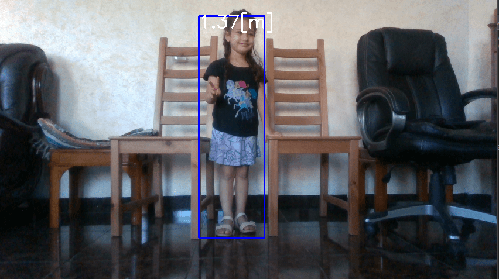

# TensorFlow with Intel RealSense Cameras

## Introduction

TensorFlow is extremely popular open source platform for machine learning. This tutorial series will highlight different ways TensorFlow-based machine learning can be applied with Intel RealSense Depth Cameras. We'll be using python as language of choice, but same concepts can be easily ported to other languages.

## Installation

We'll need the following components:

1. `python 3.6` - [download page](https://www.python.org/downloads/release/python-360/). Version 3.6 was chosen due to its compatibility with components below
2. `pyrealsense2` - on x86 Linux and Windows platforms can be installed by running `pip install pyrealsense2`. For additional installation instructions please see [official documentation](https://github.com/IntelRealSense/librealsense/tree/master/wrappers/python#installation). We'll be using `pyrealsense2` to communicate with the camera and fetch frames from the device.
3. `numpy` - We'll be using Numpy for image storage and manipulation. Install via `pip install numpy`
4. `opencv` - We'll be using OpenCV for loading and saving images, basic image processing, and inference in some examples. OpenCV can be installed via `pip install opencv-python`
5. `tensorflow` - TensorFlow is the main focus of this set of tutorials. We'll be using TensorFlow version 2.3.0, or TensorFlow-GPU version 2.2.0. We'll also be using a version of Keras library bundled inside TensorFlow installation. Keras is offering set of declarative APIs simplifying network declaration and improving readability. 

> **Note on GPU Support**: In order to run TensorFlow with GPU acceleration on NVidia GPUs you need to install `tensorflow-gpu` python package and compatible versions of CUDA and cuDNN libraries. [List of compatible combinations](https://www.tensorflow.org/install/source_windows#gpu)

We assume you are already familiar with the basics of operating Intel RealSense devices in python. Please see [official documentation](https://github.com/IntelRealSense/librealsense/tree/development/wrappers/python#python-wrapper) for more information and code samples. 

## Part 1 - Object Detection and Classification
Intel RealSense Camera can be used for object detection and classification with TensorFlow like any other video source. [Example 1](example1%20-%20object%20detection.py) is showing standard object detection using TensorFlow and data from the RGB sensor. 

In order to run this example, you will need model file. Please download and extract one of the models from [TensorFlow-Object-Detection-API](https://github.com/opencv/opencv/wiki/TensorFlow-Object-Detection-API#use-existing-config-file-for-your-model) page. We are using [Faster-RCNN Inception v2](https://arxiv.org/pdf/1611.10012.pdf) for this example, but other networks can be easily swapped-in. Extracted `frozen_inference_graph.pb` is expected to be in the working directory when running the script. 

The code should be familiar with anyone who worked with TensorFlow before. We start by creating Graph object and loading it from file:

```py
# Load the Tensorflow model into memory.
detection_graph = tf.Graph()
with detection_graph.as_default():
    od_graph_def = tf.compat.v1.GraphDef()
    with tf.compat.v1.gfile.GFile(PATH_TO_CKPT, 'rb') as fid:
        serialized_graph = fid.read()
        od_graph_def.ParseFromString(serialized_graph)
        tf.compat.v1.import_graph_def(od_graph_def, name='')
    sess = tf.compat.v1.Session(graph=detection_graph)
```

Next, we will initialize the relevant input and output vectors needed in this sample:

```py
# Input tensor is the image
image_tensor = detection_graph.get_tensor_by_name('image_tensor:0')
# Output tensors are the detection boxes, scores, and classes
# Each box represents a part of the image where a particular object was detected
detection_boxes = detection_graph.get_tensor_by_name('detection_boxes:0')
# Each score represents level of confidence for each of the objects.
# The score is shown on the result image, together with the class label.
detection_scores = detection_graph.get_tensor_by_name('detection_scores:0')
detection_classes = detection_graph.get_tensor_by_name('detection_classes:0')

# Number of objects detected
num_detections = detection_graph.get_tensor_by_name('num_detections:0')
```

We'll start the camera by specifying the type of stream and its resolution:

```py
pipeline = rs.pipeline()
config = rs.config()
config.enable_stream(rs.stream.color, 1280, 720, rs.format.bgr8, 30)
```

Inside the main loop we will get color data from the camera and convert it into a NumPy array:

```py
frames = pipeline.wait_for_frames()
color_frame = frames.get_color_frame()
color_image = np.asanyarray(color_frame.get_data())
```

Next we can perform inference using our TensorFlow session:

```py
(boxes, scores, classes, num) = sess.run([detection_boxes, detection_scores, detection_classes, num_detections],
                                         feed_dict={image_tensor: image_expanded})
```

Finally, we will assign random persistent color to each detection class and draw a bounding box around the object. We filter out low confidence predictions using `score` output. 

```py
for idx in range(int(num)):
    class_ = classes[idx]
    score = scores[idx]
    box = boxes[idx]
    if class_ not in colors_hash:
        colors_hash[class_] = tuple(np.random.choice(range(256), size=3))
    if score > 0.8:
        left = box[1] * W
        top = box[0] * H
        right = box[3] * W
        bottom = box[2] * H

        width = right - left
        height = bottom - top
        bbox = (int(left), int(top), int(width), int(height))
        p1 = (int(bbox[0]), int(bbox[1]))
        p2 = (int(bbox[0] + bbox[2]), int(bbox[1] + bbox[3]))
         # draw box
        r, g, b = colors_hash[class_]
        cv2.rectangle(color_image, p1, p2, (int(r), int(g), int(b)), 2, 1)
```

Expected output: 


## Part 2 - Augmenting output using Depth data

Since Intel RealSense Cameras also offer per-pixel depth information, we can use this extra data to solve additional problems related to our detection and classification example. In [Example 2](example2%20-%20person%20height.py) we'll use color data to detect people and depth data to quickly estimate the height of each person.

In this example we will configure depth stream in addition to color:
```py
config.enable_stream(rs.stream.depth, 848, 480, rs.format.z16, 30)
```

We'll also need `pointcloud` and `align` helper objects for depth data manipulation:

```py
aligned_stream = rs.align(rs.stream.color) # alignment between color and depth
point_cloud = rs.pointcloud()
```

Inside the main loop we will first make sure depth data is aligned to color sensor viewport and next generate an array of XYZ coordinates instead of raw depth:
```py
frames = aligned_stream.process(frames)
depth_frame = frames.get_depth_frame()
points = point_cloud.calculate(depth_frame)
verts = np.asanyarray(points.get_vertices()).view(np.float32).reshape(-1, W, 3)  # xyz
```

This allows us to query XYZ coordinates of each detected object and to separate individual coordinates (in meters):

```py
obj_points = verts[int(bbox[1]):int(bbox[1] + bbox[3]), int(bbox[0]):int(bbox[0] + bbox[2])].reshape(-1, 3)
zs = obj_points[:, 2]
ys = obj_points[:, 1]
```

To avoid outliers we will delete any Y values corresponding to Z values far away from Z median. This makes sure the background has minimal interference with our calculation. 

```py
z = np.median(zs)
ys = np.delete(ys, np.where((zs < z - 1) | (zs > z + 1)))
```

Assuming camera is horizontal, persons height can be approximated by its length in Y direction. This can be easily calculated using max and min Y:

```py
my = np.amin(ys, initial=1)
My = np.amax(ys, initial=-1)
height = (My - my)
```

Expected output: 



## Part 3 - Deploying TensorFlow model using OpenCV

While TensorFlow is convenient to install and use, it is not as convinient as OpenCV. OpenCV is ported to most platforms and is well optimised for various types of CPUs. It also comes with built-in DNN module capable of loading and using TensorFlow models without having TensorFlow (or its dependencies) installed.

[Example 3](example3%20-%20opencv%20deploy.py) is functionally equal to Example 2, but instead of using TensorFlow APIs directly it is loading and running inference using OpenCV.

In addition to the model file, you will need `pbtxt` file accompanying the model. This file can be found [at this link](https://github.com/opencv/opencv_extra/blob/master/testdata/dnn/faster_rcnn_inception_v2_coco_2018_01_28.pbtxt).

```py
net = cv2.dnn.readNetFromTensorflow(r"frozen_inference_graph.pb", 
                                    r"faster_rcnn_inception_v2_coco_2018_01_28.pbtxt")
```

After converting color image to NumPy array, inference can be done as follows:

```py
scaled_size = (int(W), int(H))
net.setInput(cv2.dnn.blobFromImage(color_image, size=scaled_size, swapRB=True, crop=False))
detections = net.forward()
```

Resulting `detections` array will capture all detections and associated information. 

		
# Tools
There are several helper tools located under `tools` folder: 


##  RMSE

RMSE tool can be use to show surface smoothness by showing plane-fit RMS of pixels inside a selected rectangle inside the image.
The tools is approximating best fit plane passing through selected points, ignoring zero depth and calculates how far on average points are from that plane. 
When evaluated on planar surface, this gives good metric for surface smoothness. In addition, noise distribution within the selected bounding box is color coded: 
Black pixels correspond to low deviation from predicted plane-fit with white pixels corresponding to points further always from the plane, normalized by standard deviation. 


 
## Convert to Bag
This tool runs on a folder that contains:

	1. depth images as captured by ds5 camera
	
	2. ground truth of depth images from #1
	
	3. IR images from left sensor corresponding to #1 and #2
	
	4. denoised images : Unet network model prediction of noisy images from #1
	
The output is a BAG file that could be opened by RealSense viewer.


## Conclusions

This article is showing small number of examples for using deep learning together with Intel RealSense hardware. It is intended to be further extended and you are welcomed to propose enhancements and new code samples. You are also free to use provided sample code, dataset and model for research or commercial use, in compliance with Intel RealSense SDK 2.0 [License](https://github.com/IntelRealSense/librealsense/blob/master/LICENSE)

