# UnrealEngine4 Wrapper for RealSense SDK 2.0

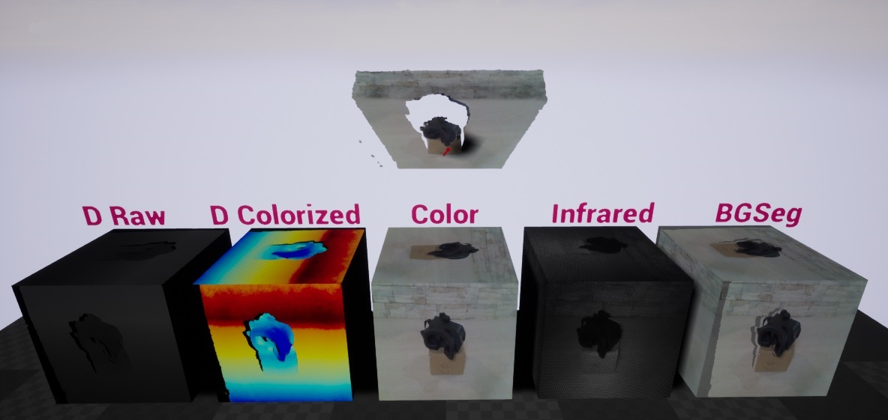

_Level with examples demonstrating streaming depth, color (IR and external RGB) and pointcloud in Unreal Engine 4._
## Overview

UnrealEngine4 wrapper shows how to use RealSense features via Blueprints (UE4 version 4.19+). At the moment it provides next functionality:
* enumerate devices/sensors/options/profiles
* load and save configuration presets
* tune sensor options
* access live sensor streams via textures
* record and playback sensor streams
* process raw data in shader
* align depth/color streams
* generate and render point cloud mesh

## Getting Started

Download and install [RealSense SDK 2.0](https://github.com/IntelRealSense/librealsense/releases)

Download wrapper and [generate project files](https://wiki.unrealengine.com/Generate_Visual_Studio_Project) for RealSenseUE.uproject

Copy C:\Program Files (x86)\Intel RealSense SDK 2.0\bin\x64\realsense2.dll to either:
* The engine bin folder C:\Program Files\Epic Games\UE_4.19\Engine\Binaries\Win64\ **OR**
* The plugin build folder RealSense-UE4-Wrapper\Plugins\RealSense\Binaries\Win64\

In case RealSense SDK was installed in custom folder:
* edit file RealSense-UE4-Wrapper\Plugins\RealSense\Source\RealSense\RealSense.Build.cs
* update line `string RealSenseDirectory = "REALSENSE_SDK_PATH_HERE"`

Build RealSenseUE.sln using DevelopmentEditor configuration

Start and play RealSenseUE.uproject to see some live data

## Next steps

Check out prefab BP_RealSenseAPI, it shows functionality exposed to Blueprints and a few examples:
* ExEnumerateHardware - get connected devices/sensors and print some info
* ExModifyOption - modify specific sensor option
* ExPresetLoadSave - load and save device configuration preset
* ExStreamConfiguration - enable/disable streams, set video mode
* ExRecordPlayback - record and playback demo

Check out prefab BP_RealSenseInspector, it simplifies stream configuration and management, also binds live data to scene objects.

## Hardware inspector

Hardware inspector allows to check connected hardware and tune sensor options via editor. This feature is for debugging only and changes are not saved automatically. It's possible to load and save configuration presets using corresponding buttons in hardware inspector dropdown or via blueprint functions. 

Preset files can be downloaded [here](https://github.com/IntelRealSense/librealsense/wiki/D400-Series-Visual-Presets).

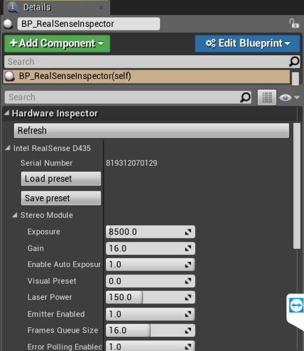

_Picture: hardware inspector_

## Device configuration

DeviceSerial allows to select specific device by serial. If empty default device will be used.

PipelineMode switches between CaptureOnly/Record/Playback:
* CaptureOnly - fetch and render live data
* Record - fetch and render live data but also record it to specified file
* Playback - load previously recorded file and loop it content

EnablePolling switches poll/wait update mode. Poll mode is checking for data with specified rate, wait mode is blocking until data is available.

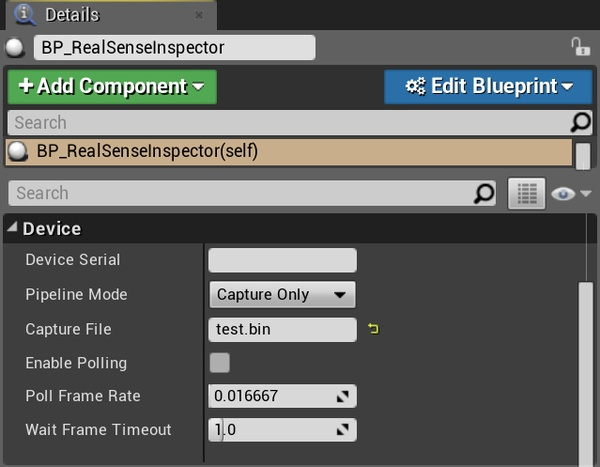

_Picture: mode inspector_

## Stream configuration

Each stream has it's own dropdown with enable/disable flag and video mode selector. These options should be configured before starting RealSenseInspector. Restarting is required to change video mode. Enable/disable flag can be used to pause/resume already running stream.

Depth can provide two textures: raw and colorized. Colorized depth is soft-processed based on Equalize/MinMax/Colormap settings. Avoid using colorized depth on high resolutions/rates.

In case running both depth and infrared they should be configured to same video mode.

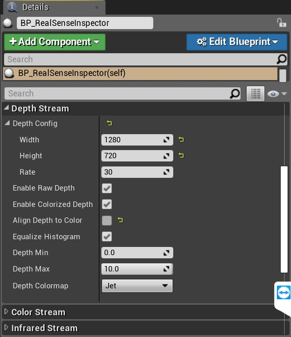

_Picture: depth stream inspector_

## Point cloud configuration

Point cloud support is experimental and has a lot of flaws. Current implementation uses third-party plugin for dynamic mesh generation and should be optimized.

* PclScale - allows to scale the whole cloud
* PclVoxelSize - single point/voxel size in mm
* PclDensity - percentage of rendered points
* PclRenderRate - how often the PCL mesh is updated (0.5 means two times per second)

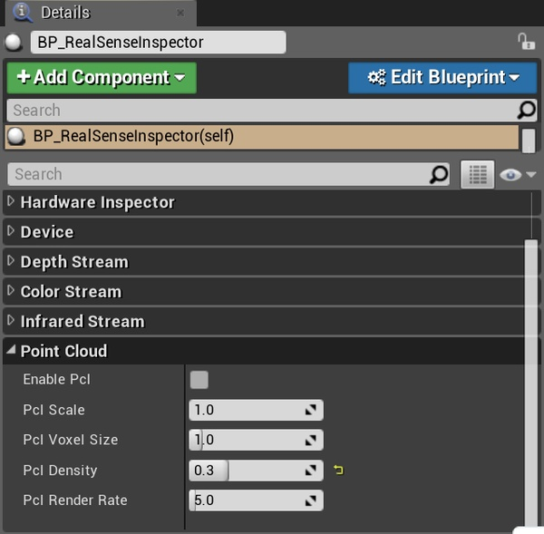

_Picture: point cloud inspector_

## Blueprint API

`RealSenseContext` is global object initialized at plugin load. It wraps native RealSense library and provides device management functions.

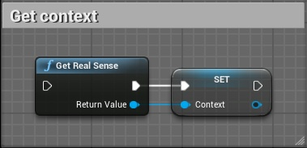

_Picture: get context blueprint_

After getting the context devices can be enumerated. Each device contains a few sensors, each sensor has some options. Sensor profile contains video mode and frame rate.

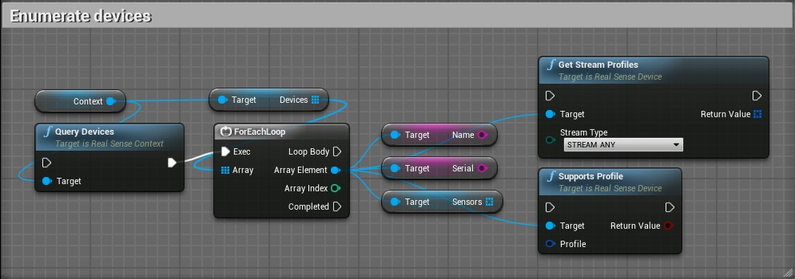

_Picture: enumerate devices blueprint_

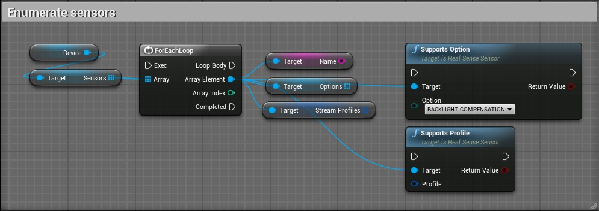

_Picture: enumerate sensors blueprint_

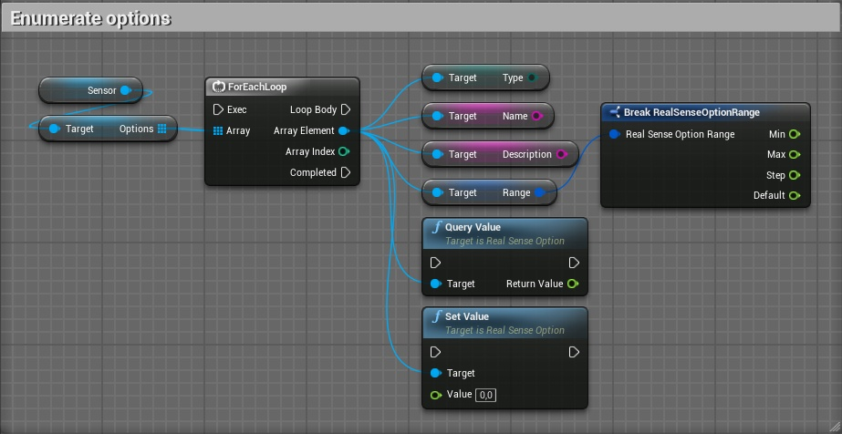

_Picture: enumerate options blueprint_

Sensor options can be tuned one by one or using preset load/save functions.

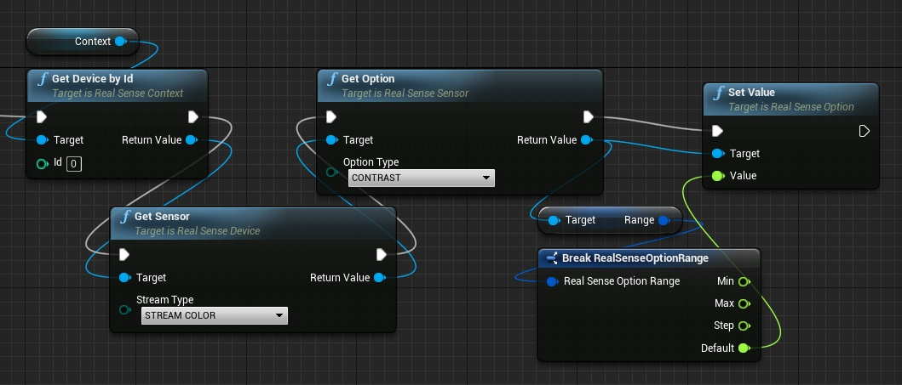

_Picture: get and set options value_


_Picture: save and load preset blueprint_

`RealSenseInspector` provides stream configuration and management functions. It updates textures and PCL mesh.

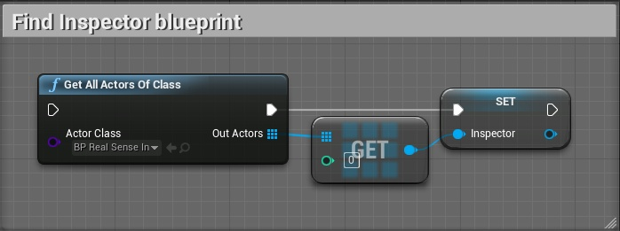

_Picture: find Inspector blueprint_

Properties described in StreamConfiguration section also can be modified from Blueprints.

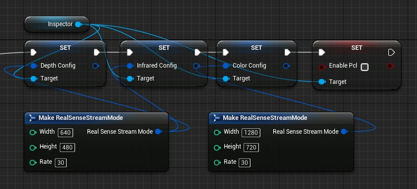

_Picture: modify stream mode blueprint_

After configuration RealSenseInspector should be started with any PipelineMode.

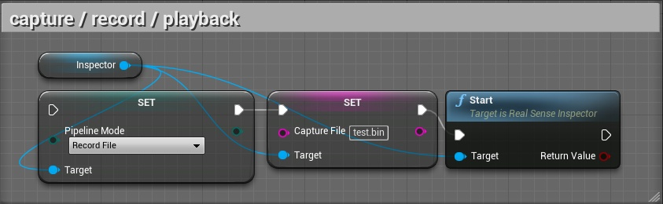

_Picture: set mode blueprint_

Time to get texture objects and PCL mesh.

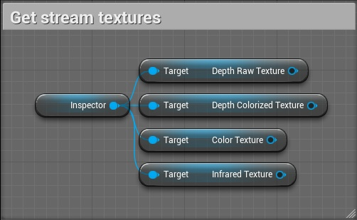

_Picture: get stream texture blueprint_

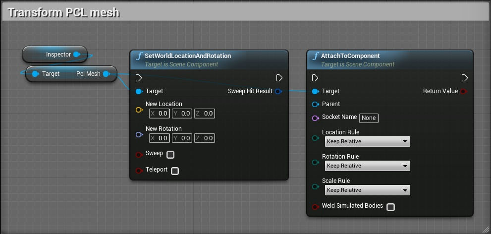

_Picture: transform PCL mesh blueprint_

## Native code

It's also possible to access wrapper from native code, check RealSenseTestActor.cpp for example:
```cpp
#include "RealSensePlugin.h"
#include "RealSenseContext.h"
#include "RealSenseDevice.h"
#include "RealSenseNative.h"

ARealSenseTestActor::ARealSenseTestActor()
{
	auto Context = IRealSensePlugin::Get().GetContext();
	Context->QueryDevices();
	for (auto Device : Context->Devices)
	{
		UE_LOG(LogRealSenseDemo, Display, TEXT("Wrapper device %s"), *(Device->Name));
	}

	rs2::context_ref RsContext(Context->GetHandle());
	auto DeviceList = RsContext.query_devices();
	for (auto Device : DeviceList)
	{
		FString DevName(ANSI_TO_TCHAR(Device.get_info(RS2_CAMERA_INFO_NAME)));
		UE_LOG(LogRealSenseDemo, Display, TEXT("Native device %s"), *DevName);
	}
}
```

## Known Issues

* Frame drop/timeout on high resolutions might be laggy (depends on the hosts hardware)
* High CPU usage (RealSenseSDK issue)
* ColorizedDepth is CPU bound
* PointCloud (PCL) has sometimes texture corruptions at thhe egdes (RealSenseSDK issue)
* PointCloud (PCL) update/rendering performance is somtime slow
* rebuilding project files can sometimes fail after switching Unreal Engine versions. Cleaning the solution or Deleting the intermediate directory should fix this.

## License

This project is licensed under the [Apache License](https://github.com/PaloAlto-Group/libRealsense_UE4_wrapper/blob/master/LICENSE), Version 2.0.
